# Crown & Conquest

## Overview

Crown & Conquest is a full-stack Django web application developed as part of the Code Institute Full Stack Frameworks module. The project combines persistent database-driven gameplay, strategic decision-making, artificial intelligence, subscription functionality, and simulation modelling into a single browser-based medieval kingdom management experience.

Rather than functioning as a conventional CRUD application, Crown & Conquest was designed as a stateful simulation in which every decision made by the player influences the future evolution of their kingdom. Economic growth, food production, military strength, territorial expansion, diplomatic relations, public happiness, infrastructure, stability, and random events are interconnected systems that evolve together over time. This creates a gameplay experience where successful long-term progression depends upon balancing competing priorities rather than optimising a single numerical value.

Unlike many browser-based management games that rely on fixed event chains or predetermined progression, Crown & Conquest combines deterministic simulation with controlled stochastic behaviour. Core systems evolve according to mathematical relationships between stored kingdom attributes, while dynamic events introduce uncertainty that forces players to continually adapt their strategy. This combination allows each kingdom to develop differently even when players begin with identical starting conditions.

The project also demonstrates the capabilities of modern Django development beyond traditional content management. Authentication, relational database modelling, AI-assisted gameplay, Stripe subscription management, responsive design, and complex server-side processing have been integrated into a cohesive application that emphasises maintainability, scalability, and user experience.

The application therefore serves two complementary purposes.

From the perspective of the user, it provides an engaging medieval kingdom simulation in which strategic decisions influence persistent progression across many turns.

From the perspective of software engineering, it demonstrates the implementation of a multi-application Django architecture incorporating complex business logic, third-party service integration, relational data modelling, responsive frontend design, secure authentication, payment processing, and AI-powered decision analysis.

Throughout development, considerable emphasis was placed on ensuring that technical decisions directly supported gameplay objectives. Rather than adding features solely for technical demonstration, each major system was designed to reinforce the central objective of creating a believable and strategically engaging simulation where users experience meaningful consequences for their decisions over time.

**Crown and Conquest Deployed Link:** https://crown-and-conquest-abb2787e2b41.herokuapp.com/

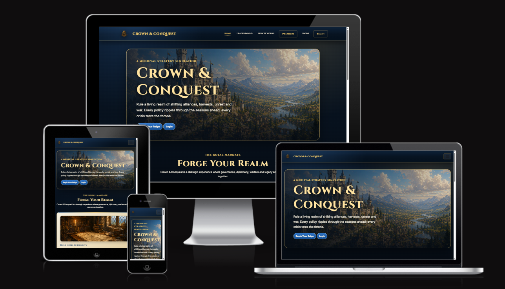

---

# Table of Contents

- [Project Introduction](#project-introduction)
- [Purpose](#purpose)
- [Project Goals](#project-goals)
- [Intended Audience](#intended-audience)
- [Scope](#scope)

- [User Experience (UX)](#user-experience-ux)
- [Site Goals](#site-goals)
- [User Stories](#user-stories)
- [Agile Development](#agile-development)

- [Design](#design)
  - [Design Philosophy](#design-philosophy)
  - [Visual Identity](#visual-identity)
  - [Branding](#branding)
  - [Layout Strategy](#layout-strategy)
  - [Responsive Strategy](#responsive-strategy)
  - [Consistency](#consistency)
  - [Feedback and Interaction](#feedback-and-interaction)
  - [Colour Palette](#colour-palette)
  - [Typography](#typography)

- [System Design](#system-design)
  - [Application Flowcharts](#application-flowcharts)
  - [Database Design](#database-design)

- [Wireframes](#wireframes)

- [Features](#features)

- [Technical Discussion](#technical-discussion)
  - [Overall Architecture](#overall-architecture)
  - [Django Applications](#django-applications)
  - [Separation of Concerns](#separation-of-concerns)
  - [Server-Side Business Logic](#server-side-business-logic)
  - [Turn Processing Architecture](#turn-processing-architecture)
  - [Simulation Algorithms](#simulation-algorithms)
  - [Policy Decision Trade-offs](#policy-decision-trade-offs)
  - [Artificial Intelligence Integration](#artificial-intelligence-integration)
  - [Stripe Integration](#stripe-integration)
  - [Frontend Architecture](#frontend-architecture)
  - [Maintainability & Extensibility](#maintainability--extensibility)

- [Accessibility](#accessibility)

- [Testing](#testing)

- [AI Tool Usage and Reflection](#ai-tool-usage-and-reflection)

- [Future Improvements](#future-improvements)

- [Technologies Used & Credits](#technologies-used--credits)

---

## Project Introduction

The inspiration for Crown & Conquest originated from classic kingdom management and grand strategy games in which players oversee the development of an evolving civilisation. However, unlike large-scale commercial strategy titles that often overwhelm new players with complexity, this project seeks to present strategic decision-making through a clear, approachable web interface while preserving the interconnected nature of simulation-based gameplay.

At its core, the project explores the question:

> *How can a persistent medieval strategy simulation be implemented within a modern Django web application while remaining intuitive, responsive, and accessible?*

Answering this question required considerably more than implementing standard CRUD functionality. Each turn advances an evolving simulation that recalculates numerous interdependent variables representing the current state of a player's kingdom. Decisions regarding taxation, investment priorities, warfare, and responses to unexpected crises combine to influence future outcomes in ways that may not become immediately apparent.

The result is an application where gameplay emerges from the interaction between multiple systems rather than isolated features. Economic prosperity can increase population growth, larger populations require greater food production, military expansion places pressure on financial resources, diplomatic choices influence future conflict, while poor leadership increases the probability of destabilising events. These relationships encourage strategic planning rather than short-term optimisation.

An additional objective was to demonstrate how modern AI services can enhance traditional simulation mechanics. Rather than treating artificial intelligence as a standalone novelty feature, Google Gemini is integrated directly into gameplay by evaluating written player responses during significant events. Instead of selecting predetermined dialogue options, players explain how they would respond as a ruler. These qualitative decisions are analysed according to leadership characteristics before influencing subsequent gameplay variables, introducing an additional dimension of strategic interaction beyond purely numerical optimisation.

Premium functionality was similarly designed to extend rather than replace the core gameplay experience. Stripe subscription management provides authenticated users with access to additional analytical tools and enhanced statistical information while preserving competitive balance between premium and non-premium users.

Collectively, these systems transform Crown & Conquest from a conventional database application into a persistent simulation platform where user decisions shape an evolving kingdom over many successive turns.

---

## Purpose

The primary purpose of Crown & Conquest is to demonstrate the implementation of a sophisticated stateful simulation using Django while providing an engaging strategic gameplay experience through the browser.

Unlike static websites that present information or traditional CRUD systems centred around creating and editing records, the application revolves around continuously evolving data. Every interaction performed by the player contributes towards an evolving simulation whose future state depends upon previous decisions, introducing persistence, uncertainty, and long-term planning into the user experience.

From an educational perspective, the project demonstrates proficiency across numerous areas of full-stack software engineering, including relational database design, server-side application architecture, secure authentication, payment processing, REST-style request handling, AI service integration, responsive interface development, and deployment to a cloud-hosted production environment.

At the same time, the application aims to provide an enjoyable strategic experience capable of sustaining repeated play sessions through emergent behaviour rather than scripted progression.

---

## Project Goals

The project was guided by several overarching objectives that informed both the technical architecture and the overall user experience.

### Primary Goals

- Develop a persistent medieval kingdom simulation using Django.
- Create meaningful relationships between economic, military, diplomatic, and social systems.
- Encourage strategic thinking through long-term consequences rather than isolated decisions.
- Integrate AI into gameplay in a manner that directly affects simulation outcomes.
- Implement secure subscription functionality using Stripe.
- Produce a responsive application suitable for desktop, tablet, and mobile devices.
- Demonstrate professional software engineering practices appropriate for portfolio presentation.

### Technical Goals

- Design a maintainable multi-application Django architecture.
- Normalise database models using appropriate relationships.
- Separate presentation, business logic, and persistence responsibilities.
- Prevent client-side manipulation by performing simulation processing on the server.
- Maintain scalability through modular application design.
- Integrate third-party services securely using environment variables.
- Ensure accessibility and responsiveness throughout the interface.

### User Experience Goals

The user experience was designed around the principle that complexity should arise from gameplay rather than interface design.

Players should be able to understand how to interact with the application almost immediately after registration, while discovering increasing strategic depth as additional mechanics become available. Information-rich dashboards, visual hierarchy, consistent navigation, and immediate feedback following each turn help users understand the consequences of their decisions without becoming overwhelmed by numerical data.

Throughout development, interface decisions were therefore evaluated according to whether they improved understanding of the underlying simulation rather than simply enhancing visual appearance.

---

## Intended Audience

Crown & Conquest has been designed for several distinct groups of users.

### Strategy Game Enthusiasts

Players interested in resource management and long-term strategic planning can experiment with different approaches to kingdom development while competing for leaderboard positions.

### Students and Educators

Because the application models interconnected systems through deterministic and probabilistic relationships, it also provides an accessible demonstration of simulation modelling within a web application.

### Recruiters and Employers

From a professional portfolio perspective, the project demonstrates competency across both frontend and backend development while illustrating experience with third-party integrations, database modelling, AI services, payment processing, authentication, responsive design, and cloud deployment.

### Technical Reviewers

The application has been structured to support detailed code review. The architecture emphasises modularity, maintainability, and clear separation of concerns, allowing reviewers to evaluate implementation decisions throughout the codebase.

---

## Scope

The scope of Crown & Conquest extends well beyond the requirements of a traditional CRUD-based Django application.

Rather than simply allowing users to create and edit records, the project implements an evolving simulation supported by persistent relational data, turn progression, random event generation, diplomatic systems, warfare, premium functionality, AI-assisted decision analysis, and historical reporting.

At the same time, the scope intentionally remains focused upon strategic kingdom management rather than attempting to recreate the enormous complexity of commercial grand strategy games. This balance ensures that the application remains approachable for new users while providing sufficient technical depth to demonstrate advanced software engineering principles.

---

# User Experience (UX)

The user experience of **Crown & Conquest** was designed around the principle that a complex simulation should not require a complex interface. While the underlying systems governing the kingdom involve numerous interconnected variables, the application aims to present these systems in a manner that remains intuitive, approachable, and visually coherent for both new and returning users.

From the outset, the project was conceived as more than a traditional CRUD application. Users are not simply managing database records; they are overseeing a living kingdom whose state evolves through a persistent simulation. Every interface decision was therefore made with a single question in mind:

> *Does this help the player understand the consequences of their decisions?*

This philosophy influenced every aspect of the application, from the organisation of dashboard information and the placement of strategic controls to the presentation of historical reports, diplomacy, warfare, AI-driven events, and premium analytics.

Unlike many strategy games that overwhelm players with dozens of simultaneous menus and statistics, Crown & Conquest introduces information progressively. Core gameplay systems become familiar before users begin exploring more advanced mechanics such as diplomacy, warfare, premium analytics, and AI-assisted decision making.

Equally important was ensuring that the application remained fully responsive across modern devices. Kingdom management often involves monitoring numerous statistics simultaneously, requiring careful consideration of responsive layouts that preserve readability without sacrificing functionality. Desktop users benefit from information-rich dashboards, while tablet and mobile users experience carefully reorganised layouts that prioritise interaction without removing important functionality.

The resulting user experience attempts to balance three complementary objectives:

- Strategic depth
- Interface clarity
- Responsive accessibility

Together these principles create an application that encourages exploration without intimidating new users while still providing experienced players with the information necessary to make increasingly sophisticated strategic decisions.

---

# Site Goals

The design and implementation of Crown & Conquest were guided by a series of user-centred goals intended to align technical functionality with an engaging gameplay experience.

Rather than viewing gameplay systems and interface design as separate concerns, each design objective was chosen to reinforce the application's central simulation philosophy.

The primary goals of the application are to:

- Create an engaging medieval kingdom simulation centred around meaningful strategic decision making.
- Encourage long-term planning by ensuring that player decisions have persistent consequences across future turns.
- Present complex simulation data through dashboards that remain understandable and visually organised.
- Reward experimentation by allowing players to explore different economic, diplomatic, and military strategies.
- Integrate artificial intelligence naturally into gameplay rather than treating it as an isolated feature.
- Provide premium users with enhanced analytical tools without compromising competitive balance.
- Deliver a fully responsive experience across desktop, tablet, and mobile devices.
- Maintain accessibility standards that ensure the simulation remains usable by as many users as possible.
- Demonstrate modern full-stack software engineering principles suitable for professional portfolio presentation.

These objectives informed every stage of development, from database modelling and application architecture through to interface layout and responsive behaviour.

---

# User Stories

User stories formed the foundation of both the planning and implementation of Crown & Conquest. Every feature implemented throughout the project originated as an individual GitHub Project user story before being estimated, prioritised using the MoSCoW framework, and allocated to one of four development sprints.

Rather than treating user stories as isolated development tasks, they were written from the perspective of the application's intended users. This ensured that every implemented feature solved a genuine user need while contributing towards the overall gameplay experience.

Each story followed the standard Agile format:

> **As a... I want... so that...**

While the GitHub Project organised these stories according to sprint planning and implementation priority, they are grouped below according to the type of user they primarily support.

---

## First-Time Users

The first experience of Crown & Conquest focuses on introducing new players to the application, allowing them to create an account, establish their kingdom, and begin playing with minimal friction.

The following GitHub user stories guided the onboarding experience.

- **US-01 – Register an Account**  
  **As a first-time visitor**, I want to register an account so that I can create and manage my own kingdom.

- **US-02 – User Login & Logout**  
  **As a returning user**, I want to securely log into my account so that I can continue managing my kingdom.

- **US-03 – Google OAuth Authentication**  
  **As a user**, I want to sign in using my Google account so that I can access the application quickly without creating additional credentials.

- **US-04 – Create a Kingdom**  
  **As a new player**, I want to create my own kingdom so that I can begin progressing through the simulation.

---

## Returning Players

Returning users spend most of their time managing and developing their kingdom. These stories therefore focus on day-to-day gameplay, kingdom administration, and maintaining long-term progress.

- **US-05 – Display Kingdom Dashboard**  
  **As a returning player**, I want to access my dashboard immediately after logging in so that I can quickly review the current state of my kingdom.

- **US-06 – Edit Kingdom Details**  
  **As a kingdom owner**, I want to update my kingdom's information so that it reflects my preferred identity.

- **US-07 – Delete Kingdom**  
  **As a user**, I want the option to permanently delete my kingdom so that I remain in control of my account and data.

- **US-14 – Store Turn History**  
  **As a player**, I want completed turns to be stored so that I can review previous decisions and monitor my kingdom's development.

- **US-17 – Kingdom Leaderboard**  
  **As a player**, I want to compare my kingdom against other players so that I can monitor my long-term performance.

- **US-18 – Kingdom Statistics & History**  
  **As a player**, I want detailed statistics and historical information so that I can analyse the long-term development of my kingdom.

---

## Strategic Gameplay

The core gameplay experience centres around managing an evolving medieval kingdom. These user stories introduce the interconnected simulation systems that drive strategic decision-making throughout the application.

- **US-08 – Advance Game Turn**  
  **As a player**, I want to advance the game by one turn so that my kingdom continues to develop over time.

- **US-09 – Economy Simulation**  
  **As a player**, I want my kingdom's economy to change dynamically so that financial management becomes an important strategic consideration.

- **US-10 – Population Growth System**  
  **As a player**, I want my population to grow or decline according to my decisions so that my actions have meaningful consequences.

- **US-11 – Food Production Mechanics**  
  **As a player**, I want food production to influence my kingdom's stability so that resource management becomes part of my overall strategy.

- **US-12 – Happiness & Stability Calculations**  
  **As a player**, I want public happiness and kingdom stability to affect future development so that balancing competing priorities becomes essential.

- **US-13 – Random Event System**  
  **As a player**, I want dynamic events to occur during gameplay so that every kingdom develops differently and requires unique strategic decisions.

- **US-15 – Gemini AI Integration**  
  **As a player**, I want AI-generated event content so that each decision feels engaging, varied, and contextually relevant to my kingdom.

- **US-16 – Warfare System**  
  **As a player**, I want to declare war against rival kingdoms so that military expansion becomes another strategic option.

---

## Premium Users

Premium functionality was designed to extend the analytical capabilities of the application without altering the underlying balance of the simulation.

- **US-20 – Premium Membership Integration**  
  **As a premium user**, I want to subscribe to additional features so that I can access enhanced strategic tools.

- **US-21 – Kingdom Customisation**  
  **As a premium member**, I want additional kingdom customisation options so that I can personalise my gameplay experience.

---

## Accessibility & Responsive Users

Accessibility and responsive design were considered throughout development rather than being implemented as isolated enhancements after the application's completion.

- **US-22 – Responsive User Interface**  
  **As a user on any device**, I want the application to adapt naturally to different screen sizes so that the complete gameplay experience remains available regardless of whether I am using a desktop, tablet, or mobile device.

---

## Development & Quality Assurance

Not every user story introduced gameplay functionality. Several stories focused upon ensuring that the completed application remained stable, maintainable, and suitable for deployment.

- **US-23 – Testing & Bug Fixing**  
  **As a developer**, I want to thoroughly test the application so that users receive a reliable and stable experience.

- **US-24 – Deployment & Documentation**  
  **As a developer**, I want the application to be successfully deployed and comprehensively documented so that it can be maintained, assessed, and presented professionally.

---

## Future Development

One user story was intentionally deferred beyond the scope of the Minimum Viable Product.

- **US-19 – Future Diplomacy Enhancements** *(Won't Have)*  
  **As a player**, I want additional diplomacy mechanics so that interactions between kingdoms become even more strategic in future releases.

Deferring this functionality allowed development effort to remain focused on delivering a complete, stable, and fully functional MVP while providing a clear roadmap for future expansion.

Collectively, these user stories provided complete traceability between project planning, Agile development, and the finished application. Every implemented feature documented throughout this README can be traced directly back to one or more of these original requirements, demonstrating how user-centred planning informed both the technical implementation and overall user experience of Crown & Conquest.

# Agile Development

Agile principles formed the foundation of the development process for Crown & Conquest, providing a structured yet flexible framework for planning, implementing, and refining the project throughout its lifecycle. Rather than attempting to develop the application as a single monolithic release, the project was divided into a series of manageable user stories organised across four iterative sprints. This incremental approach allowed new functionality to be introduced progressively, tested regularly, and refined before subsequent systems were developed.

GitHub Projects was used as the primary project management tool, providing a centralised Kanban board for organising user stories, monitoring development progress, and managing the project's overall scope. Each user story represented a discrete piece of functionality that contributed towards the Minimum Viable Product (MVP), ensuring that every development task delivered measurable value while remaining small enough to be completed within a single sprint.

To support effective prioritisation, every user story was assigned:

- **Story Points** to estimate development effort.
- **Sprint Allocation** to define the planned implementation window.
- **MoSCoW Prioritisation** (Must Have, Should Have, Could Have, Won't Have) to distinguish essential functionality from optional enhancements.
- **Milestone Assignment** to ensure that all completed work contributed towards the MVP release.

This structured planning process provided clear development goals while remaining sufficiently flexible to accommodate refinement as the project evolved.

---

## Product Backlog & Project Planning

Before development commenced, the complete project scope was decomposed into individual user stories representing each major feature of the application. These stories formed the product backlog and established the roadmap that guided development throughout the project.

Each story was carefully estimated, prioritised using the MoSCoW framework, and allocated to a planned sprint according to both implementation dependencies and overall project objectives. Core gameplay systems, authentication, and the simulation engine were prioritised as **Must Have** functionality, while premium features, interface enhancements, and additional customisation options were scheduled for later iterations where project scope allowed.

This planning stage also identified a small number of deliberately deferred features. Rather than attempting to implement every possible enhancement, features such as future diplomacy improvements were explicitly classified as **Won't Have** for the MVP, ensuring that development remained focused on delivering a stable, complete, and well-tested application within the available timeframe.

The product backlog provided a single source of truth throughout development, allowing priorities to remain transparent while ensuring that every completed feature could be traced back to an individual user story.

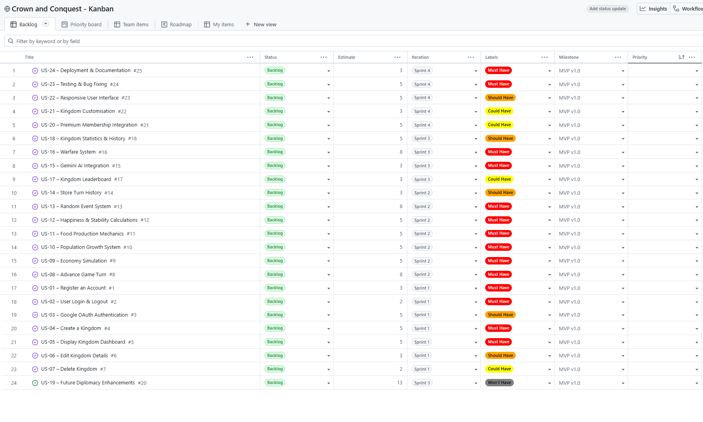

## Sprint 1 – Establishing the Foundation

With the product backlog established, development began by implementing the core infrastructure required for the remainder of the application. Rather than immediately focusing on complex gameplay mechanics, the first sprint concentrated on building the systems that every future feature would depend upon.

Initial development focused on user authentication, account management, kingdom creation, and the primary dashboard. Completing these systems first provided a stable foundation upon which the simulation engine could later be constructed. This approach also allowed the project to establish its overall architecture, database models, and navigation before introducing increasingly complex game logic.

At this stage of development, the Kanban board demonstrates an active workflow across all four stages of the development pipeline. Core authentication features had already reached completion, while kingdom creation and dashboard functionality were progressing through active development. Remaining user stories stayed within the backlog until the current sprint objectives had been completed, helping to maintain a manageable workload and preventing unnecessary context switching.

This iterative approach ensured that every completed feature was fully integrated before additional systems were introduced, reducing technical debt and allowing regular testing throughout development.

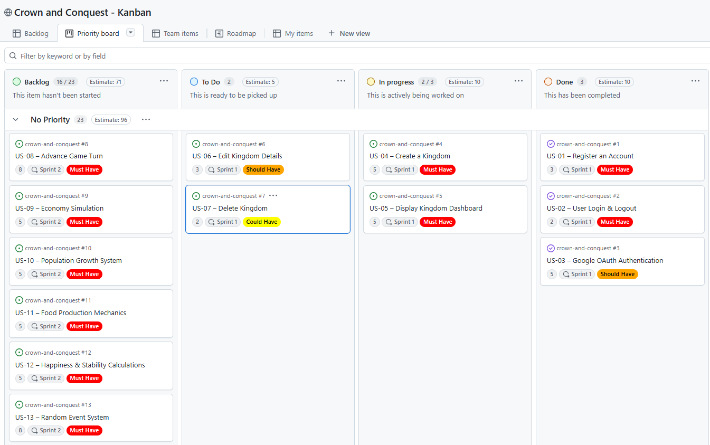

As Sprint 1 concluded, the project had successfully delivered a fully functional user management system together with the initial gameplay interface. Users could register accounts, authenticate using either standard credentials or Google OAuth, create their own kingdom, and access the dashboard that would later become the operational centre of the simulation.

Completing these core systems established a solid architectural foundation for the remainder of the project. With authentication, routing, database relationships, and the primary user workflow now complete, subsequent sprints could focus almost entirely on implementing gameplay systems rather than revisiting the application's core infrastructure.

The completed sprint also demonstrates the effectiveness of incremental delivery. Rather than attempting to build isolated components independently, each completed feature immediately became part of a functioning application, ensuring that progress remained measurable throughout the project lifecycle.

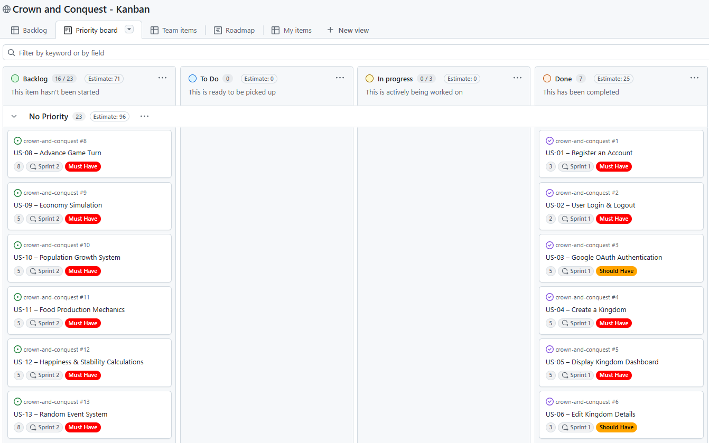

---

## Sprint 2 – Building the Simulation Engine

With the application's foundation complete, development shifted towards implementing the mechanics that define Crown & Conquest as a kingdom management simulation. Sprint 2 represented one of the most technically significant stages of the project, introducing the interconnected systems responsible for modelling the evolving state of each player's kingdom.

Development during this sprint focused on population growth, food production, economic simulation, happiness and stability calculations, turn progression, and the dynamic event system. Although each of these systems was developed independently as individual user stories, they were designed to operate together as a single simulation engine in which changes to one subsystem could influence the behaviour of several others.

The Kanban board illustrates this period of development particularly well. Earlier Sprint 1 functionality had been successfully completed, while multiple simulation systems were progressing simultaneously through active development. Less critical functionality, including turn history and later gameplay features, remained queued within the backlog until the core simulation mechanics reached a stable state.

This iterative workflow allowed each subsystem to be implemented, tested, and refined before becoming part of the wider simulation, reducing the likelihood of introducing defects into an increasingly interconnected codebase.

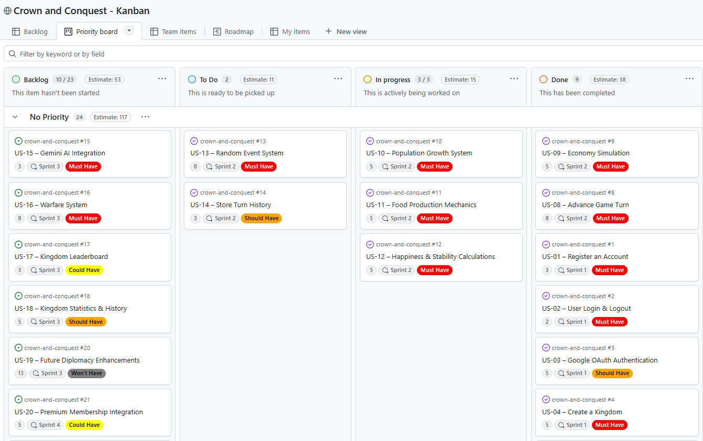

By the end of Sprint 2, the application had evolved from a collection of management interfaces into a functioning simulation. Players could now progress through turns, generate resources, experience population growth, respond to dynamically generated kingdom events, and review the historical outcomes of previous turns.

Completing these interconnected systems fundamentally changed the character of the project. Rather than simply storing user information, the application was now capable of modelling the ongoing development of an independent kingdom whose state evolved continuously according to player decisions and internally calculated simulation mechanics.

This milestone represented one of the most significant achievements of the project and provided the technical foundation required for the more advanced gameplay systems introduced during Sprint 3.

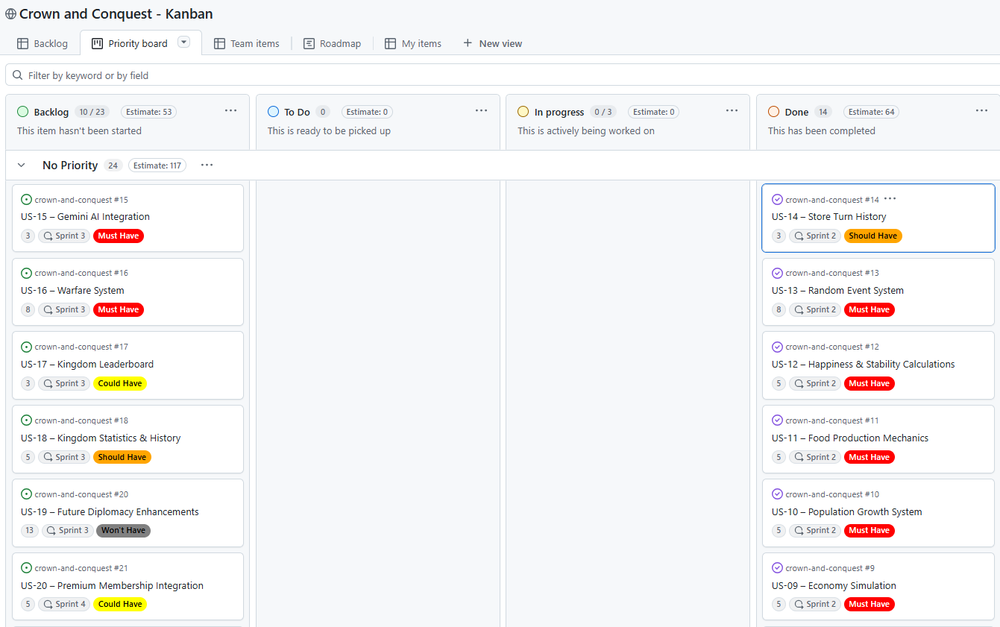

---

## Sprint 3 – Expanding the Gameplay Experience

Having completed the simulation engine during Sprint 2, development shifted towards expanding the strategic depth of the application through advanced gameplay systems. Rather than introducing entirely new foundations, this sprint focused on building upon the mechanics already established by integrating artificial intelligence, warfare, player comparison features, and enhanced statistical reporting.

Several of these systems were considerably more complex than those implemented during previous iterations. The warfare system required the coordination of multiple applications and database models, while the Gemini AI integration introduced dynamic content generation that responded directly to each player's evolving kingdom state. At the same time, the Kingdom Leaderboard and Statistics pages transformed raw simulation data into meaningful visual information, allowing players to analyse both their own progress and that of competing kingdoms.

The Kanban board illustrates this transition particularly well. Earlier simulation features had moved into the completed column, while the Gemini AI integration and Warfare System had entered active development. Supporting features, including Kingdom Statistics & History, were queued for implementation, ensuring that development remained focused on completing the highest-priority functionality before introducing additional enhancements.

Maintaining this disciplined workflow prevented the sprint from becoming overloaded despite the increasing technical complexity of the project. Each feature was completed and tested individually before becoming part of the wider application, allowing the overall codebase to remain stable throughout development.

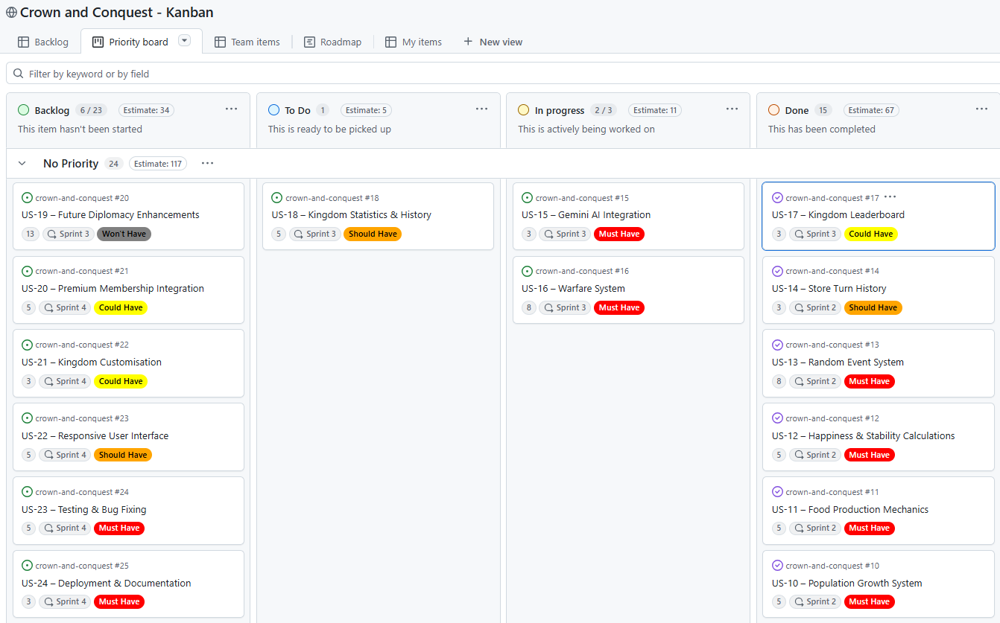

As Sprint 3 concluded, the majority of the application's core functionality had been successfully delivered. Artificial intelligence had been integrated into the dynamic event system, the warfare mechanics were fully operational, kingdom rankings could be compared through the leaderboard, and players were able to review detailed statistical summaries of their kingdom's development over time.

This sprint marked an important milestone in the project's evolution. The application had progressed beyond a traditional CRUD-based management system into a fully interactive strategy simulation in which multiple independent systems operated together to create a cohesive gameplay experience.

The completion of these advanced gameplay features also allowed the focus of the final sprint to shift away from major functionality and towards improving usability, responsiveness, testing, deployment, and overall presentation.

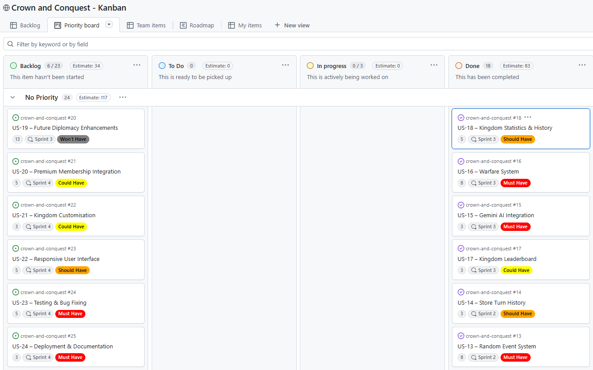

---

## Sprint 4 – Refinement, Polish & Release Preparation

With all major gameplay systems successfully implemented, the final sprint concentrated on preparing the application for production release. Unlike the earlier development phases, where the emphasis was placed on introducing new functionality, Sprint 4 focused on improving the overall quality, usability, and maintainability of the completed project.

Development during this stage centred around responsive interface improvements, premium membership functionality, final user interface refinements, comprehensive testing, deployment, and project documentation. By postponing these activities until the application's feature set had stabilised, changes could be made with confidence without disrupting core gameplay mechanics.

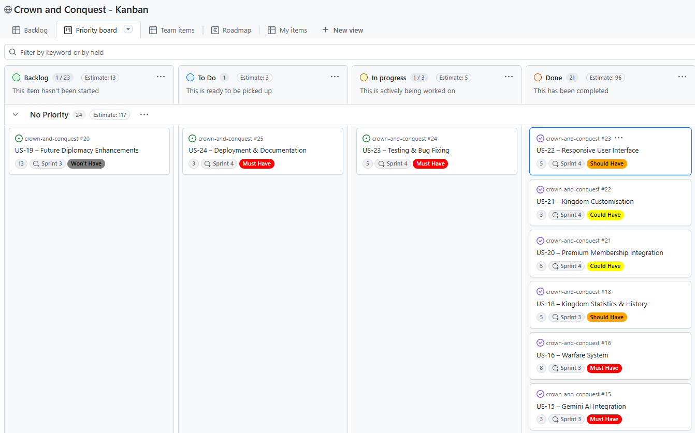

The Kanban board demonstrates how the project naturally transitioned into its release phase. The majority of user stories had already reached completion, leaving only deployment, documentation, testing, and a small number of optional enhancements to progress through the remaining workflow stages. Importantly, the intentionally deferred **Future Diplomacy Enhancements** user story remained categorised as a **Won't Have**, demonstrating that the original MoSCoW prioritisation continued to guide decision-making throughout the project rather than being abandoned during the final stages of development.

This disciplined approach ensured that the MVP remained achievable without sacrificing quality by attempting to implement every desirable feature before release.

### Final Project Board

The completed project board provides an overview of the entire development lifecycle. Almost every planned user story progressed successfully from the backlog to completion, leaving only deliberately deferred functionality within the **Won't Have** column. This demonstrates that the original MoSCoW prioritisation remained effective throughout the project, ensuring that development effort remained focused on delivering a stable, fully functional Minimum Viable Product without unnecessary scope expansion.

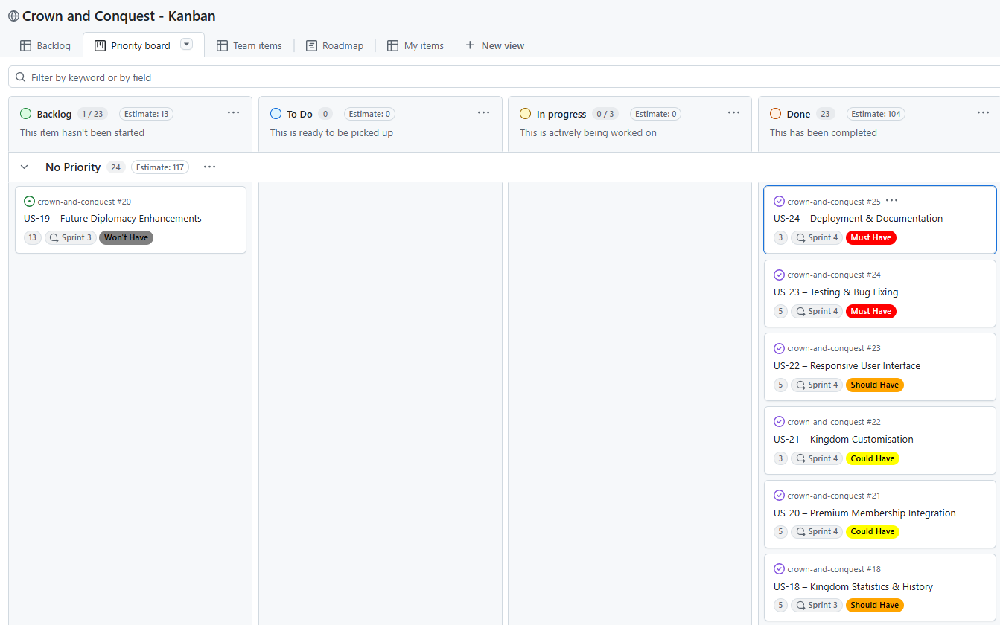

---

## Agile Reflection

Adopting an Agile methodology throughout the development of Crown & Conquest proved invaluable in managing a project that grew significantly in both size and complexity over time. Dividing development into clearly defined sprints made it possible to focus on a manageable number of objectives during each iteration while maintaining a functioning application throughout the entire development lifecycle.

The use of GitHub Projects provided a transparent overview of development progress at every stage, allowing user stories to move naturally through the workflow from backlog to completion. Story point estimation, sprint allocation, and MoSCoW prioritisation helped maintain realistic development goals while ensuring that the Minimum Viable Product remained the highest priority throughout the project.

Perhaps the greatest advantage of this iterative workflow was the opportunity to continually refine both the application and the development plan itself. As new ideas emerged and technical challenges became apparent, individual user stories could be reprioritised without disrupting the overall roadmap. This flexibility allowed the project to evolve organically while remaining aligned with its original objectives.

Looking back, the staged delivery of authentication, simulation mechanics, advanced gameplay systems, and finally refinement and deployment resulted in a far more maintainable and robust application than would likely have been achieved through a traditional linear development process. The completed Kanban board demonstrates not only the delivery of the planned MVP but also the effectiveness of using Agile principles to guide the development of a complex full-stack web application from initial concept through to production-ready release.

---

# Design

The visual design of **Crown & Conquest** was developed with the same philosophy that guided the technical implementation of the project: complexity should exist within the simulation itself rather than within the interface used to control it.

Although the application models numerous interconnected gameplay systems—including economics, diplomacy, warfare, AI-driven events, premium analytics, and historical reporting—the interface was intentionally designed to minimise cognitive load by presenting information through clear visual hierarchy, logical grouping, and consistent interaction patterns.

Unlike many medieval strategy games that favour dense interfaces and heavily ornamented visuals, Crown & Conquest adopts a more restrained interpretation of the medieval aesthetic. Decorative elements are used to reinforce immersion without compromising readability or usability. The result is an interface that evokes the atmosphere of medieval kingdom management while remaining practical as a modern web application.

Throughout development, every design decision was evaluated according to four guiding principles:

- Clarity before decoration.
- Consistency before complexity.
- Accessibility before aesthetics.
- Gameplay before visual effects.

These principles ensured that the visual presentation always supported the underlying simulation rather than distracting from it.

---

# Design Philosophy

At its core, Crown & Conquest is a data-driven application.

Every turn generates new information regarding the player's kingdom, requiring users to continuously monitor changing statistics, evaluate reports, respond to events, and formulate long-term strategies.

Consequently, the interface needed to satisfy two competing objectives.

Firstly, it had to communicate the atmosphere of ruling a medieval kingdom.

Secondly, it had to present large volumes of evolving information in a manner that remained understandable after many hours of gameplay.

Achieving this balance required avoiding two common design extremes.

A purely decorative medieval interface would likely obscure important gameplay information beneath excessive ornamentation.

Conversely, an overly minimalist dashboard would sacrifice much of the atmosphere that distinguishes the project from conventional management software.

The final design therefore combines subtle medieval-inspired styling with modern dashboard principles.

Cards, panels, tables, reports, and navigation components provide the organisational structure expected from contemporary web applications, while typography, textures, imagery, colours, and iconography reinforce the project's medieval identity without reducing usability.

This philosophy allows players to focus upon strategic decision making while remaining immersed within the world of the simulation.

---

# Visual Identity

The visual identity of Crown & Conquest is centred around the idea of governing a living medieval realm.

Rather than representing fantasy through exaggerated visual effects, the interface communicates authority, stability, and progression through structured layouts and restrained thematic styling.

The identity is reinforced through several recurring visual themes.

## Structured Information

Kingdom management naturally revolves around monitoring numerous variables simultaneously.

To prevent the interface becoming overwhelming, related information is grouped into clearly defined sections.

For example:

- kingdom statistics appear together;
- economic controls remain separate from military controls;
- reports are visually distinguished from strategic actions;
- historical information is separated from current kingdom data.

This organisation allows players to quickly identify the information relevant to their current objective without needing to search the entire interface.

---

## Medieval Inspiration

The medieval theme extends beyond decorative imagery.

Language, terminology, icons, colour choices, typography, and visual hierarchy all contribute towards reinforcing the identity of ruling a kingdom.

Examples include references to:

- kingdoms;
- diplomacy;
- warfare;
- battles;
- population;
- stability;
- infrastructure;
- prosperity;
- nobles;
- territories.

Rather than presenting gameplay through modern financial terminology, these thematic elements help maintain immersion throughout the application.

---

## Progressive Complexity

Another important aspect of the visual identity is the gradual introduction of complexity.

The homepage presents relatively little information beyond introducing the simulation.
 
Once authenticated, users gain access to progressively richer interfaces as gameplay begins.

The dashboard provides the primary overview.

Historical reports, diplomacy, premium analytics, AI events, and warfare each introduce additional information only when relevant.

This gradual increase in complexity allows users to build confidence before engaging with more sophisticated gameplay systems.

---

# Branding

Although Crown & Conquest was developed as an educational project, considerable attention was given to creating a coherent and recognisable visual brand.

Branding extends beyond the project title itself and encompasses the overall atmosphere presented throughout the application.

Several objectives informed branding decisions.

## Authority

The interface should communicate the responsibility associated with governing a kingdom.

Structured layouts, restrained colour usage, and balanced spacing all contribute towards creating an experience that feels deliberate rather than playful.

---

## Immersion

The branding avoids breaking the medieval atmosphere through unnecessary modern visual conventions.

Buttons, navigation, typography, and supporting imagery work together to reinforce the feeling of participating in an evolving medieval simulation rather than interacting with administrative software.

---

# Layout Strategy

Because Crown & Conquest presents large quantities of dynamic information, layout design became one of the most important aspects of the user experience.

Rather than placing information according to purely aesthetic considerations, layouts were organised according to the frequency with which users interact with each component.

This resulted in a clear hierarchy.

## Primary Content

The most important gameplay systems occupy the most visually prominent positions.

These include:

- current kingdom statistics;
- dashboard metrics;
- strategic controls;
- turn progression.

These components are intentionally positioned where users naturally begin scanning the page.

---

## Secondary Content

Supporting information is positioned nearby but remains visually distinct.

Examples include:

- recent events;
- battle summaries;
- diplomatic updates;
- leaderboard positions.

These features support decision making without distracting attention from the current state of the kingdom.

---

## Historical Information

Historical reports are separated from immediate gameplay controls.

This distinction helps players understand whether they are viewing the current simulation state or analysing previous outcomes.

Separating historical data from active gameplay also reduces interface clutter while improving navigation throughout the application.

---

# Responsive Strategy

Responsive behaviour formed a fundamental component of the design process rather than being introduced after desktop layouts had been completed.

From the earliest wireframes, every major page was designed across desktop, tablet, and mobile screen sizes simultaneously.

This ensured that responsive behaviour remained an integral part of the overall architecture instead of becoming a series of isolated layout adjustments.

Rather than simply shrinking desktop components, layouts reorganise themselves according to the user's device.

Information hierarchy is preserved while interaction patterns are adapted to suit different screen sizes.

---

## Desktop Experience

Desktop layouts prioritise information density.

The larger available screen space allows multiple panels to be displayed simultaneously, enabling users to compare different aspects of their kingdom without excessive scrolling.

For example, kingdom statistics, strategic controls, reports, and navigation remain visible together, encouraging efficient decision making.

This layout best supports experienced players who frequently monitor numerous gameplay systems simultaneously.

---

## Tablet Experience

Tablet layouts represent a transition between desktop productivity and mobile accessibility.

Columns begin collapsing into larger stacked sections while maintaining sufficient horizontal space for comparative analysis.

Interactive controls remain comfortably accessible through touch while preserving much of the dashboard's original organisation.

---

## Mobile Experience

The mobile experience required the greatest degree of adaptation.

Rather than attempting to preserve multi-column layouts, content is reorganised into a clear vertical hierarchy.

Priority is always given to:

1. Current kingdom state.
2. Strategic actions.
3. Recent events.
4. Historical information.

This organisation reduces unnecessary scrolling while ensuring that essential gameplay actions remain immediately accessible.

Buttons, forms, and interactive elements were also designed with touch interaction in mind, increasing usability on smaller devices without sacrificing functionality.

---

# Consistency

Maintaining consistency throughout the interface became increasingly important as the application expanded.

Repeated interaction patterns allow users to develop familiarity over time, reducing the effort required to navigate increasingly sophisticated gameplay systems.

Consistency is maintained through several recurring design principles.

- Uniform spacing between interface components.
- Consistent card layouts.
- Repeated typography hierarchy.
- Shared button styles.
- Predictable navigation.
- Reusable form styling.
- Consistent feedback messages.
- Standardised dashboard components.

These repeated visual patterns help users concentrate upon gameplay decisions rather than learning new interface conventions for each feature.

---

# Feedback and Interaction

Every meaningful user action produces clear visual feedback.

Whether creating a kingdom, progressing a turn, responding to an event, initiating diplomacy, declaring war, or subscribing to premium functionality, users receive immediate confirmation that their action has been processed successfully.

Providing timely feedback serves two important purposes.

Firstly, it increases confidence that the application is functioning correctly.

Secondly, it reinforces the relationship between player decisions and the evolving simulation.

This feedback loop is fundamental to the overall gameplay experience because it continually reminds users that their decisions have persistent consequences.

---

# Colour Palette

The visual identity of **Crown & Conquest** is built around a carefully selected palette inspired by medieval heraldry, illuminated manuscripts, and royal insignia. Rather than serving as purely decorative elements, colours play an important functional role throughout the application by reinforcing branding, establishing visual hierarchy, communicating gameplay information, and maintaining accessibility.

The palette combines deep navy backgrounds with rich gold accents to create a distinctive medieval atmosphere, while parchment-inspired neutrals provide comfortable reading surfaces that balance the darker interface elements. Supporting semantic colours are used consistently throughout the application to communicate system status, allowing players to interpret important information quickly without relying solely on textual feedback.

The colour palette used throughout the application is shown below.


The restrained use of colour helps maintain a professional appearance while ensuring that interactive elements, notifications, and gameplay information remain immediately recognisable. By avoiding excessive saturation, the interface reinforces the themes of governance, strategy, and long-term kingdom management rather than adopting a highly stylised fantasy aesthetic.

### Deep Navy (`#07111D`)

Deep Navy forms the primary background colour throughout the application and establishes the dark, immersive atmosphere that underpins the medieval theme. Its low luminance creates strong contrast against the lighter content panels and gold branding, allowing important interface elements to stand out while reducing visual fatigue during extended gameplay sessions.

### Navy Blue (`#142945`)

Navy Blue provides a secondary background colour for navigation, cards, and supporting interface components. Using a slightly lighter tone than the primary background introduces subtle depth throughout the interface while maintaining visual consistency across different sections of the application.

### Royal Blue (`#174F92`)

Royal Blue serves as the application's primary accent colour, highlighting interactive elements and providing additional visual emphasis where required. It introduces colour variation without distracting from the dominant medieval palette and complements the surrounding navy tones while remaining highly visible.

### Rich Gold (`#C9952D`)

Rich Gold is the principal brand colour and appears throughout the application's logo, headings, navigation highlights, buttons, and key interface elements. Inspired by traditional heraldic colours, it reinforces the regal identity of **Crown & Conquest** while immediately drawing attention to important actions and navigation controls.

### Bright Gold (`#F0C86A`)

Bright Gold is used sparingly for hover states, active elements, and decorative highlights. Providing a lighter variation of the primary brand colour creates additional visual feedback for interactive components while maintaining consistency with the overall branding.

### Parchment (`#F6EAD1`)

Parchment provides the primary background for cards, panels, reports, and content containers. Its warm neutral tone reflects the appearance of historical manuscripts, complementing the medieval theme while providing excellent contrast for both body text and interface controls.

### Ink (`#241A11`)

Ink serves as the primary text colour throughout the application. Rather than using pure black, this softer dark brown improves readability against the parchment backgrounds while reinforcing the historical aesthetic through its resemblance to traditional ink used in medieval documents.

### Status Colours

In addition to the primary branding palette, a collection of semantic colours communicates the current state of the application. These colours are used consistently throughout notifications, messages, and gameplay feedback to improve usability without disrupting the overall visual identity.

| Purpose | Colour | Hex |
|----------|--------|------|
| Success | Green | `#3F7C4C` |
| Warning | Amber | `#BF7E24` |
| Error / Danger | Red | `#923232` |
| Information | Blue | `#2B6D9C` |

Using dedicated semantic colours allows players to quickly distinguish between positive developments, warnings, critical events, and informational messages without needing to read every notification in detail. This visual language becomes increasingly valuable as kingdoms grow in complexity and larger volumes of simulation data are presented to the player.

Overall, the colour palette balances atmosphere, branding, and usability by combining a distinctive medieval aesthetic with the clarity and accessibility expected of a modern web application. The restrained use of decorative colours, together with strong contrast ratios and consistent semantic feedback, ensures that the interface remains visually engaging while supporting long-term strategic gameplay.

# Typography

Typography plays a fundamental role in establishing the identity of **Crown & Conquest**, balancing the atmosphere of a medieval strategy game with the readability expected of a modern web application. Rather than relying on a single typeface throughout the interface, the project adopts a complementary typographic system that pairs a decorative display font with a highly legible sans-serif font.

This combination creates a clear visual hierarchy while ensuring that the large volume of gameplay information, statistical data, and narrative content remains comfortable to read across desktop, tablet, and mobile devices.

The design system consists of two primary typefaces, each serving a distinct purpose within the interface.

---

## Primary Typeface — Cinzel

Cinzel serves as the primary display typeface and forms the foundation of the project's visual identity. Inspired by classical Roman inscriptions, its elegant letterforms evoke the prestige, authority, and grandeur commonly associated with medieval kingdoms and royal heraldry. Throughout the application, Cinzel is used selectively for branding and prominent interface elements, reinforcing the game's historical aesthetic without compromising readability.

### Primary Font Example

The image below demonstrates how Cinzel is used throughout the application for branding, page headings, navigation, and other prominent interface elements, establishing a strong visual identity while maintaining a clear typographic hierarchy.

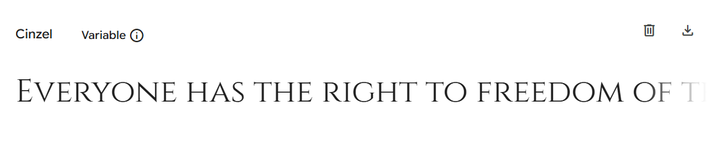

Cinzel is used for:

- Application logo and branding
- Page titles
- Section headings
- Navigation headings
- Primary buttons
- Card headings
- Major interface labels

Restricting Cinzel to high-level interface elements creates a strong visual hierarchy while preventing decorative typography from becoming overwhelming during extended gameplay sessions.

---

## Secondary Typeface — Inter

Inter serves as the application's primary body typeface and is used throughout the majority of the user interface. Designed specifically for digital interfaces, Inter offers exceptional readability across a wide range of screen sizes and resolutions, making it particularly well suited to the dashboard-driven nature of the application.

Its clean, modern appearance provides an effective contrast to the decorative headings, allowing players to comfortably read reports, statistical information, forms, and gameplay instructions without visual fatigue.

### Secondary Font Example

The image below illustrates how Inter is used for the application's primary content, including dashboard information, reports, forms, and interface controls. Its excellent readability ensures that large quantities of gameplay information remain easy to scan across all supported devices.

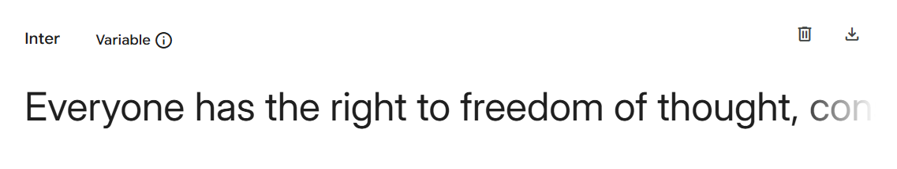

Inter is used for:

- Body text
- Dashboard content
- Reports and historical records
- Forms and input fields
- Tables and statistical information
- Notifications and system messages
- General interface text

---

## Typographic Hierarchy

Combining Cinzel and Inter establishes a clear hierarchy that helps users distinguish between navigational elements, gameplay content, and supporting information at a glance. Decorative headings immediately communicate structure and reinforce the medieval theme, while the restrained use of Inter ensures that large quantities of information remain easy to scan and understand.

This hierarchy is particularly important throughout the application's dashboards and reports, where players frequently review complex simulation data before making strategic decisions.

---

## Readability & Accessibility

Typography was selected with accessibility and long-term usability in mind. While Cinzel provides the project's distinctive visual identity, it is intentionally reserved for headings and branding where larger font sizes preserve legibility. All extended reading content uses Inter, whose generous x-height, consistent letter spacing, and clean characterforms improve readability across both desktop and mobile devices.

Additional typographic considerations include:

- Clear heading hierarchy throughout every page.
- Consistent font sizing and spacing across the interface.
- Comfortable line lengths for extended reading.
- Strong colour contrast between text and background surfaces.
- Responsive typography that scales effectively across desktop, tablet, and mobile layouts.

Together, Cinzel and Inter create a balanced typographic system that successfully combines the atmosphere of a medieval fantasy strategy game with the clarity, accessibility, and usability expected of a contemporary full-stack web application.

# System Design

One of the primary objectives of Crown & Conquest was to develop a simulation that remained understandable from both a gameplay and software engineering perspective.

As the project evolved, the number of interacting systems increased considerably. Authentication, kingdom management, economic simulation, diplomacy, warfare, AI-assisted event handling, premium functionality, and payment processing all communicate with one another through the Django backend.

Without careful planning, these relationships could easily have become difficult to understand and maintain.

For this reason, a series of diagrams were produced during development to visualise both the logical flow of the application and the relationships between its underlying data structures.

Rather than acting purely as design artefacts created before implementation, these diagrams also served as documentation throughout development, helping to ensure that newly introduced functionality remained consistent with the existing architecture.

The following sections discuss the application's flowcharts and Entity Relationship Diagram (ERD), explaining not only how each system operates but also why these architectural decisions were adopted.

---

# Application Flowcharts

Unlike relatively simple CRUD applications where user requests typically follow straightforward request-response cycles, Crown & Conquest revolves around a persistent simulation consisting of numerous interconnected systems.

Each player action has the potential to influence multiple parts of the application simultaneously.

For example, progressing a turn may:

- update kingdom statistics;
- generate random events;
- modify diplomatic relationships;
- trigger warfare;
- store historical snapshots;
- update leaderboard rankings;
- produce AI event prompts;
- unlock premium analytical information.

Visualising these interactions through flowcharts proved extremely valuable throughout development.

They helped clarify the sequence of operations taking place behind each major gameplay mechanic while reducing the complexity involved in reasoning about interactions between multiple systems.

Rather than simply documenting implementation after development had finished, the flowcharts became planning tools that supported iterative refinement throughout the project.

---

## Overall Application Flow

The first flowchart illustrates the overall journey through the application.

Rather than focusing upon individual implementation details, it presents the high-level progression experienced by a typical player, beginning with authentication and continuing through the core gameplay loop.

This provides an overview of how the application's major systems interact with one another while demonstrating the relationship between user actions and the persistent simulation.

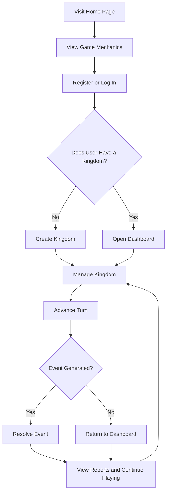
```mermaid
flowchart TD

    A[Visit Home Page]
    --> B[View Game Mechanics]

    B --> C[Register or Log In]

    C --> D{Does User Have a Kingdom?}

    D -- No --> E[Create Kingdom]
    D -- Yes --> F[Open Dashboard]

    E --> G[Manage Kingdom]
    F --> G

    G --> H[Advance Turn]

    H --> I{Event Generated?}

    I -- Yes --> J[Resolve Event]
    I -- No --> K[Return to Dashboard]

    J --> L[View Reports and Continue Playing]
    K --> L

    L --> G
```

The diagram illustrates how Crown & Conquest centres around a continuous gameplay cycle rather than isolated user interactions.

After authentication, players establish their kingdom before entering a repeating loop of strategic decision making. Each completed turn updates the simulation, generates new outcomes, stores historical information, and prepares the next strategic decision.

This cyclical structure reflects the project's central design philosophy: kingdoms evolve continuously rather than progressing through predetermined stages.

---

## Turn Progression Flow

The turn progression system represents the heart of the simulation.

Although advancing a turn appears to users as a single action, considerable processing occurs on the server before the updated kingdom state is returned to the dashboard.

The flowchart below illustrates this sequence.

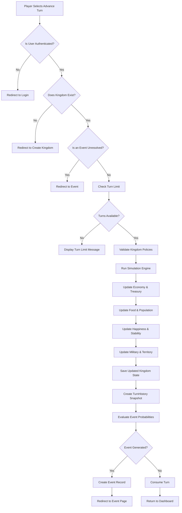
```mermaid
flowchart TD

    A[Player Selects Advance Turn]
    --> B{Is User Authenticated?}

    B -- No --> Z1[Redirect to Login]
    B -- Yes --> C{Does Kingdom Exist?}

    C -- No --> Z2[Redirect to Create Kingdom]
    C -- Yes --> D{Is an Event Unresolved?}

    D -- Yes --> E[Redirect to Event]
    D -- No --> F[Check Turn Limit]

    F --> G{Turns Available?}

    G -- No --> H[Display Turn Limit Message]
    G -- Yes --> I[Validate Kingdom Policies]

    I --> J[Run Simulation Engine]

    J --> K[Update Economy & Treasury]
    K --> L[Update Food & Population]
    L --> M[Update Happiness & Stability]
    M --> N[Update Military & Territory]

    N --> O[Save Updated Kingdom State]

    O --> P[Create TurnHistory Snapshot]

    P --> Q[Evaluate Event Probabilities]

    Q --> R{Event Generated?}

    R -- Yes --> S[Create Event Record]
    S --> T[Redirect to Event Page]

    R -- No --> U[Consume Turn]
    U --> V[Return to Dashboard]
```

The process begins when the player chooses to advance their kingdom by one turn.

Rather than simply increasing a turn counter, the backend recalculates numerous gameplay variables including economic production, population changes, food availability, stability, infrastructure development, military capacity, and treasury values.

Once these calculations have been completed, additional systems evaluate whether random events should occur.

If event conditions are satisfied, the appropriate event is generated and presented to the player. Historical records are then created before the updated kingdom state is saved to the database and displayed on the dashboard.

Performing these calculations server-side provides two important advantages.

Firstly, it ensures that the simulation remains consistent for every player.

Secondly, it prevents client-side manipulation of gameplay values, improving both fairness and security.

---

## Event Generation Flow

One of the distinguishing characteristics of Crown & Conquest is its dynamic event system.

Rather than relying upon scripted sequences, events emerge according to the evolving condition of each kingdom.

The following flowchart illustrates this process.

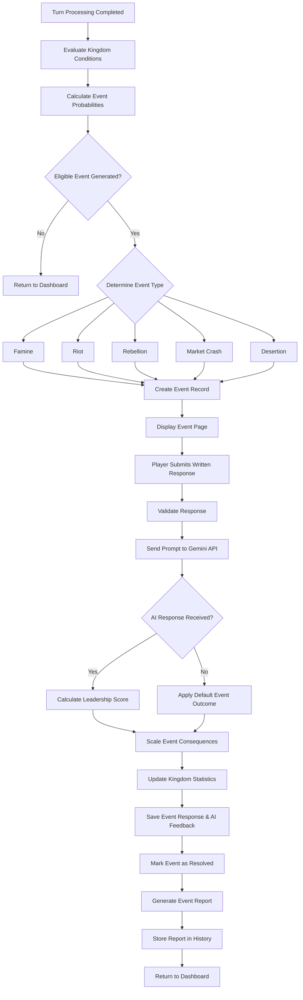
```mermaid
flowchart TD

    A[Turn Processing Completed]
    --> B[Evaluate Kingdom Conditions]

    B --> C[Calculate Event Probabilities]

    C --> D{Eligible Event Generated?}

    D -- No --> E[Return to Dashboard]

    D -- Yes --> F{Determine Event Type}

    F --> G[Famine]
    F --> H[Riot]
    F --> I[Rebellion]
    F --> J[Market Crash]
    F --> K[Desertion]

    G --> L[Create Event Record]
    H --> L
    I --> L
    J --> L
    K --> L

    L --> M[Display Event Page]

    M --> N[Player Submits Written Response]

    N --> O[Validate Response]

    O --> P[Send Prompt to Gemini API]

    P --> Q{AI Response Received?}

    Q -- No --> R[Apply Default Event Outcome]

    Q -- Yes --> S[Calculate Leadership Score]

    S --> T[Scale Event Consequences]
    R --> T

    T --> U[Update Kingdom Statistics]

    U --> V[Save Event Response & AI Feedback]

    V --> W[Mark Event as Resolved]

    W --> X[Generate Event Report]

    X --> Y[Store Report in History]

    Y --> Z[Return to Dashboard]
```

After each turn has been processed, the simulation evaluates multiple kingdom attributes to determine whether event conditions have been satisfied.

Examples include:

- food shortages;
- declining stability;
- military weakness;
- economic prosperity;
- population growth;
- diplomatic circumstances.

Where appropriate, probabilistic evaluation introduces controlled randomness into the simulation.

This approach produces two important benefits.

Firstly, kingdoms with similar statistics can still experience different histories.

Secondly, player decisions influence the likelihood of particular events without making outcomes entirely predictable.

The resulting gameplay remains strategically meaningful while avoiding excessive repetition.

---

## Diplomacy and Warfare

Diplomacy and warfare extend the simulation beyond purely internal kingdom management.

Instead of treating military expansion as an isolated mechanic, conflict emerges through interactions between diplomatic relationships and strategic player decisions.

The flowchart below summarises this process.

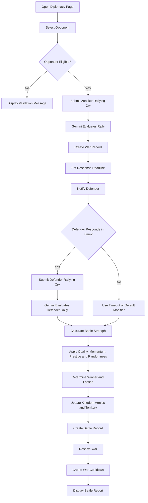
```mermaid
flowchart TD
    A[Open Diplomacy Page] --> B[Select Opponent]
    B --> C{Opponent Eligible?}
    C -->|No| D[Display Validation Message]
    C -->|Yes| E[Submit Attacker Rallying Cry]
    E --> F[Gemini Evaluates Rally]
    F --> G[Create War Record]
    G --> H[Set Response Deadline]
    H --> I[Notify Defender]
    I --> J{Defender Responds in Time?}
    J -->|Yes| K[Submit Defender Rallying Cry]
    J -->|No| L[Use Timeout or Default Modifier]
    K --> M[Gemini Evaluates Defender Rally]
    M --> N[Calculate Battle Strength]
    L --> N
    N --> O[Apply Quality, Momentum, Prestige and Randomness]
    O --> P[Determine Winner and Losses]
    P --> Q[Update Kingdom Armies and Territory]
    Q --> R[Create Battle Record]
    R --> S[Resolve War]
    S --> T[Create War Cooldown]
    T --> U[Display Battle Report]
```

The process begins with diplomatic interaction between kingdoms.

Depending upon the player's actions and the current state of diplomatic relations, peaceful cooperation may continue or tensions may escalate towards armed conflict.

Should war occur, battle calculations determine military outcomes before territorial changes, reports, historical records, and leaderboard positions are updated accordingly.

Separating diplomacy from warfare provides greater flexibility than treating conflict as a simple button press.

It also creates additional strategic depth by allowing players to consider peaceful alternatives before initiating military expansion.

---

## Premium Functionality

Premium functionality integrates several independent systems including authentication, subscription management, access control, and premium analytical dashboards.

The following flowchart summarises this workflow.

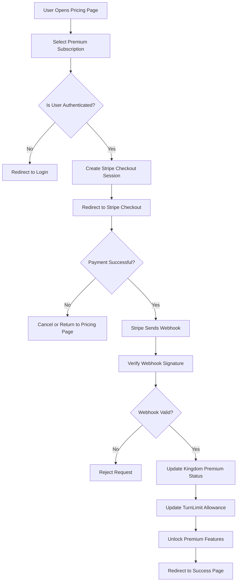
```mermaid
flowchart TD

    A[User Opens Pricing Page]
    --> B[Select Premium Subscription]

    B --> C{Is User Authenticated?}

    C -- No --> D[Redirect to Login]

    C -- Yes --> E[Create Stripe Checkout Session]

    E --> F[Redirect to Stripe Checkout]

    F --> G{Payment Successful?}

    G -- No --> H[Cancel or Return to Pricing Page]

    G -- Yes --> I[Stripe Sends Webhook]

    I --> J[Verify Webhook Signature]

    J --> K{Webhook Valid?}

    K -- No --> L[Reject Request]

    K -- Yes --> M[Update Kingdom Premium Status]

    M --> N[Update TurnLimit Allowance]

    N --> O[Unlock Premium Features]

    O --> P[Redirect to Success Page]
```

Authenticated users requesting premium functionality first undergo subscription verification.

Users with active subscriptions gain access to enhanced analytical dashboards, additional historical reporting, and premium statistical information.

Users without active subscriptions are instead directed towards the Stripe payment workflow before premium content becomes available.

Separating authentication, payment processing, and premium content access simplifies maintenance while reducing coupling between unrelated components of the application.

---

## AI Decision Workflows

Artificial intelligence is one of the defining features of **Crown & Conquest**, but rather than functioning as a general-purpose chatbot, it has been integrated into two specific gameplay systems where qualitative decision making enhances the simulation.

The first workflow evaluates how rulers respond to internal kingdom crises, allowing written decisions to influence the severity of dynamic events. The second evaluates rallying cries submitted before warfare, converting each ruler's leadership into numerical modifiers that contribute to battle resolution.

Separating these workflows ensures that AI supports gameplay mechanics directly while preserving deterministic simulation logic for the wider application.

---

## Event AI Decision Workflow

The first AI workflow operates within the dynamic event system. When a kingdom experiences a crisis, players are invited to describe how they intend to respond as the ruler of their realm rather than selecting from a predefined list of options.

The submitted response is validated before being sent to Google's Gemini API using a carefully structured prompt designed to assess leadership qualities rather than generate unrestricted text.

Gemini evaluates each response according to multiple characteristics including empathy, leadership, and practicality. These individual scores are combined into an overall leadership score which is then used to adjust the severity of the event's predefined consequences before the updated kingdom state is saved.

By evaluating free-text responses instead of fixed dialogue options, the application encourages players to think strategically while ensuring that every decision can produce meaningful and persistent gameplay consequences.

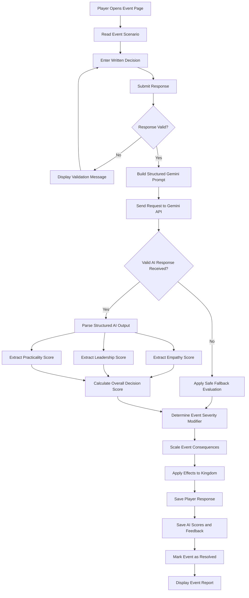
```mermaid
flowchart TD

    A[Player Opens Event Page]
    --> B[Read Event Scenario]

    B --> C[Enter Written Decision]

    C --> D[Submit Response]

    D --> E{Response Valid?}

    E -- No --> F[Display Validation Message]
    F --> C

    E -- Yes --> G[Build Structured Gemini Prompt]

    G --> H[Send Request to Gemini API]

    H --> I{Valid AI Response Received?}

    I -- No --> J[Apply Safe Fallback Evaluation]

    I -- Yes --> K[Parse Structured AI Output]

    K --> L[Extract Empathy Score]
    K --> M[Extract Leadership Score]
    K --> N[Extract Practicality Score]

    L --> O[Calculate Overall Decision Score]
    M --> O
    N --> O

    J --> P[Determine Event Severity Modifier]
    O --> P

    P --> Q[Scale Event Consequences]

    Q --> R[Apply Effects to Kingdom]

    R --> S[Save Player Response]

    S --> T[Save AI Scores and Feedback]

    T --> U[Mark Event as Resolved]

    U --> V[Display Event Report]
```

Unlike conventional AI integrations that simply generate narrative text, the resulting evaluation becomes part of the persistent simulation. The player's response, Gemini feedback, leadership score, and final consequences are all stored within the database, allowing event reports and historical records to accurately reflect how individual decisions shaped the kingdom's development.

---

## Warfare AI Decision Workflow

Artificial intelligence is also integrated into the warfare system, although it serves a different purpose from the event workflow.

Before battle calculations begin, both the attacking and defending rulers are invited to submit a rallying cry intended to inspire their armies. Rather than evaluating crisis management, Gemini assesses the motivational quality of each speech and converts the result into a numerical battle modifier.

These modifiers become one of several factors used during combat resolution alongside army strength, army quality, prestige, momentum, and controlled randomness.

This approach rewards thoughtful leadership without allowing AI-generated scores to dominate the outcome of battles. Military success continues to depend primarily upon strategic kingdom development, while effective rallying cries provide an additional tactical advantage.

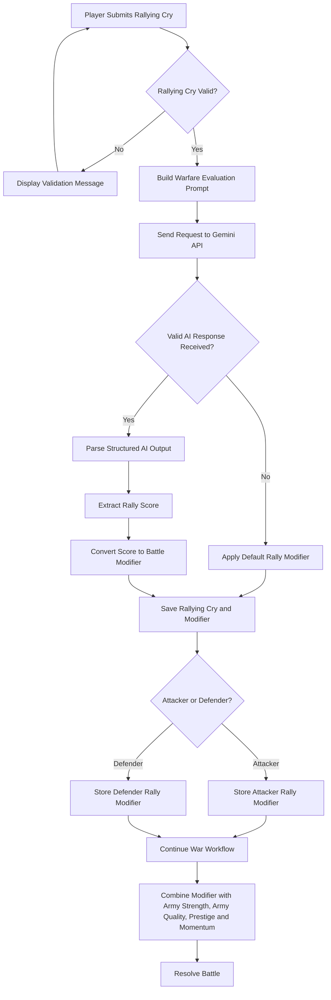
```mermaid
flowchart TD

    A[Player Submits Rallying Cry]
    --> B{Rallying Cry Valid?}

    B -- No --> C[Display Validation Message]
    C --> A

    B -- Yes --> D[Build Warfare Evaluation Prompt]

    D --> E[Send Request to Gemini API]

    E --> F{Valid AI Response Received?}

    F -- No --> G[Apply Default Rally Modifier]

    F -- Yes --> H[Parse Structured AI Output]

    H --> I[Extract Rally Score]

    I --> J[Convert Score to Battle Modifier]
    G --> K[Save Rallying Cry and Modifier]
    J --> K

    K --> L{Attacker or Defender?}

    L -- Attacker --> M[Store Attacker Rally Modifier]
    L -- Defender --> N[Store Defender Rally Modifier]

    M --> O[Continue War Workflow]
    N --> O

    O --> P[Combine Modifier with Army Strength, Army Quality, Prestige and Momentum]

    P --> Q[Resolve Battle]
```

Separating the two AI workflows demonstrates that Gemini has been integrated as a genuine gameplay system rather than a standalone feature. In both cases, artificial intelligence contributes structured data that influences persistent simulation mechanics while remaining fully integrated with the application's existing business logic, database models, and historical reporting systems.

# Database Design

The database architecture of **Crown & Conquest** was designed to support a persistent simulation rather than a conventional collection of independent CRUD records. Every completed turn, generated event, military declaration, battle result, and cooldown contributes to an evolving gameplay state that must remain internally consistent across multiple sessions.

The schema therefore separates three primary responsibilities:

- **Current state**, represented by the active `Kingdom` and its related control records.
- **Historical state**, preserved through turn, event, war, and battle records.
- **Gameplay constraints**, enforced through turn limits, unresolved-event checks, warfare status, and cooldown records.

This structure allows the current kingdom to continue evolving while preserving the exact outcomes that produced its present condition. It also prevents the central `Kingdom` model from becoming overloaded with historical, temporary, or system-control data.

The complete and subsystem diagrams below present the database at different levels of detail. The full ERD documents the wider schema, the simplified diagram clarifies the principal relationships, and the two subsystem diagrams examine the kingdom-management and warfare domains independently.

---

## Complete Entity Relationship Diagram

The complete ERD provides the most detailed representation of the application's primary gameplay models and their relationships. It includes the principal fields used by authentication, kingdom management, turn progression, event processing, premium access, warfare, battle reporting, and cooldown enforcement.

The diagram demonstrates that the `Kingdom` model forms the centre of the gameplay domain. The authenticated user owns the kingdom, while turn history, limits, events, wars, battles, and cooldowns all extend from the kingdom through clearly defined relational links.

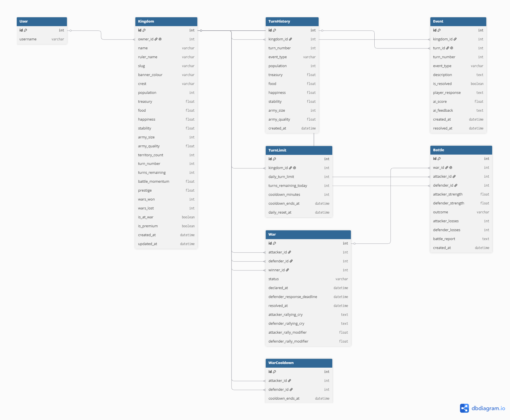

Although the complete ERD includes many fields, these attributes can be understood as belonging to several broad categories.

### Identity and Customisation

The `Kingdom` model stores identity fields such as:

- kingdom name;
- ruler name;
- slug;
- banner colour;
- crest.

These values allow each realm to maintain a distinct identity without mixing visual customisation with account authentication.

### Current Simulation State

The kingdom also stores the live values used by the simulation, including:

- population;
- treasury;
- food;
- happiness;
- stability;
- army size;
- army quality;
- territory count;
- current turn.

These values represent the kingdom as it exists at the present moment. They are recalculated through turn processing and subsequently displayed through the dashboard and other active gameplay interfaces.

### Progression and Warfare State

Additional fields preserve strategic progression and military context, including:

- remaining turns;
- battle momentum;
- prestige;
- wars won;
- wars lost;
- current warfare state;
- premium status.

Keeping these values on the kingdom allows the application to evaluate eligibility, calculate rankings, resolve battles, and provide premium functionality without reconstructing the current state from historical records.

### Historical and Supporting Records

The models surrounding `Kingdom` preserve the information that should not be overwritten when the live state changes.

These include:

- `TurnHistory`;
- `Event`;
- `War`;
- `Battle`;
- `TurnLimit`;
- `WarCooldown`.

Together, they provide the historical and rule-enforcement layers required by the simulation.

---

## Simplified System Overview

The complete diagram is valuable for technical reference, but its level of detail can make the overall architecture difficult to interpret at a glance. The simplified ERD therefore removes many implementation-specific attributes and focuses on the principal entities and foreign-key relationships.

This diagram is intended to communicate how the application fits together conceptually before the individual subsystems are examined in greater depth.


The simplified schema can be read as a sequence of connected gameplay domains:

```text
User
  ↓
Kingdom
  ├── TurnHistory
  │      └── Event
  ├── TurnLimit
  ├── War
  │      └── Battle
  └── WarCooldown
```

# Database Architecture

The `Kingdom` remains the central entity because almost every gameplay action affects or references a realm. However, responsibilities are deliberately distributed across related models rather than concentrated within a single database table.

## User and Kingdom Ownership

The `User` model represents the authenticated account, while `Kingdom` represents the persistent simulation controlled by that account.

The relationship is effectively one-to-one:

```text
User
  │
  └── Kingdom
```

Separating authentication from gameplay was an important architectural decision. Django and Allauth remain responsible for account identity and session management, while the kingdom application manages simulation-specific data.

This separation provides several benefits:

- Authentication can evolve independently of gameplay.
- The user model is not overloaded with simulation fields.
- Ownership checks remain explicit.
- Kingdom deletion or recreation can be handled without modifying authentication records.
- Future account-level features can be introduced without restructuring the simulation domain.

The kingdom therefore acts as the bridge between the authenticated user and every major gameplay subsystem.

---

## Kingdom as the Authoritative Current State

The `Kingdom` model stores the current state of the player's realm.

When the player advances a turn, simulation logic recalculates the relevant economic, social, territorial, and military values before saving the updated state back to this model.

The kingdom is therefore mutable:

```text
Kingdom = present simulation state
```

This distinguishes it from historical models, which preserve past outcomes.

The current state is consumed by:

- The dashboard.
- Event probability calculations.
- Leaderboards.
- Premium statistics.
- Diplomacy.
- Warfare eligibility.
- Battle calculations.
- AI-generated policy advice.

The design avoids recalculating the present state from historical records every time a page is requested, improving both clarity and performance.

---

# Kingdom Management Subsystem

The Kingdom Management ERD isolates the models responsible for turn progression, persistent history, event processing, premium turn allowances, and the evolving state of the realm.

By separating this subsystem from warfare, the relationship between live kingdom data and historical simulation records becomes easier to understand.

The subsystem is built around four principal models:

1. `Kingdom`
2. `TurnHistory`
3. `TurnLimit`
4. `Event`

The diagram below shows the relationships between the inbuilt `User` model and the `Kingdom`, `TurnHistory`, `TurnLimit`, and `Event` models.

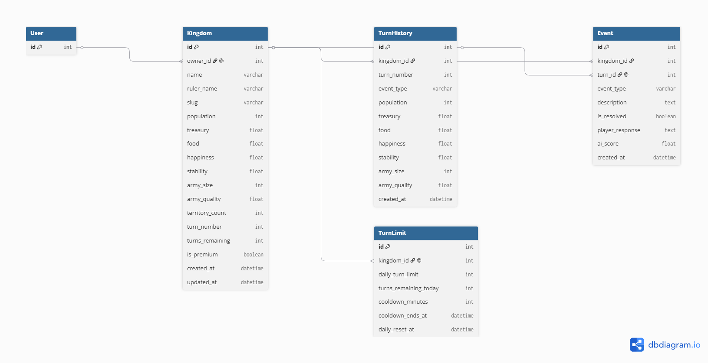

---

## Kingdom

Within this subsystem, `Kingdom` is the source of truth for the live simulation.

Its values are updated by the turn engine and by resolved events. For example, a completed turn may change population, treasury, food, happiness, stability, army size, and army quality. An event response may subsequently modify some of those values again.

Because the kingdom always represents the latest state, it can be displayed immediately without replaying the full simulation history.

---

## Turn History

A `TurnHistory` record is created whenever a turn is successfully processed.

The model stores a snapshot of the kingdom at that point in time, including values such as:

- Turn number
- Event type
- Population
- Treasury
- Food
- Happiness
- Stability
- Army size
- Army quality
- Creation timestamp

The relationship is one-to-many:

```text
Kingdom
  │
  └── many TurnHistory records
```

This design is essential because the current kingdom continues changing after every turn. Without snapshots, previous states would be lost or would need to be reconstructed through potentially fragile calculations.

Persisting the values directly supports:

- Turn reports
- Long-term history
- Premium analytics
- Trend comparison
- Debugging and auditability

The snapshots are treated as historical evidence rather than mutable gameplay state.

---

## Turn Limit

The `TurnLimit` model manages turn availability independently of the simulation itself.

It stores values such as:

- Daily turn limit
- Turns remaining for the current day
- Cooldown duration
- Cooldown end time
- Daily reset time

The relationship between `Kingdom` and `TurnLimit` is one-to-one.

```text
Kingdom
  │
  └── TurnLimit
```

Separating this data prevents rate-limiting rules from becoming mixed with economic and military values.

It also makes premium behaviour easier to manage. Premium status can alter the daily allowance through the associated limit record without changing the core turn-processing algorithm or historical schema.

Before a turn begins, the application can validate:

1. The player has available turns.
2. The cooldown has expired.
3. No unresolved event is blocking progression.

Only after these checks pass does the simulation update the kingdom.

---

## Event

The `Event` model preserves crises generated during turn processing.

Each event references both:

- The affected kingdom.
- The turn during which it occurred.

This dual relationship establishes ownership and historical context.

```text
Kingdom
  │
  ├── TurnHistory
  │       │
  │       └── Event
  │
  └── Event
```

The event record stores information including:

- Event type
- Turn number
- Narrative description
- Resolution state
- Player response
- AI score
- AI feedback
- Creation time
- Resolution time

This is especially important because the event workflow spans multiple requests. The event is generated after turn processing, displayed to the player, resolved after a written response, evaluated through Gemini, and finally applied to the kingdom.

The database record preserves that state throughout the workflow.

---

## Event Resolution Flow

The relationship between `Kingdom`, `TurnHistory`, and `Event` supports the following lifecycle:

```text
Player advances turn
        ↓
Kingdom recalculated
        ↓
TurnHistory snapshot created
        ↓
Event probabilities evaluated
        ↓
Event record created
        ↓
Further turns temporarily blocked
        ↓
Player submits response
        ↓
Gemini evaluates response
        ↓
Consequences applied to Kingdom
        ↓
Event marked resolved
```

Linking the event to the originating turn prevents it from becoming detached from the conditions that caused it.

The `is_resolved` field also performs an important rule-enforcement function. An unresolved event prevents the player from advancing another turn, ensuring that crises cannot be bypassed.

---

## AI Data Persistence

The event schema demonstrates that the Gemini integration is not limited to generating temporary text.

The player's response, AI score, and AI feedback are persisted with the event. This provides several benefits:

- The result remains available in historical views.
- Event reports can explain the evaluation.
- Gameplay effects can be traced back to the recorded decision.
- Future analytics could compare leadership responses across event types.

The AI therefore contributes to the persistent simulation rather than operating as a disconnected interface enhancement.

---

# Warfare Subsystem

The Warfare ERD isolates the models responsible for military declarations, response windows, battle resolution, historical reports, and bilateral cooldown enforcement.

This subsystem is intentionally separated from turn progression because war follows its own staged lifecycle and involves multiple kingdoms simultaneously.

The warfare domain is built around four connected models:

1. `Kingdom`
2. `War`
3. `Battle`
4. `WarCooldown`

The diagram below shows the relationships between these models:

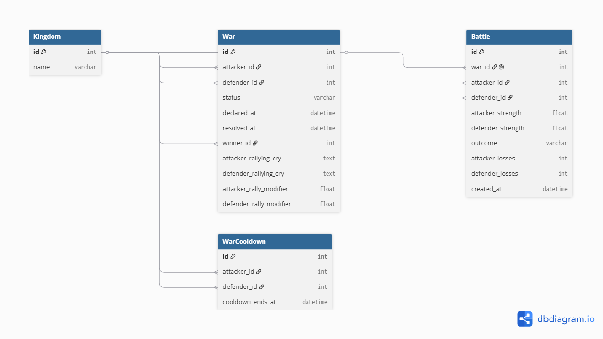

---

## War

The `War` model represents the complete lifecycle of a military challenge.

It references the `Kingdom` model multiple times through role-specific foreign keys:

- Attacker
- Defender
- Winner

Conceptually:

```text
Kingdom ── attacker ──┐
                      ├── War
Kingdom ── defender ──┤
Kingdom ── winner ────┘
```

Using separate role-based relationships allows the application to retrieve:

- Wars declared by a kingdom
- Wars received by a kingdom
- Wars won by a kingdom

The model also stores:

- Status
- Declaration time
- Defender response deadline
- Resolution time
- Attacker rallying cry
- Defender rallying cry
- Attacker rally modifier
- Defender rally modifier

The status field allows the same record to move through several stages instead of creating unrelated records for declaration and resolution.

A typical lifecycle is:

```text
Declared
   ↓
Awaiting defender response
   ↓
Accepted or timed out
   ↓
Resolved
```

The response deadline supports asynchronous gameplay by giving the defending player a limited period in which to submit their rallying cry.

---

## Rallying Cries and AI Modifiers

Both kingdoms may submit rallying cries before battle resolution.

These written responses are evaluated through Gemini and converted into numerical modifiers stored directly on the `War` record.

Persisting both the original text and the resulting modifiers provides:

- A narrative record of the confrontation.
- Reproducible battle calculations.
- Historical context for reports.
- Separation between AI evaluation and combat resolution.

The battle engine therefore consumes already stored modifiers rather than repeatedly sending the same response to the external AI service.

---

## Battle

The `Battle` model stores the resolved military engagement.

Each battle references:

- Its originating war
- The attacking kingdom
- The defending kingdom

The relationship between `War` and `Battle` is one-to-one in the intended workflow:

```text
War
  │
  └── Battle
```

Separating the declaration from the result reflects the staged nature of warfare. A war may exist while awaiting a response, but a battle only exists once combat has been resolved.

The battle stores:

- Attacker strength
- Defender strength
- Outcome
- Attacker losses
- Defender losses
- Battle report
- Creation time

These values are persisted after the simulation completes.

This prevents historical reports from changing if the participating kingdoms later gain troops, improve quality, or acquire territory.

---

## Battle Resolution Flow

The warfare relationships support the following process:

```text
Attacker selects defender
        ↓
War record created
        ↓
Attacker rally stored and evaluated
        ↓
Defender responds or deadline expires
        ↓
Defender rally evaluated
        ↓
Battle strengths calculated
        ↓
Losses and outcome determined
        ↓
Kingdom values updated
        ↓
Battle record created
        ↓
War marked resolved
```

The battle calculation can use current kingdom values together with stored rally modifiers, momentum, prestige, and controlled randomness.

After resolution, the live `Kingdom` records are updated while the `Battle` preserves the exact values used during the engagement.

---

## War Cooldown

The `WarCooldown` model prevents the same pair of kingdoms from repeatedly entering conflict without interruption.

It stores:

- Attacking kingdom
- Defending kingdom
- Cooldown end time

```text
Attacker Kingdom
       │
       ├── WarCooldown
       │
Defender Kingdom
```

A separate model was chosen instead of adding a global cooldown field to `Kingdom`.

This allows restrictions to be applied to a specific pair of kingdoms rather than preventing all military activity.

The design supports rules such as:

- Kingdom A cannot immediately attack Kingdom B again.
- Kingdom A may remain eligible to interact with Kingdom C.
- The cooldown can be checked in either relevant direction where required.

This produces more precise gameplay control while keeping temporary relationship state outside the permanent kingdom model.

---

# Relationship Summary

| Relationship | Cardinality | Purpose |
|-------------|------------|----------|
| `User` → `Kingdom` | One-to-one | Connects an authenticated account to its persistent realm |
| `Kingdom` → `TurnHistory` | One-to-many | Preserves successive simulation snapshots |
| `Kingdom` → `TurnLimit` | One-to-one | Controls daily allowance, cooldown, and premium turn rules |
| `Kingdom` → `Event` | One-to-many | Stores crises experienced by the kingdom |
| `TurnHistory` → `Event` | Optional one-to-one | Links a generated event to its originating turn |
| `Kingdom` → `War` | Multiple role-based links | Identifies attacker, defender, and winner |
| `War` → `Battle` | One-to-one | Associates a declaration lifecycle with its resolved engagement |
| `Kingdom` → `Battle` | Multiple role-based links | Identifies participating kingdoms |
| `Kingdom` → `WarCooldown` | Multiple role-based links | Enforces temporary bilateral conflict restrictions |

---

# Normalisation

The schema follows a normalised design in which each model represents a distinct domain concept.

For example:

- Current kingdom values remain on `Kingdom`.
- Previous simulation states remain in `TurnHistory`.
- Event decisions remain in `Event`.
- Declarations and response windows remain in `War`.
- Calculated military results remain in `Battle`.
- Turn restrictions remain in `TurnLimit`.
- Bilateral military restrictions remain in `WarCooldown`.

This reduces duplication and ensures that each table has a clear responsibility.

The separation also limits the impact of future changes. For example, expanding battle reports primarily affects `Battle`, while changing daily turn rules primarily affects `TurnLimit`.

---

# Data Integrity

Relational constraints and Django ORM validation help ensure that records remain internally consistent.

The model relationships support checks such as:

- Confirming that a user owns the kingdom being modified.
- Preventing turn progression while an event remains unresolved.
- Preventing a kingdom from declaring war against itself.
- Confirming that both kingdoms are eligible for combat.
- Preventing duplicate battle resolution.
- Enforcing bilateral warfare cooldowns.
- Synchronising premium status with turn allowance.

Foreign keys ensure that event, turn, war, battle, and cooldown records cannot exist independently of the kingdoms they describe.

This contributes directly to both technical reliability and gameplay fairness.

---

# Historical Persistence

A major objective of the database design was preserving the exact outcomes of prior gameplay.

The application stores results rather than attempting to recreate them later.

This principle applies throughout the schema:

- `TurnHistory` preserves the state after each turn.
- `Event` preserves the crisis, response, AI evaluation, and resolution.
- `War` preserves the declaration lifecycle and rallying cries.
- `Battle` preserves strengths, losses, outcome, and report.
- `WarCooldown` preserves the temporary post-conflict restriction.

Historical views therefore remain accurate even after the current kingdom has changed substantially.

The same persisted data also supports premium analytics, where multiple historical snapshots can be compared to identify long-term trends.

---

# Extensibility

The database was designed to support future expansion without requiring fundamental restructuring.

Potential additions could be introduced through new models linked to `Kingdom`, `TurnHistory`, or `War`, including:

- Diplomatic treaties
- Alliances
- Trade agreements
- Espionage reports
- Achievements
- Technologies
- Seasonal modifiers
- Multiple battle types
- Expanded subscription history

Because current state, historical state, and temporary control state are already separated, future systems can be added incrementally while preserving existing records.

---

# Database Design Reflection

The completed schema reflects the core philosophy of **Crown & Conquest**: a kingdom should exist as both a live strategic state and a permanent historical narrative.

`Kingdom` represents the present. `TurnHistory`, `Event`, `War`, and `Battle` preserve the decisions and outcomes that produced it. `TurnLimit` and `WarCooldown` enforce gameplay rules without mixing temporary restrictions with permanent simulation values.

Using a complete ERD, a simplified overview, and subsystem diagrams makes this architecture easier to evaluate at different levels of detail. Together, the diagrams demonstrate how the project extends beyond a conventional CRUD application into a relationally modelled, persistent strategy simulation.

# Wireframes

Wireframing played a fundamental role in the early planning of Crown & Conquest, allowing the structure of the application to be explored before any development work began. Rather than focusing on colours, typography, or visual styling, the wireframes concentrated entirely on content hierarchy, navigation, user flow, and responsive layout.

Creating wireframes before implementation provided an opportunity to evaluate how each page would support the player's journey through the application. It also helped identify potential usability issues at an early stage, allowing layouts to be refined before they became tied to backend functionality or visual design.

Every major page was planned across desktop, tablet, and mobile screen sizes from the outset. This ensured that responsive behaviour became an integral part of the design process rather than something that was introduced after the desktop layouts had been completed. Instead of simply shrinking larger layouts to fit smaller screens, each wireframe explored how information could be reorganised to provide the most intuitive experience for the available screen space.

The wireframes shown below represent the structural foundations of the application. Although the visual design evolved considerably during development, the overall information hierarchy and navigation established during this planning stage remained largely consistent throughout the finished project.

---

# Home

The homepage was planned as the public entry point to the application and therefore required a different design approach to the authenticated areas of the site. The primary objective during wireframing was to create a clear content flow that would introduce visitors to the project, establish the overall visual direction, and naturally guide them towards account creation.

Planning focused on the order in which information should be presented rather than the final appearance of individual sections. The wireframes also explored how the introductory content could be reorganised across different devices while maintaining a consistent reading experience.

### Desktop Wireframe

The desktop wireframe investigates a wide, spacious layout that allows introductory content and calls to action to be presented together without overwhelming the user.

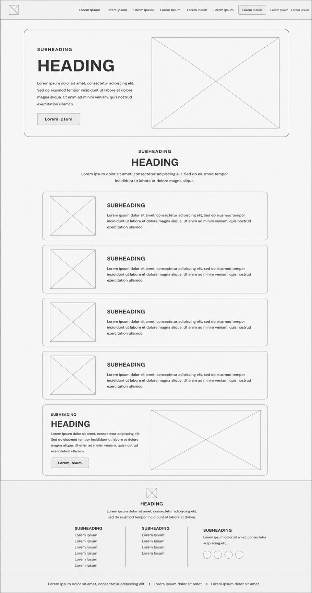

### Tablet Wireframe

The tablet layout explores how the homepage structure can be simplified while preserving the same content hierarchy and navigation flow.

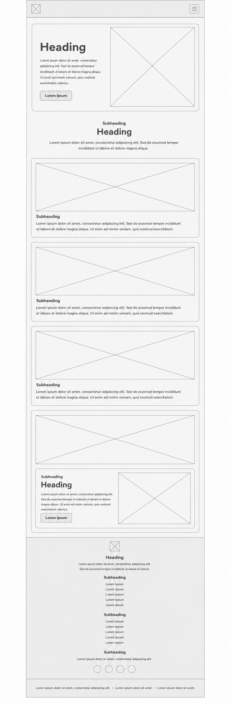

### Mobile Wireframe

The mobile wireframe restructures the homepage into a single-column layout that encourages comfortable scrolling while maintaining the intended sequence of information.

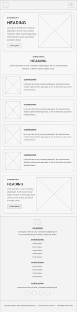

---

# Create Kingdom

The Create Kingdom page represents the transition between account creation and gameplay. During planning, the objective was to create a focused layout that would introduce players to the simulation without presenting unnecessary complexity.

The wireframes explored how the page could remain visually uncluttered while still emphasising the significance of establishing a new kingdom. Responsive layouts were also considered from the outset to ensure that the form remained equally accessible across desktop, tablet, and mobile devices.

### Desktop Wireframe

The desktop wireframe explores a balanced layout that combines supporting content with the kingdom creation form.

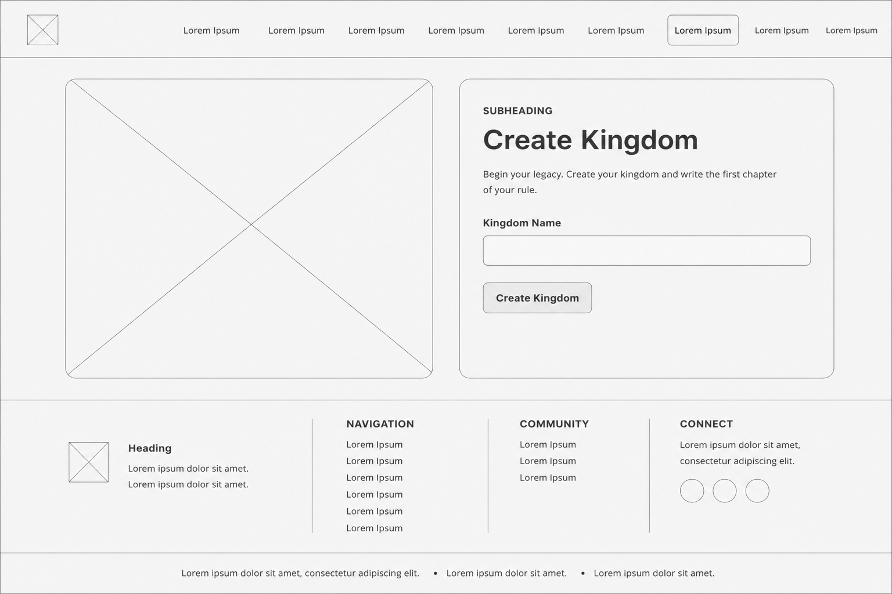

### Tablet Wireframe

The tablet layout investigates a simplified arrangement where content becomes more vertically aligned while maintaining clear visual separation.

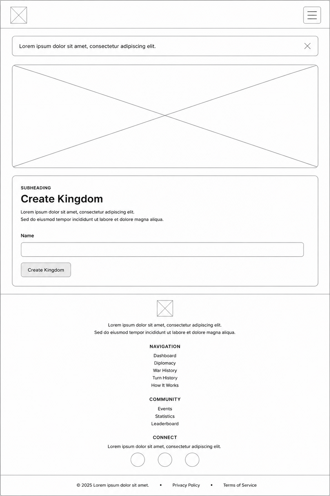

### Mobile Wireframe

The mobile wireframe presents the page as a straightforward vertical workflow, allowing users to complete the setup process comfortably on smaller screens.

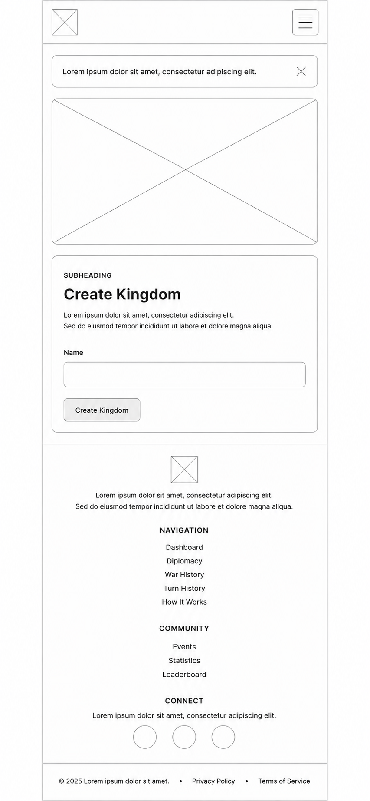

---

# Dashboard

The dashboard required considerably more planning than any other page within the project due to the amount of information that would eventually need to be presented. During the wireframing stage, the emphasis was placed on creating a flexible layout capable of accommodating future gameplay systems without compromising clarity or usability.

Rather than defining the final appearance of individual interface components, the wireframes focused on establishing an effective information hierarchy. Consideration was also given to how the same structure could adapt naturally across desktop, tablet, and mobile layouts while preserving a consistent user experience.

### Desktop Wireframe

The desktop wireframe explores a multi-panel layout that allows several content areas to coexist within a single interface.

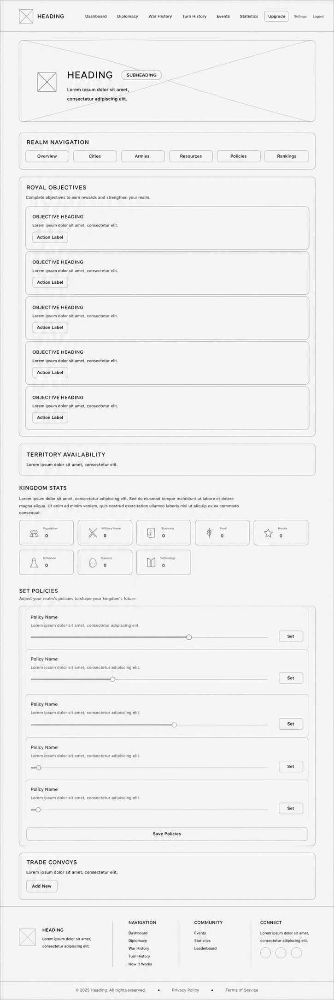

### Tablet Wireframe

The tablet wireframe investigates how the desktop layout can be reorganised into fewer content regions while maintaining the planned information hierarchy.

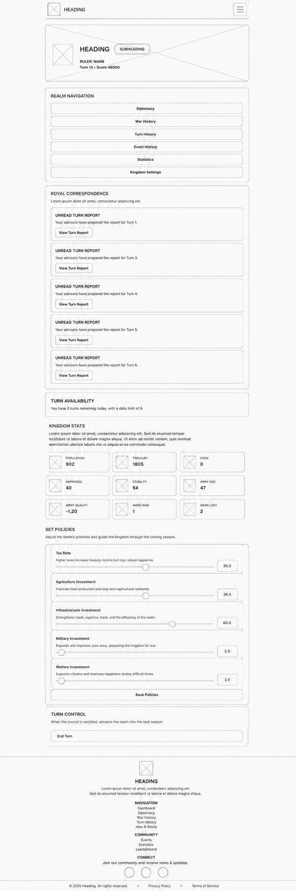

### Mobile Wireframe

The mobile wireframe restructures the dashboard into a vertically organised layout that prioritises the most important interface regions first.

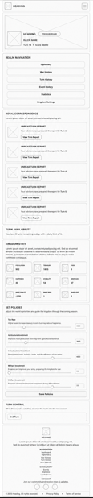

---


# Turn Reports

The Turn Reports page was planned as a document-style interface intended to present structured information in a clear and readable format. During wireframing, attention focused on creating a layout that would comfortably accommodate detailed narrative content alongside supporting statistical information.

Rather than concentrating on visual styling, the planning process explored how longer reports could remain easy to read across a range of different devices.

### Desktop Wireframe

The desktop wireframe explores a spacious report layout capable of displaying multiple sections of information simultaneously.

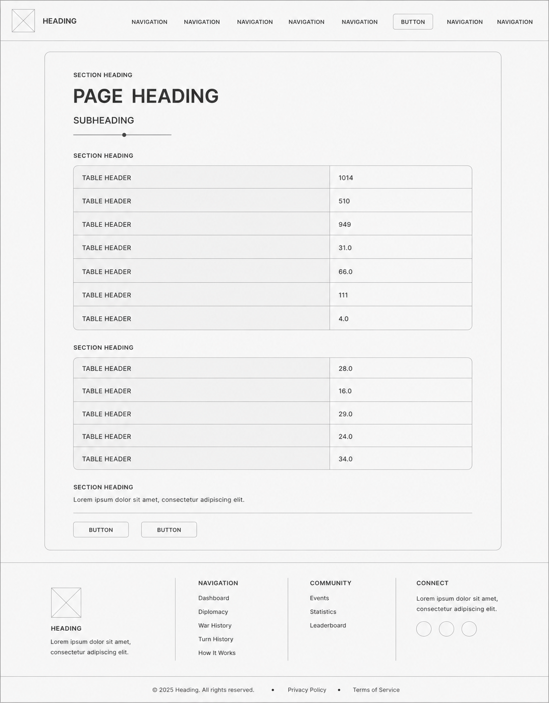

### Tablet Wireframe

The tablet design reorganises report content into larger stacked sections while preserving the intended reading order.

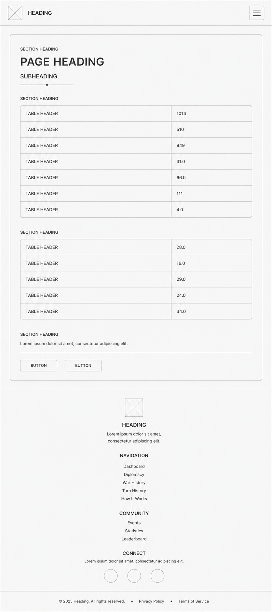

### Mobile Wireframe

The mobile wireframe adopts a simplified document layout that encourages natural vertical scrolling.

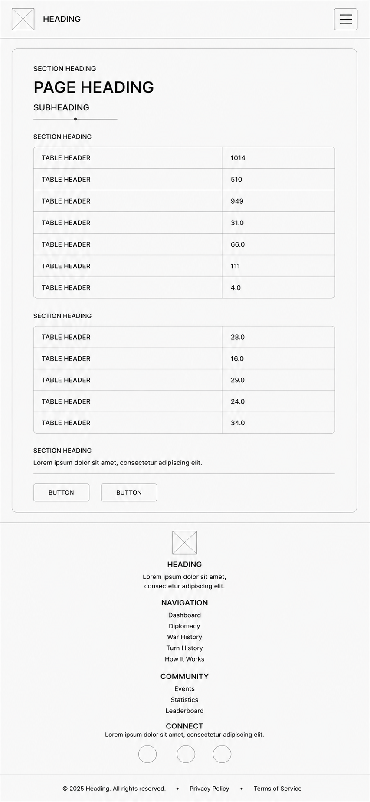

---

# Dynamic Event System

The Dynamic Event System required careful planning because it introduces narrative-driven interactions that temporarily interrupt the normal gameplay loop. During the wireframing stage, the objective was to create a layout that clearly separated the event narrative from the player's response while maintaining consistency with the rest of the application's interface.

Rather than focusing on the specific content of individual events, the wireframes explored a reusable layout that could accommodate different event types without requiring separate page designs. This modular approach ensured that future events could be introduced while maintaining a familiar user experience.

### Desktop Wireframe

The desktop wireframe explores a balanced layout where the event narrative and response area can coexist without competing for attention.

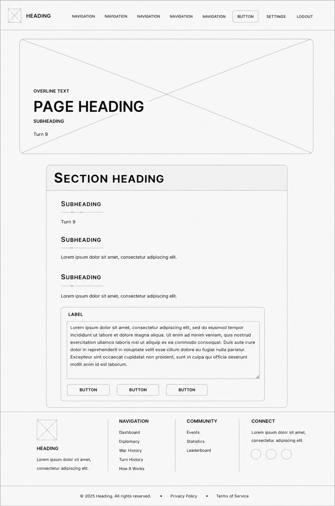

### Tablet Wireframe

The tablet layout investigates how the same interface can be reorganised into larger touch-friendly sections while maintaining the intended reading order.

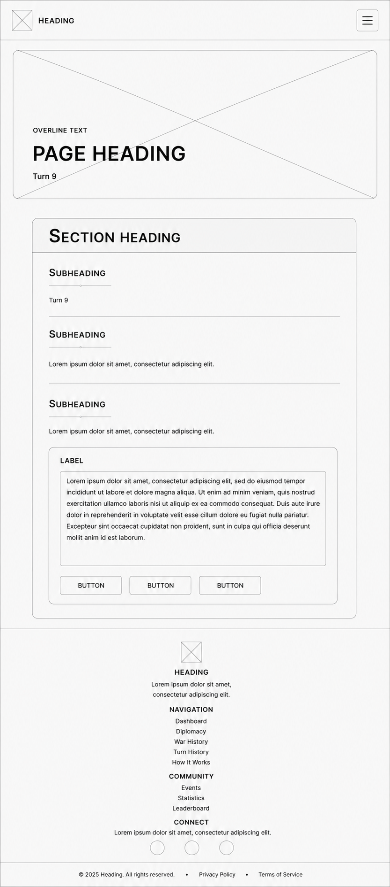

### Mobile Wireframe

The mobile wireframe restructures the event into a straightforward vertical workflow that naturally guides users from reading the event through to submitting their response.

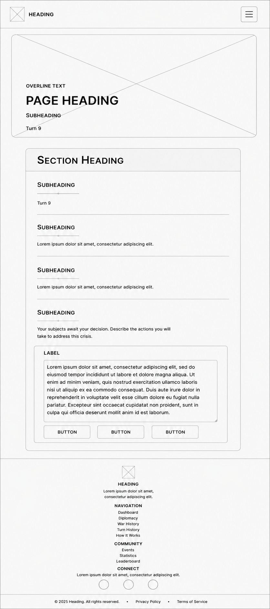

---

# Event Report

The Event Report page was planned as a reusable reporting interface that would summarise the outcome of significant kingdom events after the player's decision had been processed. Rather than creating separate layouts for each possible event, the wireframes focused on designing a flexible report template capable of presenting different event outcomes using a consistent structure.

During planning, emphasis was placed on establishing a clear reading order that would separate the event summary, the consequences of the player's decision, and any resulting changes to the kingdom. Creating a reusable report layout also ensured that future event types could be incorporated without requiring additional interface redesign.

### Desktop Wireframe

The desktop wireframe explores a document-style layout where the event summary, outcome, and supporting information can be presented within clearly defined sections.

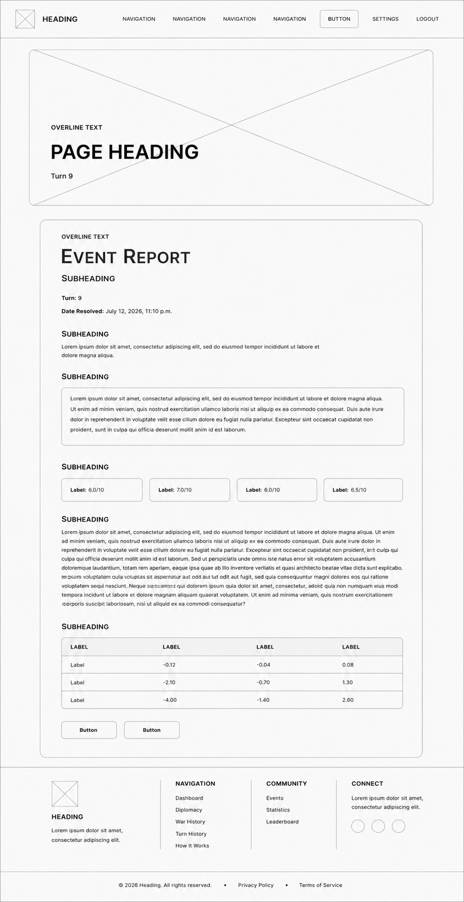

### Tablet Wireframe

The tablet layout investigates how the report structure can be simplified into larger stacked sections while preserving the same reading hierarchy established by the desktop design.

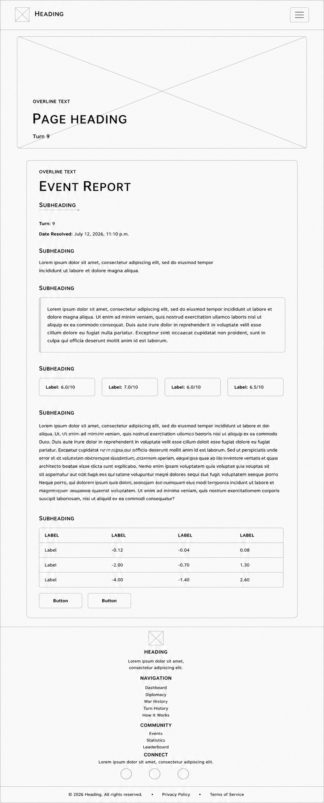

### Mobile Wireframe

The mobile wireframe reorganises the report into a vertically scrolling document that remains comfortable to read while maintaining the intended flow of information.

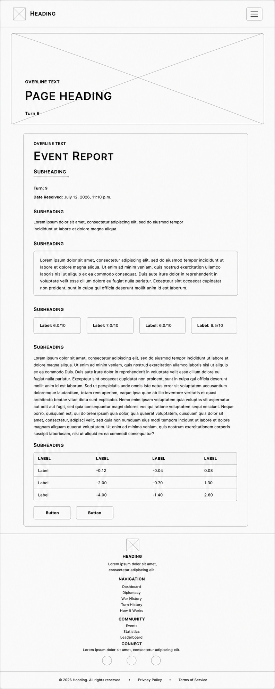

---

# Event History

The Event History page was planned as a long-form historical archive capable of displaying an expanding collection of records without becoming difficult to navigate. During the planning stage, emphasis was placed on creating a consistent document layout that would remain readable regardless of the number of recorded events.

The wireframes explored chronological organisation and spacing rather than visual styling, ensuring that historical information could continue to scale naturally as kingdoms progressed through additional turns.

### Desktop Wireframe

The desktop wireframe investigates a spacious chronological layout capable of presenting large numbers of historical entries comfortably.

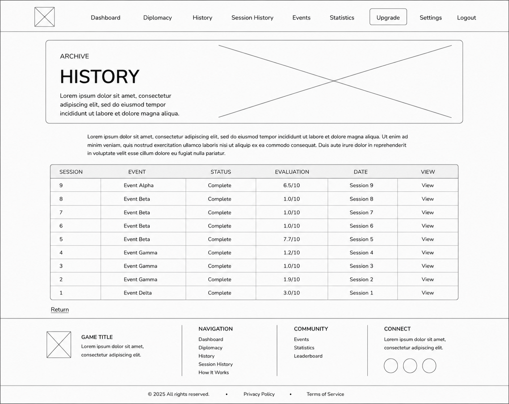

### Tablet Wireframe

The tablet version simplifies the layout by reducing horizontal spacing while preserving the same chronological reading experience.

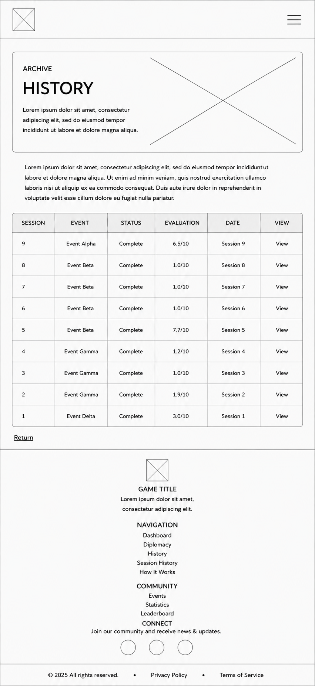

### Mobile Wireframe

The mobile wireframe adopts a document-style layout that supports comfortable vertical scrolling through historical records.

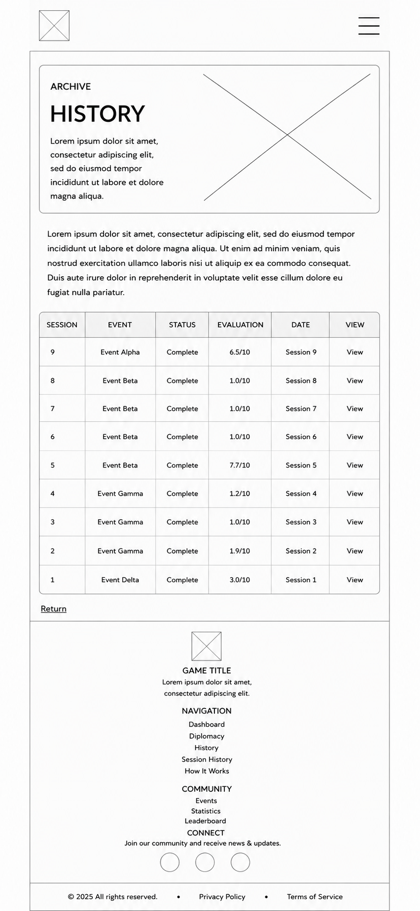

---

# Kingdom Detail

The Kingdom Detail page was planned as a public information page that would allow players to inspect another kingdom without exposing private management controls. During wireframing, the focus was placed on presenting comparative information clearly while distinguishing public statistics from the authenticated user's own dashboard.

The layouts explored how structured data could be displayed consistently across different devices while remaining easy to compare and navigate.

### Desktop Wireframe

The desktop wireframe investigates a structured profile layout where public statistics can be presented clearly alongside supporting information.

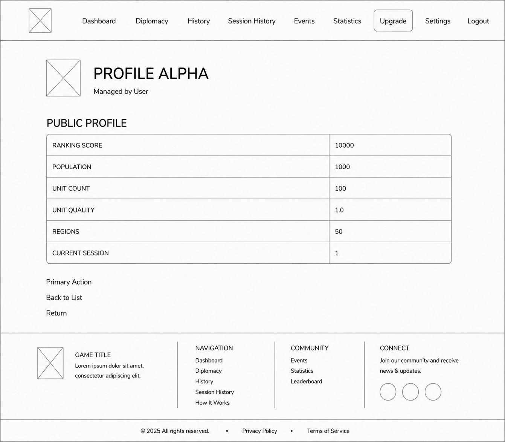

### Tablet Wireframe

The tablet layout reorganises the profile into fewer content regions while maintaining the same information hierarchy.

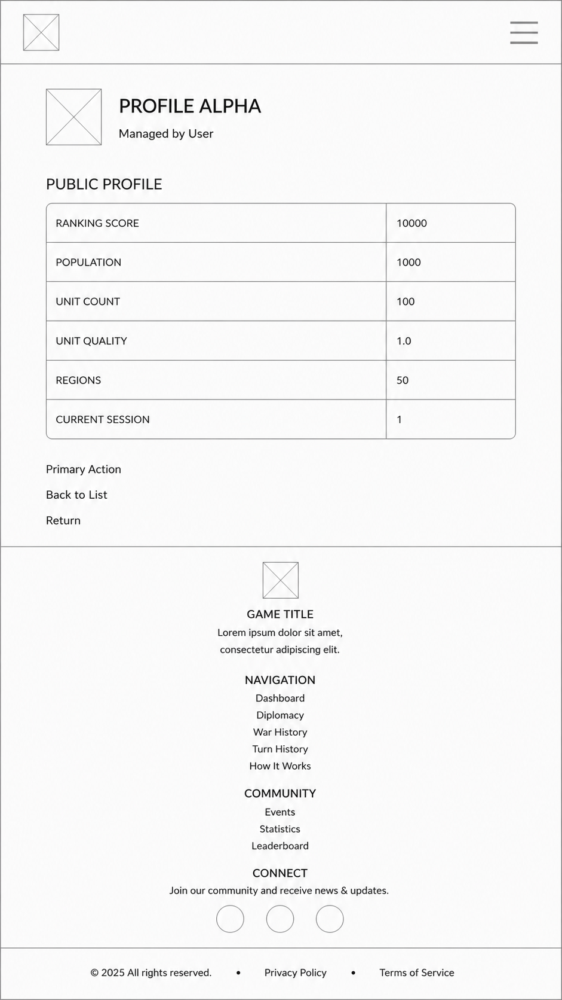

### Mobile Wireframe

The mobile wireframe restructures the page into a vertical summary designed for comfortable reading on smaller displays.

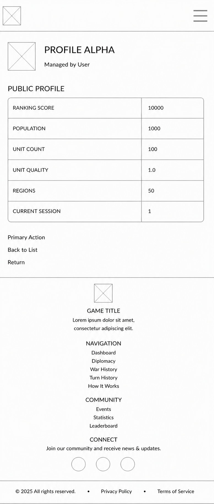

---

# Leaderboard

The Leaderboard required relatively little experimentation during planning because its primary purpose was to present comparative information clearly. The wireframes instead focused on determining the most effective method of displaying rankings while ensuring that the layout remained readable across different screen sizes.

Maintaining a consistent table structure across responsive layouts formed the principal objective throughout this planning stage.

### Desktop Wireframe

The desktop wireframe explores a wide comparative table capable of displaying multiple kingdoms simultaneously.

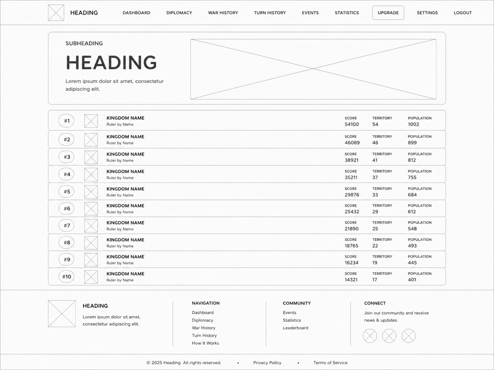

### Tablet Wireframe

The tablet layout investigates how ranking information can remain easily comparable while reducing the overall page width.

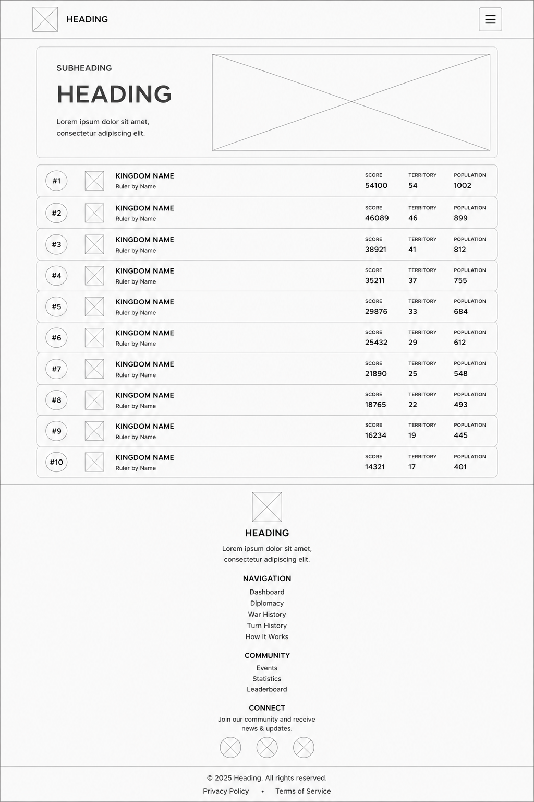

### Mobile Wireframe

The mobile wireframe reorganises ranking information into vertically stacked entries that remain easy to browse through scrolling.

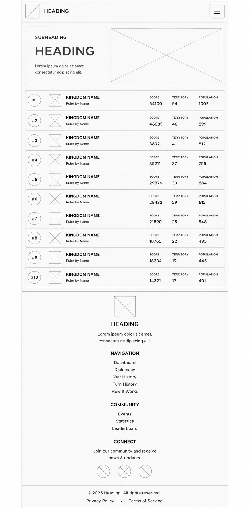

---

# Diplomacy

The Diplomacy page introduces a more interactive planning challenge because it combines informational content with strategic decision making. During the wireframing stage, attention focused on ensuring that diplomatic relationships, supporting information, and available actions remained clearly separated without creating unnecessary visual complexity.

The responsive layouts explored how this balance could be preserved across different screen sizes before development commenced.

### Desktop Wireframe

The desktop wireframe investigates a multi-section layout where diplomatic information and available actions can be viewed together.

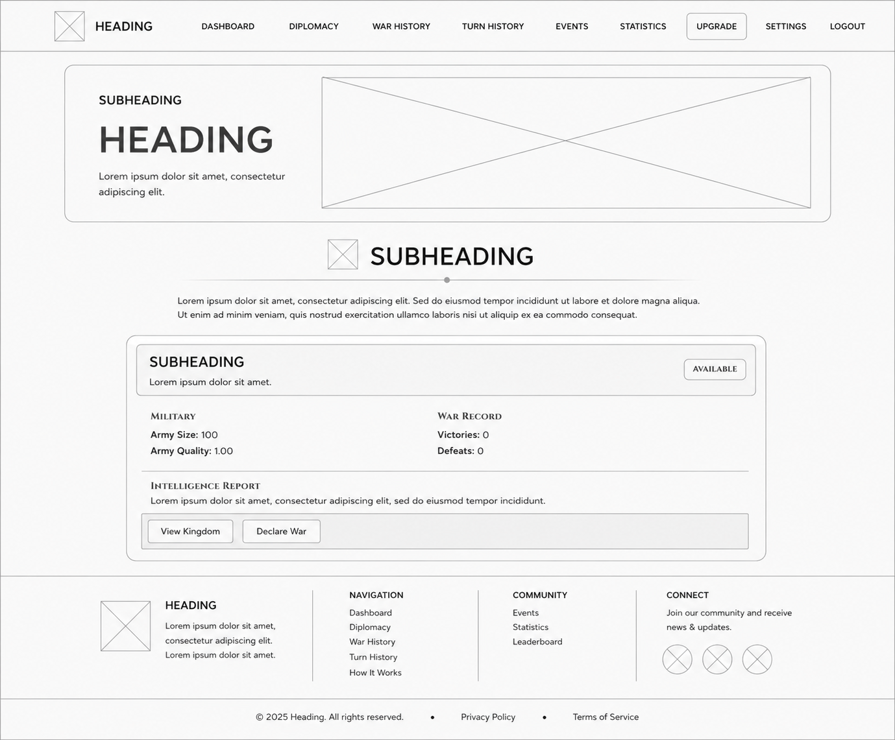

### Tablet Wireframe

The tablet design reduces horizontal complexity while maintaining clear separation between relationship information and user actions.

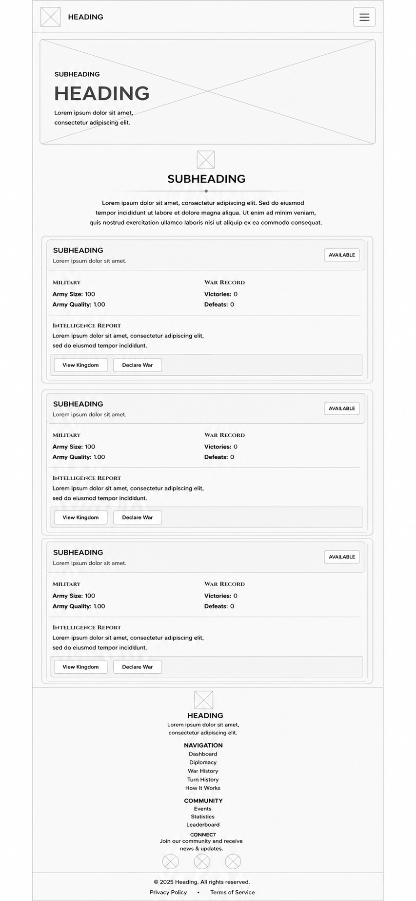

### Mobile Wireframe

The mobile wireframe reorganises the planned layout into a simple vertical workflow suitable for touch interaction.

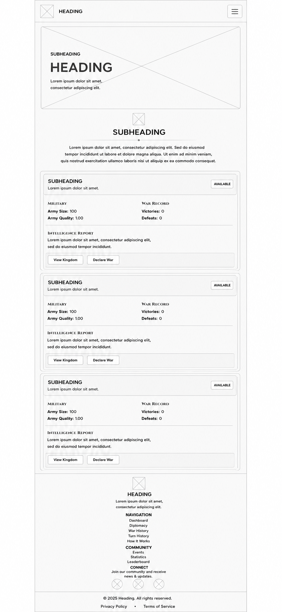

---

# Declare War

The Declare War page was planned around communicating the significance of initiating military conflict. Rather than encouraging immediate interaction, the layout was designed to ensure that supporting information would naturally be reviewed before users reached the confirmation controls.

The wireframes focused on establishing a logical progression from strategic information to final confirmation while remaining responsive across all supported devices.

### Desktop Wireframe

The desktop wireframe explores a spacious decision-focused layout where supporting information precedes the confirmation controls.

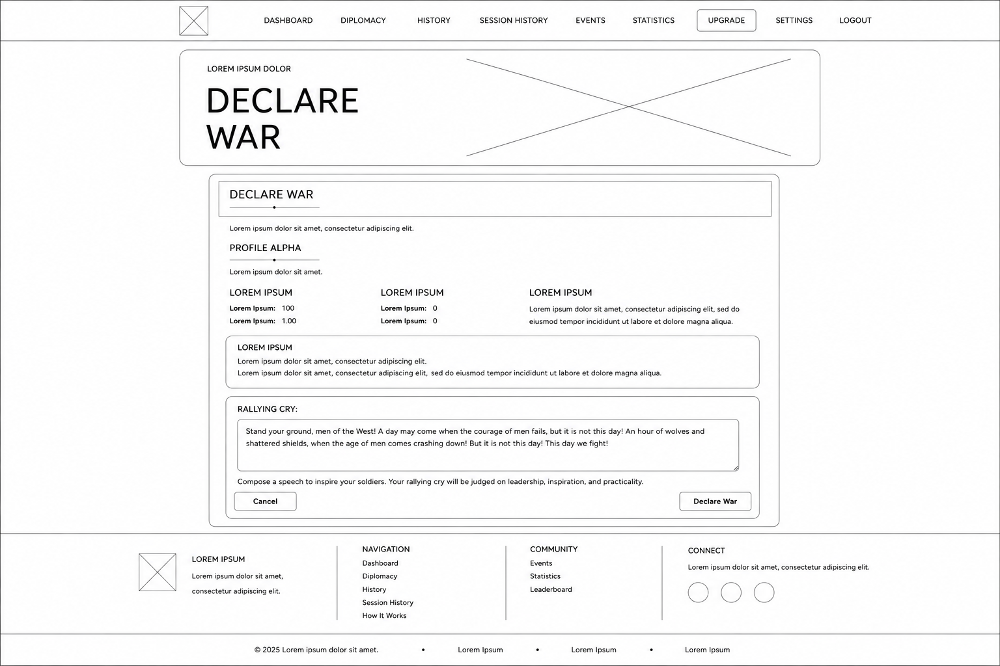

### Tablet Wireframe

The tablet layout investigates how strategic information can remain clearly organised while adapting to reduced screen width.

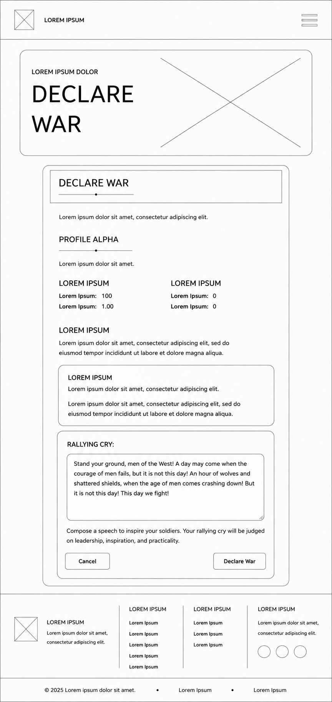

### Mobile Wireframe

The mobile wireframe presents the planned workflow as a continuous vertical sequence leading naturally towards the confirmation action.

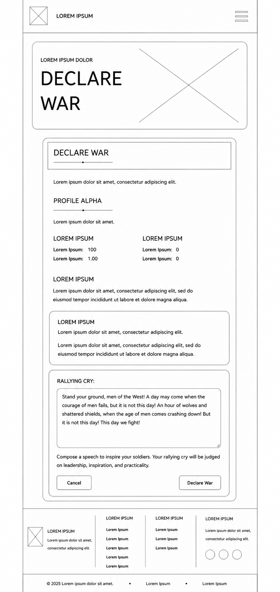

---

# War Declaration Received

The War Declaration Received page was planned as a response-focused interface where incoming military challenges could be reviewed before action was taken. During wireframing, emphasis was placed on establishing a clear reading order that would prioritise the incoming declaration before presenting supporting military information and response controls.

Planning also explored how this structured briefing could remain equally effective across desktop, tablet, and mobile devices.

### Desktop Wireframe

The desktop wireframe investigates a report-style layout capable of presenting military information and response actions together.

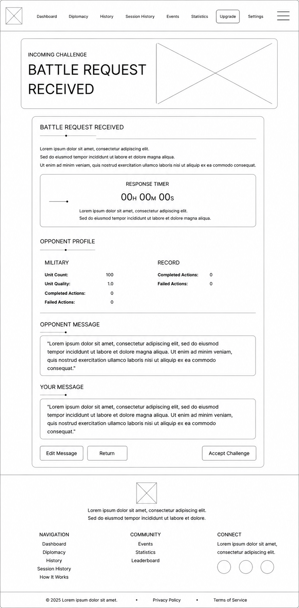

### Tablet Wireframe

The tablet layout simplifies the arrangement into larger content blocks while preserving the intended sequence of information.

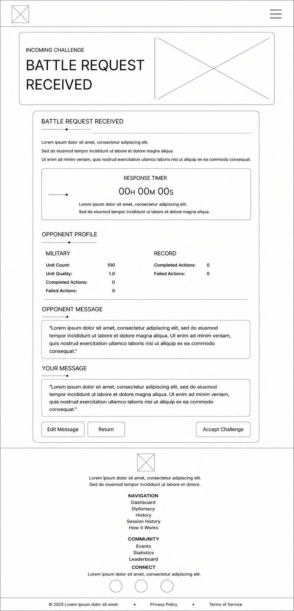

### Mobile Wireframe

The mobile wireframe restructures the interface into a vertically organised briefing that remains easy to navigate on smaller devices.

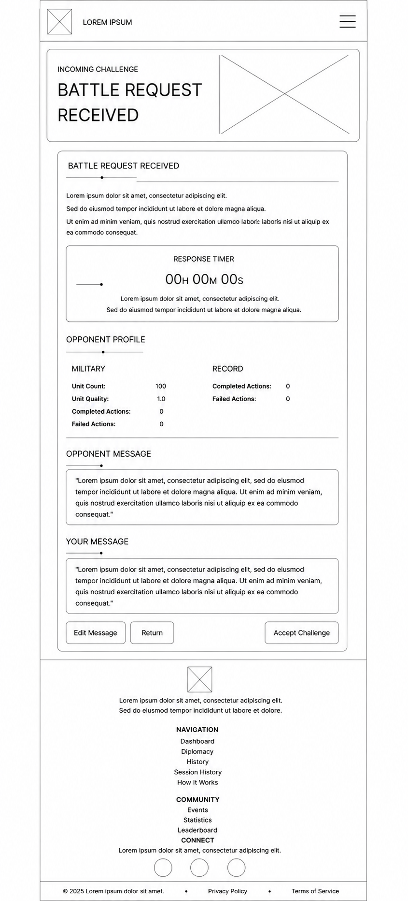

---

# War Pending

The War Pending page was planned as a transitional state between accepting a military challenge and receiving the final battle result. The main design objective was to communicate that the conflict had been registered successfully while avoiding the impression that the application had stalled or failed to process the action.

The wireframes therefore focused on a simple status-led layout with a clear message, restrained supporting content, and an obvious route back to the wider application. Because this page contains relatively little information, spacing and visual balance were particularly important during planning.

### Desktop Wireframe

The desktop wireframe explores a centred status layout that uses the available space to emphasise the pending state without introducing unnecessary interface elements.

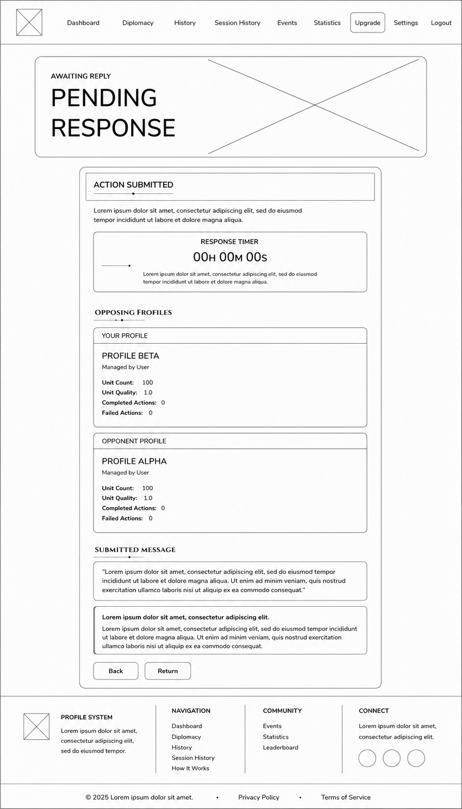

### Tablet Wireframe

The tablet design preserves the same focused composition while reducing surrounding whitespace to maintain balance on a narrower display.

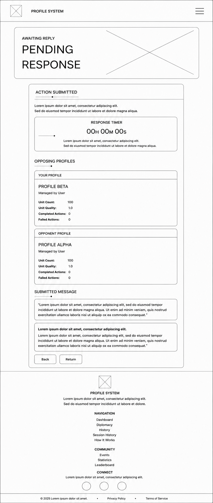

### Mobile Wireframe

The mobile wireframe presents the status message and supporting navigation in a compact vertical arrangement suited to smaller screens.

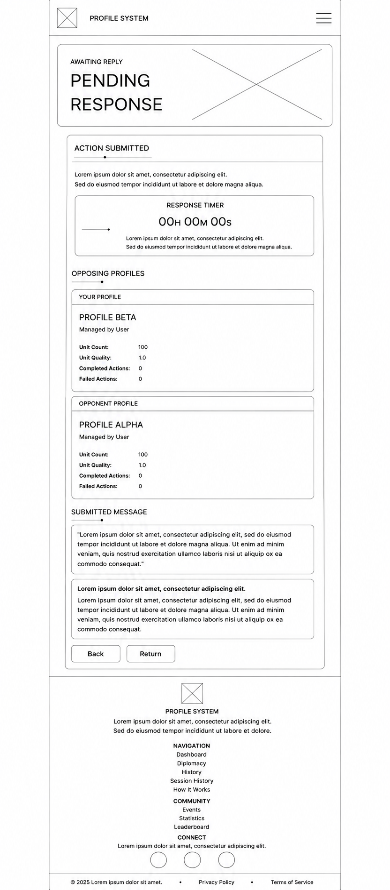

---

# Battle Reports

The Battle Report page was planned as a structured document capable of presenting the outcome of a military engagement without overwhelming the player with dense information. During wireframing, the emphasis was placed on establishing a clear sequence between the battle result, participating kingdoms, comparative statistics, and supporting narrative.

The layout needed to accommodate both short and detailed reports while retaining a consistent reading order across all devices. This led to a report-oriented structure rather than a dashboard-style arrangement.

### Desktop Wireframe

The desktop wireframe explores a broad document layout where the result and supporting battle information can be separated into clearly defined sections.

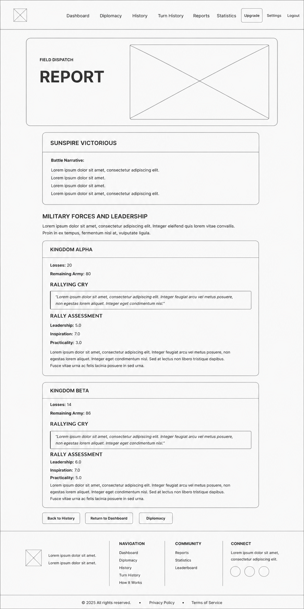

### Tablet Wireframe

The tablet design reorganises the report into narrower stacked sections while preserving the intended hierarchy of information.

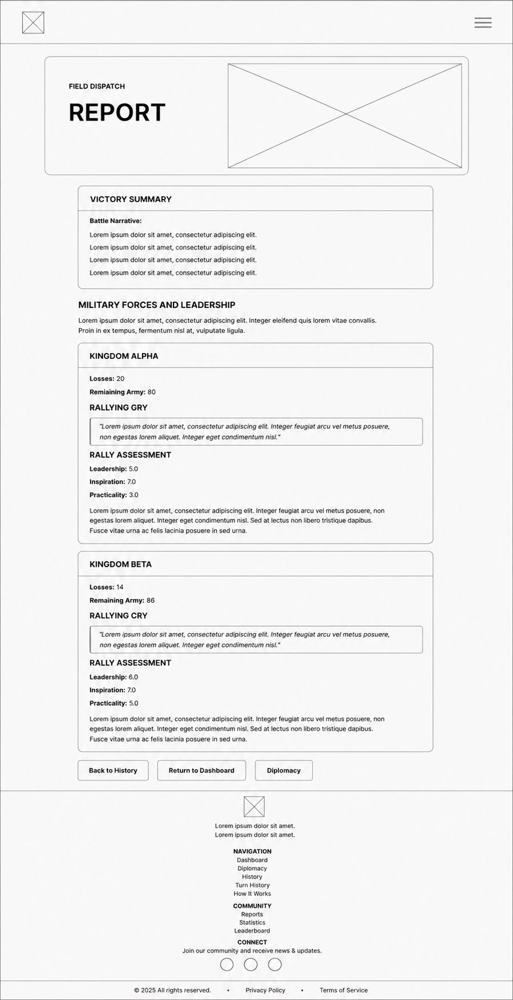

### Mobile Wireframe

The mobile wireframe converts the report into a continuous vertical reading experience, ensuring that the complete battle summary remains accessible without horizontal scrolling.

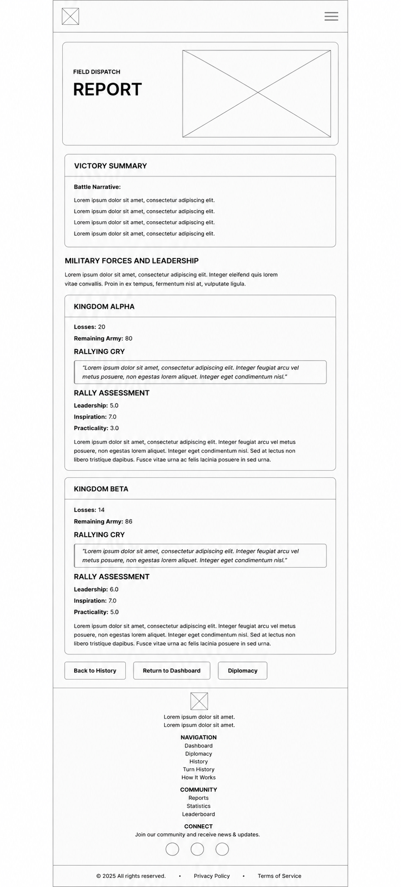

---

# War History

The War History page was planned as a scalable chronological archive that could continue to accommodate additional military records as the kingdom progressed. The design process focused on making individual conflicts easy to distinguish while maintaining a consistent overall structure.

Rather than attempting to display extensive battle information immediately, the wireframes explored a summary-led approach that would allow users to scan previous conflicts before selecting a particular record for further detail.

### Desktop Wireframe

The desktop wireframe explores a wide historical listing where multiple military records can be reviewed efficiently within a structured layout.

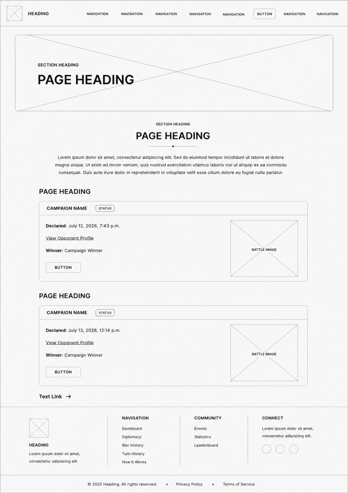

### Tablet Wireframe

The tablet layout reduces the width of each historical entry while preserving chronological organisation and visual separation.

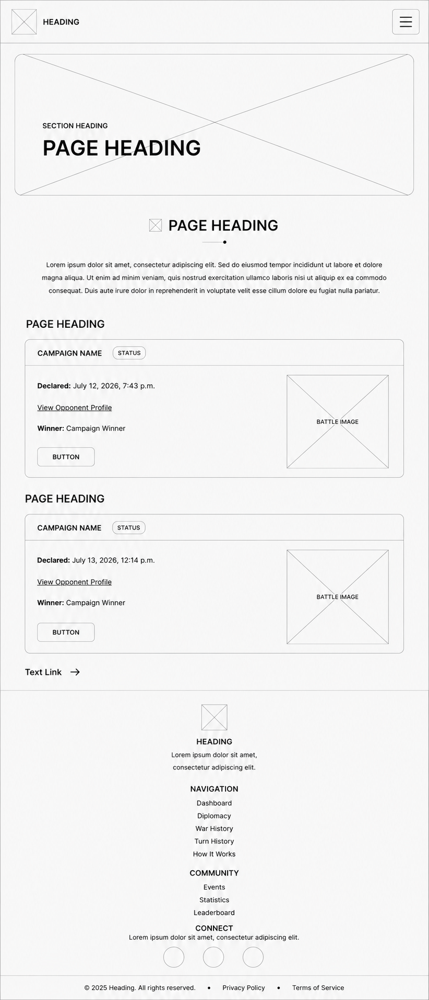

### Mobile Wireframe

The mobile wireframe presents each military record as a vertically stacked summary, supporting natural scrolling through an expanding history.

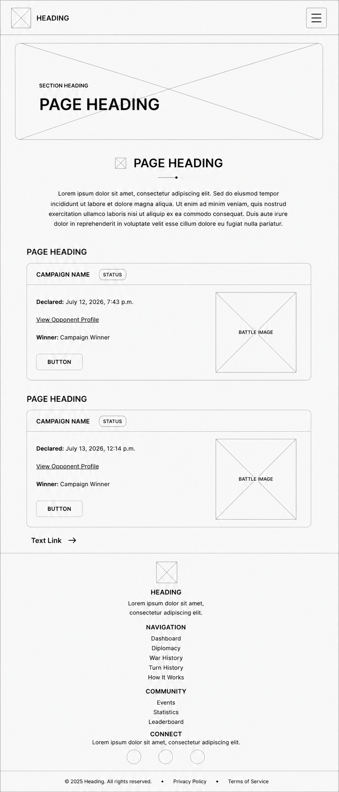

---

# Settings

The Settings page was planned as a focused management interface separate from the main gameplay experience. During wireframing, the objective was to create a familiar form-based layout that would allow users to review or update configurable information without confusing account administration with active kingdom management.

The design intentionally avoids the information density found elsewhere in the application. Instead, the wireframes prioritise clear labels, predictable form placement, and sufficient spacing around potentially consequential actions.

### Desktop Wireframe

The desktop wireframe explores a centred settings panel that separates editable information from supporting navigation and actions.

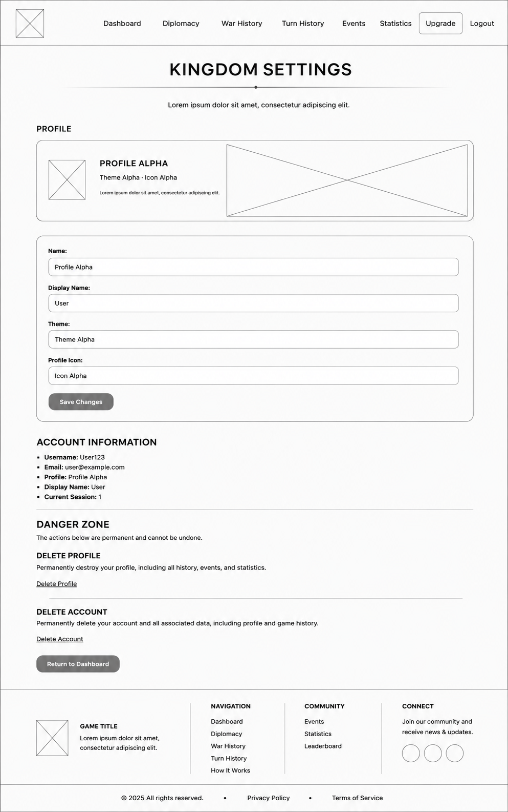

### Tablet Wireframe

The tablet design narrows the settings panel while preserving clear alignment between labels, controls, and action buttons.

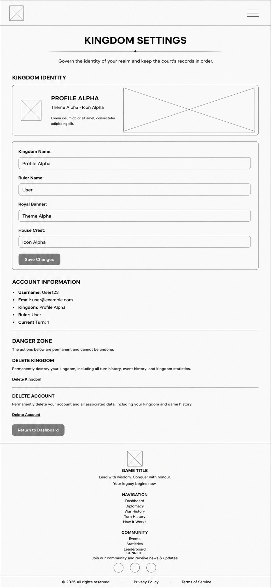

### Mobile Wireframe

The mobile wireframe restructures the page into a straightforward vertical form, ensuring that each control remains easy to reach and understand.

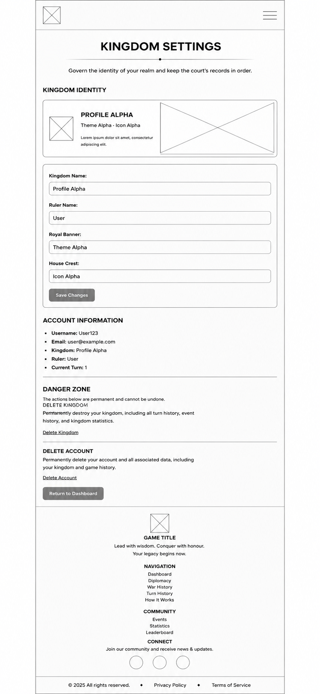

---

# Pricing

The Pricing page was planned to communicate the optional premium offering clearly without adopting an overly aggressive commercial layout. During wireframing, emphasis was placed on transparency, visual comparison, and ensuring that the subscription action followed naturally from the supporting information.

The design explored how pricing details, premium benefits, and the principal call to action could be organised consistently across all screen sizes while remaining visually separate from the core gameplay interface.

### Desktop Wireframe

The desktop wireframe investigates a spacious pricing layout where subscription information and supporting benefits can be reviewed together.

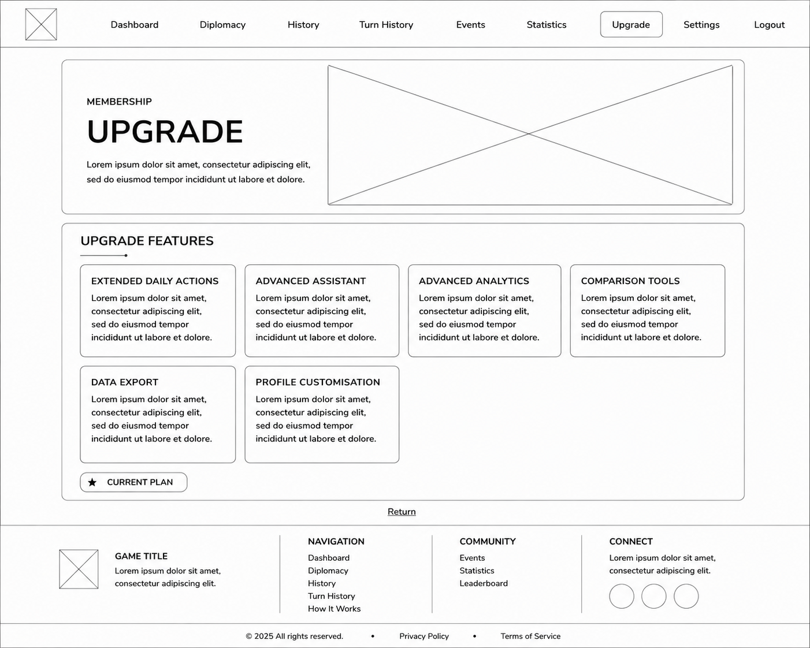

### Tablet Wireframe

The tablet layout reorganises the pricing content into larger stacked sections while preserving the intended comparison and reading order.

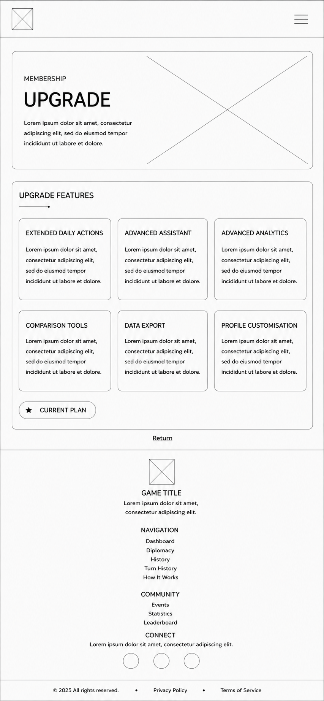

### Mobile Wireframe

The mobile wireframe presents premium information as a simple vertical sequence ending with the subscription action.

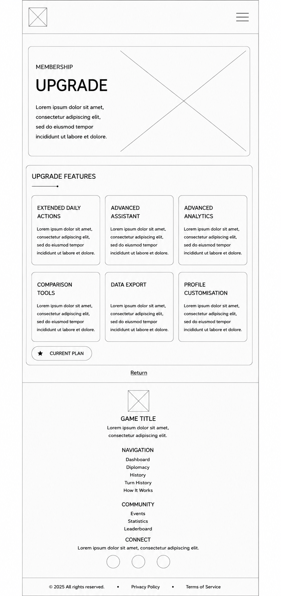

---

# Premium Statistics

The Premium Statistics page was planned as a dedicated analytical interface rather than an extension of a standard report. During wireframing, the central challenge was determining how multiple charts, summaries, and comparative values could coexist without creating an excessively dense layout.

Planning focused on grouping related analytical content, maintaining visual consistency between data panels, and preserving enough spacing for graphs and labels to remain readable across responsive breakpoints.

### Desktop Wireframe

The desktop wireframe explores a multi-panel analytical layout where several categories of statistical information can be reviewed simultaneously.

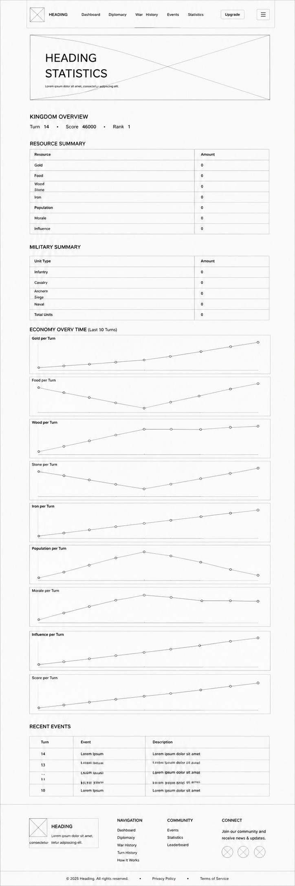

### Tablet Wireframe

The tablet layout reduces the number of side-by-side panels and increases the width available to individual analytical components.

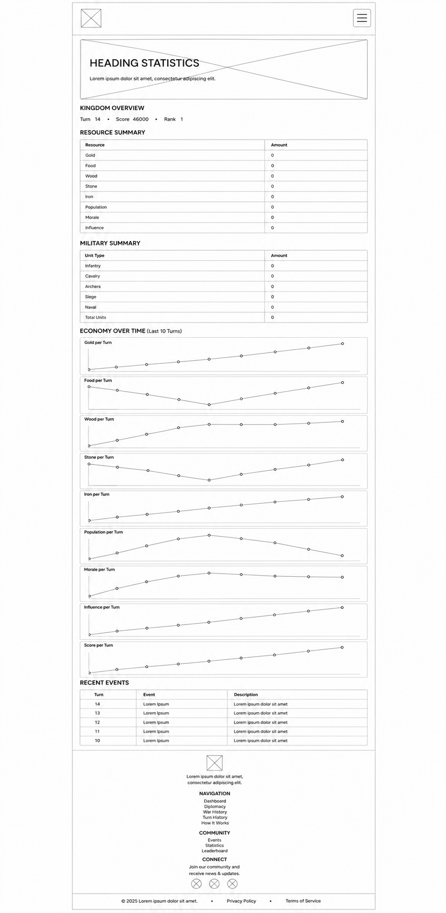

### Mobile Wireframe

The mobile wireframe reorganises analytical content into a vertical series, ensuring that charts and summaries retain sufficient width to remain legible.

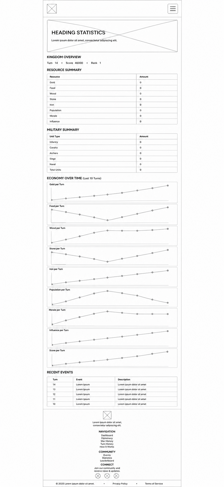

---

# Turn History

The Turn History page was planned to support long-term analysis across an expanding collection of turn records. Unlike the individual Turn Report page, this layout needed to make broader historical navigation possible while remaining manageable as the number of completed turns increased.

The wireframes focused on chronological organisation, consistent entry structure, and the ability to scan records before examining individual details. Responsive planning aimed to preserve that hierarchy without relying on wide tables that would become difficult to use on smaller screens.

### Desktop Wireframe

The desktop wireframe explores a broad historical layout where multiple turn records can be compared and reviewed efficiently.

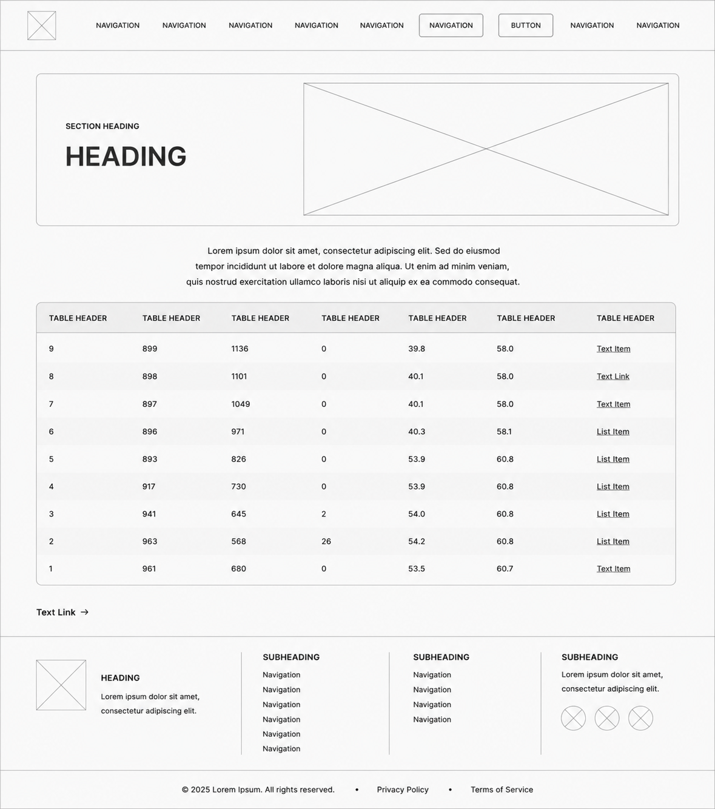

### Tablet Wireframe

The tablet design narrows the historical entries while maintaining their chronological order and visual consistency.

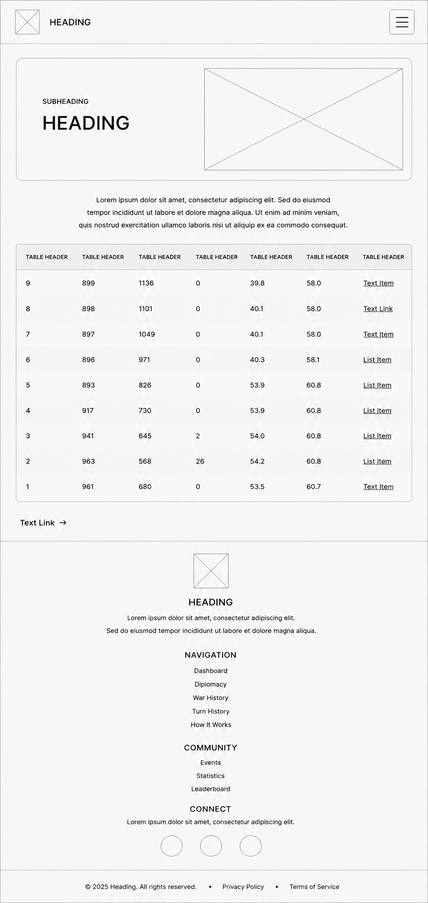

### Mobile Wireframe

The mobile wireframe presents turn records as a sequence of vertically stacked summaries designed for natural scrolling.

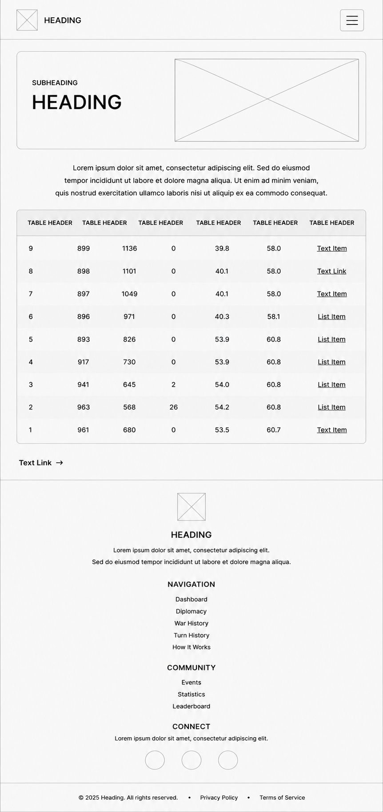

---

## Wireframe Reflection

The wireframing process established the structural foundations of Crown & Conquest before visual styling and backend implementation began. By planning each page across desktop, tablet, and mobile layouts, responsive behaviour could be considered as part of the initial design rather than added retrospectively.

Some layouts evolved as the scope of the application expanded, particularly around warfare, event handling, and premium analytics. However, the principal information hierarchy, navigation patterns, and responsive strategies established during planning remained recognisable within the completed application.

The wireframes therefore served not only as preliminary sketches but as practical reference points throughout iterative development, helping the interface remain coherent as new systems were introduced.

---

# Features

## Responsive Navigation Header

The navigation header provides consistent access to the application's primary features regardless of the device being used. During development, the header was designed to adapt progressively across different screen sizes rather than simply reducing the size of the desktop navigation. This responsive approach ensures that navigation remains clear, accessible, and intuitive whether players are managing their kingdom on a desktop computer, tablet, or mobile device.

On larger displays, the full navigation menu is presented horizontally, allowing players to move directly between the application's major gameplay systems with a single click. As available screen space decreases, the navigation transitions into a collapsible hamburger menu, preserving the complete navigation structure while reducing visual clutter and maximising the available content area.

### Desktop View

The desktop header makes full use of the available screen width by displaying the application branding alongside the complete navigation menu. Frequently used sections, including the Dashboard, Diplomacy, War History, Turn History, Events, Statistics, Premium, Settings, and Logout, remain immediately accessible, allowing experienced players to navigate efficiently between gameplay systems without additional interaction.


### Tablet View

On tablet devices, the navigation transitions to a responsive hamburger menu while preserving the application's branding and visual identity. This approach provides additional space for page content without sacrificing access to the full navigation structure, making the interface more comfortable for touch-based interaction.


### Mobile View

The mobile header adopts the most compact layout, prioritising the application branding together with a prominent hamburger navigation control. This simplified presentation maximises the available screen space for gameplay while still providing quick access to every section of the application through the collapsible navigation menu.


---

## Responsive Footer

The footer serves as a consistent endpoint across the Crown & Conquest application, providing secondary navigation, community resources, social links, and legal information while reinforcing the platform's visual identity.

Built with a responsive-first approach, the footer adapts gracefully across different screen sizes. On larger screens, information is organised into clearly defined columns, while smaller devices display content in a vertically stacked format that prioritises readability and touch-friendly navigation. This ensures that important links and supporting information remain accessible on all devices.

### Desktop View

On desktop screens, the footer uses a multi-column layout that displays branding, navigation, community resources, and social links side by side. This structure allows users to quickly access key areas of the application while maintaining a balanced and visually appealing design.

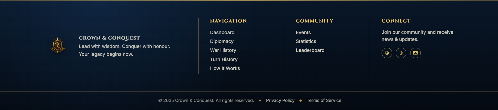

### Tablet View

For tablet-sized devices, the footer transitions into a centred, vertically stacked layout. Content sections remain clearly separated and logically organised, ensuring readability while accommodating the reduced screen width.

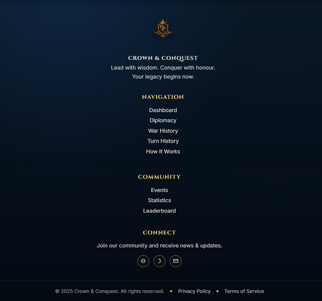

### Mobile View

On mobile devices, the footer retains the stacked layout, presenting branding, navigation links, community resources, social media links, and legal information in a clear top-to-bottom sequence. This approach eliminates horizontal scrolling and provides an intuitive browsing experience on smaller screens.

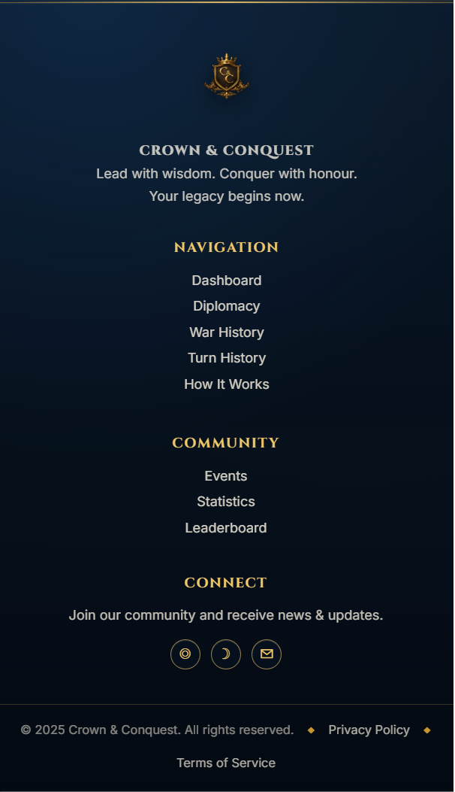

---

## Home

The Home page serves as the public introduction to **Crown & Conquest**, providing prospective players with an overview of the game's concept before they create an account. Rather than functioning as a simple landing page, it establishes the medieval theme, introduces the strategic gameplay loop, and explains the core mechanics that differentiate the project from a traditional CRUD application.

The page was designed to gradually guide visitors through the experience, beginning with a prominent hero section before introducing the key gameplay pillars, premium functionality, and calls to action. By separating public information from authenticated gameplay, the homepage creates a clear onboarding journey while maintaining a consistent visual identity that continues throughout the rest of the application.

### Desktop View

The desktop layout makes full use of the available screen width, allowing the hero section, feature highlights, and supporting content to be displayed with generous spacing. Information is presented in clearly defined sections that encourage visitors to scroll naturally through the page while maintaining a strong visual hierarchy.


The image below meanwhile shows the desktop view when the user is logged out.


### Tablet View

On tablet devices, the layout begins to stack major content blocks vertically while preserving the overall structure of the desktop design. Navigation remains easily accessible, imagery scales proportionally, and content spacing is adjusted to provide a comfortable touch-based browsing experience.


### Mobile View

The mobile homepage adopts a single-column layout that prioritises readability and ease of navigation. Hero content, feature descriptions, and calls to action are arranged into a natural scrolling sequence, ensuring that users receive the same information as desktop visitors without overwhelming the smaller screen.


---

## User Registration

The registration page marks the beginning of the player's journey by allowing new users to create a secure account that will store their kingdom and all associated gameplay progress. Authentication forms the foundation of every major feature within the application, linking each kingdom, historical report, diplomatic interaction, battle, and premium subscription to an authenticated user.

The interface intentionally remains simple, requesting only the information required to create an account before guiding users directly into kingdom creation. This streamlined approach reduces friction during onboarding while ensuring that new players can begin interacting with the simulation as quickly as possible.

### Desktop View

The desktop registration page presents a clean, centred form with generous spacing that keeps the focus on account creation. Supporting branding and consistent styling help maintain continuity with the rest of the application while ensuring that validation messages and form controls remain easy to identify.

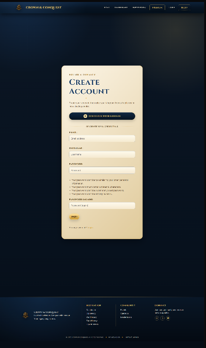

### Tablet View

The tablet layout preserves the same registration workflow while reducing horizontal spacing to better suit medium-sized displays. Form controls remain comfortably sized for touch interaction, and the simplified layout ensures that users can complete registration without distraction.

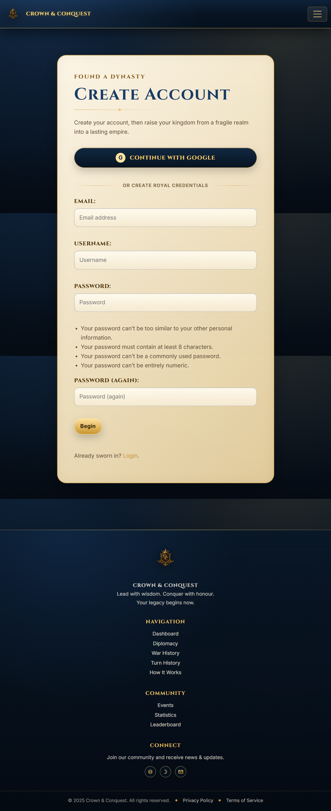

### Mobile View

On mobile devices, the registration form is displayed as a single-column layout optimised for smaller screens. Inputs are easy to reach, labels remain clearly associated with their fields, and the overall design prioritises quick, comfortable account creation regardless of device.

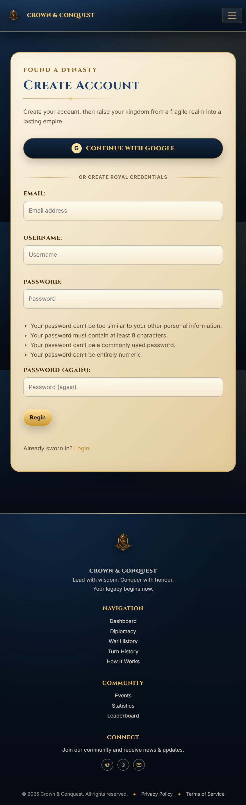

---

## User Login

The login page provides returning players with secure access to their existing kingdom and all previously saved progress. Unlike the registration page, which focuses on onboarding new users, the login experience is designed around speed and familiarity, allowing players to resume their game with minimal interaction.

Consistency between the registration and login interfaces helps reduce cognitive load while reinforcing a predictable authentication workflow. Once successfully authenticated, users are taken directly into the main gameplay experience where they can continue managing their kingdom.

### Desktop View

The desktop login page centres the authentication form within a clean and uncluttered layout, allowing users to focus entirely on signing in. Consistent styling with the registration page helps reinforce familiarity while maintaining the application's overall visual identity.

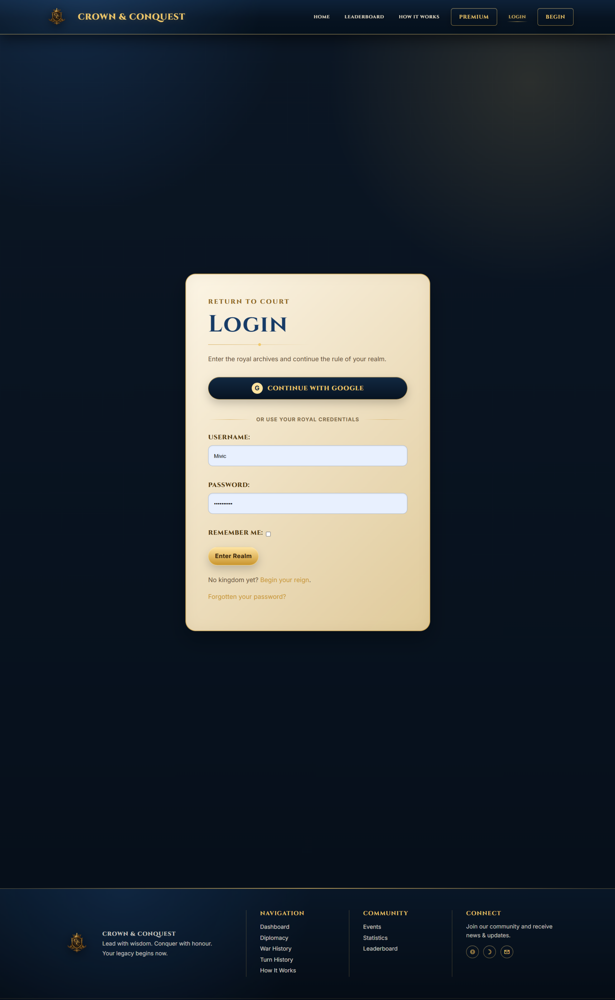

### Tablet View

The tablet version retains the same layout while optimising spacing and control sizes for touch interaction. Navigation and form validation continue to behave consistently, providing a smooth authentication experience across medium-sized devices.

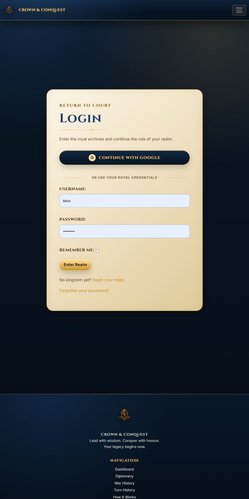

### Mobile View

The mobile login interface adopts a compact single-column layout that prioritises usability on smaller screens. Form fields remain easy to interact with, while responsive spacing ensures that the page remains comfortable to use without sacrificing readability.

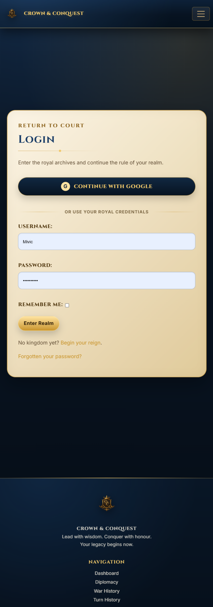

---

## Logout

The Logout feature provides users with a secure method of ending their authenticated session. Although technically straightforward, it forms an important part of the application's overall security by ensuring that authenticated sessions can be terminated safely, particularly when accessing the application from shared or public devices.

Maintaining a clearly accessible logout option throughout the authenticated interface also improves usability by following established web application conventions and giving users confidence that they remain in control of their account.

### Desktop View

On desktop devices, the logout option remains consistently available through the primary navigation, allowing users to end their session quickly without interrupting the application's overall navigation structure.

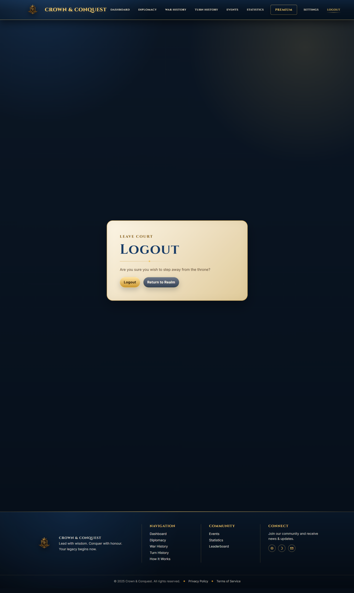

### Tablet View

The tablet interface integrates the logout option within the responsive navigation menu, ensuring that account management remains easily accessible while preserving screen space for gameplay content.

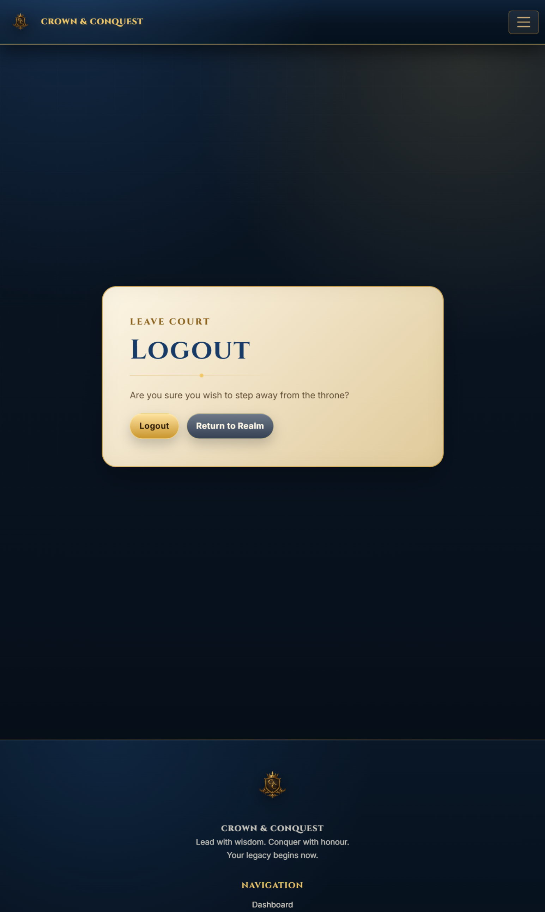

### Mobile View

On mobile devices, the logout option is presented within the collapsible navigation menu, providing a familiar and intuitive interaction that aligns with the application's responsive navigation design.

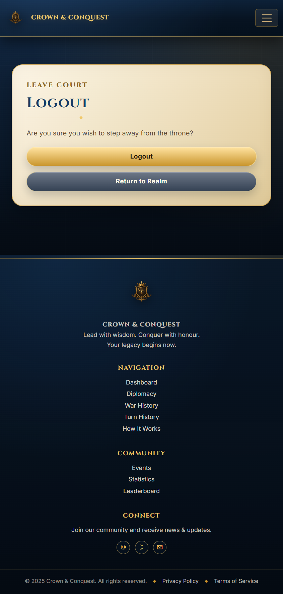

---

## Game Mechanics

The Game Mechanics page introduces prospective players to the core systems that drive Crown & Conquest before they begin their own kingdom. Rather than requiring users to discover gameplay through trial and error, the page explains the simulation's fundamental mechanics, including kingdom management, turn progression, resource balancing, warfare, diplomacy, and dynamic events.

Providing this information before gameplay begins helps establish clear expectations while reducing the learning curve for new users. It also reinforces the strategic nature of the application by demonstrating that successful progression depends upon balancing multiple interconnected systems rather than optimising a single statistic.

### Desktop View

The desktop layout presents the mechanics within spacious content sections that allow players to read detailed explanations comfortably while maintaining a clear visual hierarchy between each gameplay system.


### Tablet View

The tablet layout reorganises the content into larger vertically stacked sections while preserving the logical flow established by the desktop design. This maintains readability without sacrificing the depth of information presented.


### Mobile View

The mobile interface presents each gameplay mechanic as part of a continuous scrolling guide, allowing users to explore the application's core systems comfortably on smaller devices before creating their kingdom.


---

## Create Kingdom

The Create Kingdom page represents the player's transition from account owner to ruler of a persistent medieval kingdom. While the interface itself is intentionally simple, the action performed here is one of the most significant within the application, creating the primary Kingdom record that becomes the centre of every subsequent gameplay system.

Rather than overwhelming players with complex configuration options, the page establishes a balanced starting point from which each kingdom can evolve naturally. This allows new players to begin making meaningful strategic decisions immediately while ensuring that all kingdoms begin under comparable conditions.

### Desktop View

The desktop layout provides a focused form surrounded by generous whitespace, helping reinforce the importance of founding a new kingdom. Supporting visual elements maintain the medieval theme while ensuring that the primary action remains immediately obvious.

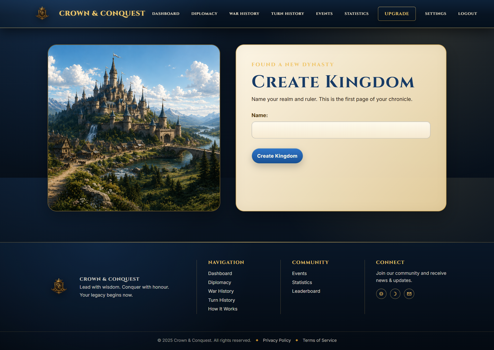

### Tablet View

The tablet layout preserves the same straightforward workflow while reducing horizontal spacing to improve readability and touch interaction. Form controls remain consistent with the wider application, creating a familiar user experience across devices.

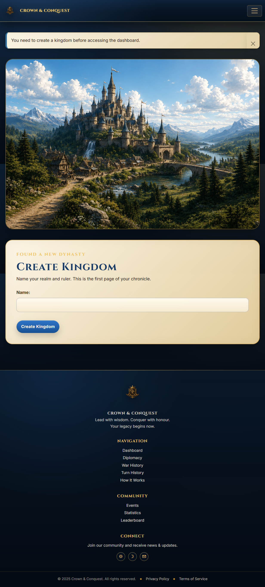

### Mobile View

On mobile devices, the Create Kingdom page transitions into a vertically stacked layout that keeps every form element easily accessible. The simplified presentation allows players to complete the setup process comfortably before entering the main simulation.

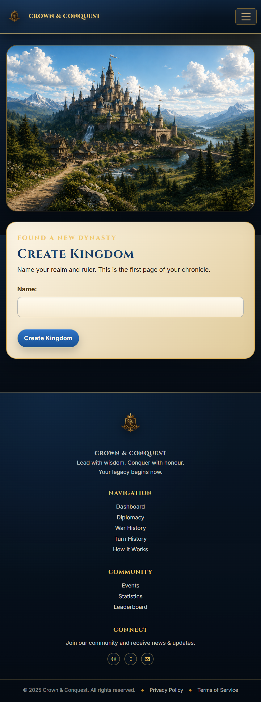

---

## Dashboard

The Dashboard is the central hub of Crown & Conquest and the page that players will interact with most frequently throughout the simulation. It brings together the kingdom's most important statistics, recent developments, strategic actions, and navigation into a single interface, allowing players to quickly assess the state of their realm before making their next decision.

In addition to displaying the current state of the kingdom, the dashboard is also where the core gameplay loop takes place. From this page, players advance the simulation by progressing to the next turn, triggering the backend simulation engine to recalculate kingdom statistics, generate dynamic events, update historical reports, evaluate diplomacy and warfare, and refresh the dashboard with the kingdom's newly calculated state. This creates a seamless gameplay experience where every turn naturally flows from the primary management interface.

### Desktop View

The desktop dashboard takes advantage of the available screen width by organising information into multiple sections that can be viewed simultaneously. Core kingdom statistics remain immediately visible while supporting panels display recent activity, strategic actions, and navigation links. This layout allows players to compare different areas of the simulation without excessive scrolling and provides an efficient overview of the kingdom's current condition.


### Tablet View

On tablet devices, the dashboard maintains the same logical organisation while progressively stacking secondary information beneath the primary kingdom statistics. Interactive elements remain comfortably sized for touch input, and spacing is adjusted to preserve readability without sacrificing access to important gameplay features.


### Mobile View

The mobile dashboard is reorganised into a single-column layout that prioritises the most important information first. Core statistics, strategic controls, and recent updates are displayed in a natural scrolling order, ensuring that players can comfortably manage their kingdom from smaller devices while retaining access to the full functionality of the application.


---

## Turn Feedback

After a turn has been processed, the Turn Feedback page provides an immediate summary of how the player’s chosen policies influenced the kingdom during that simulation cycle.

Unlike the more detailed Turn Report, this page focuses on concise feedback that helps the player quickly understand whether their economic, agricultural, military, and welfare decisions produced positive or negative results. Presenting this information immediately after turn progression strengthens the connection between strategic choices and their consequences before the player returns to the dashboard.

### Desktop View

The desktop layout presents the feedback within a wide report-style panel, allowing several outcomes and explanatory messages to be reviewed together without excessive scrolling.

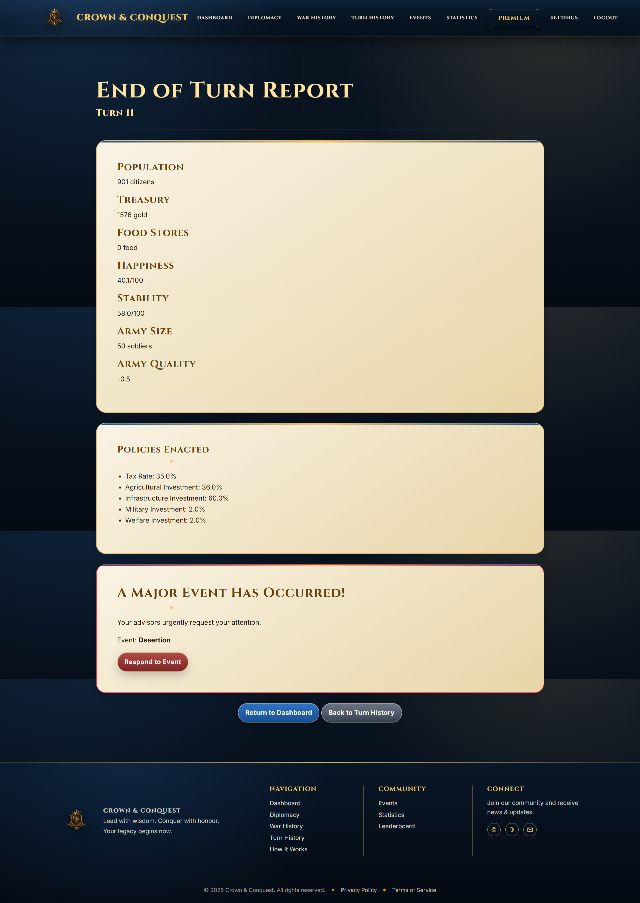

### Tablet View

The tablet layout preserves the same feedback hierarchy while reorganising the content into larger stacked sections that remain easy to read and operate using touch controls.

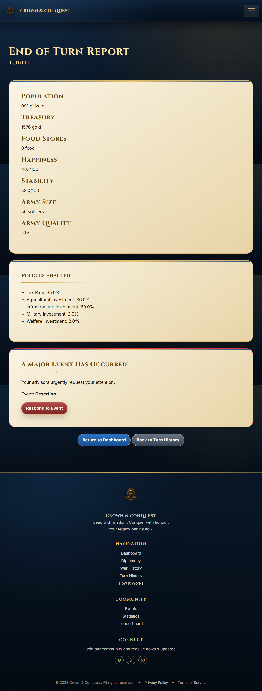

### Mobile View

On mobile devices, feedback is displayed as a clear vertical sequence, allowing players to review each outcome naturally before continuing to the full Turn Report or returning to the dashboard.

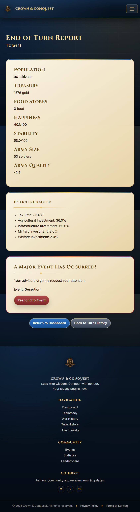

---

## Turn Reports

Each completed turn generates a detailed report summarising the changes that have occurred throughout the kingdom. Rather than simply displaying updated statistics, Turn Reports provide context by explaining how the simulation has evolved, allowing players to understand the consequences of previous strategic decisions before planning their next move.

These reports also contribute to the persistent nature of the simulation by creating a historical record that players can revisit throughout the lifetime of their kingdom. As additional turns are completed, the reports collectively document the kingdom's development and provide valuable insight into long-term trends.

### Desktop View

The desktop report layout provides enough space to display statistical summaries alongside descriptive narrative, allowing players to review detailed information without excessive scrolling. Information is grouped into clearly defined sections that support quick interpretation of the completed turn.

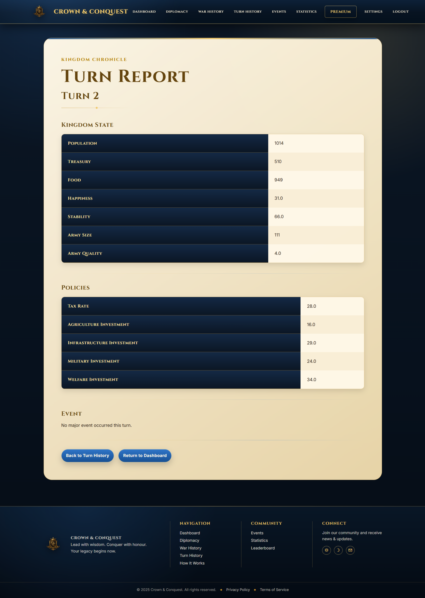

### Tablet View

The tablet version maintains the same information hierarchy while reducing horizontal spacing and reorganising content into larger stacked sections. This preserves readability while remaining comfortable for touch interaction.

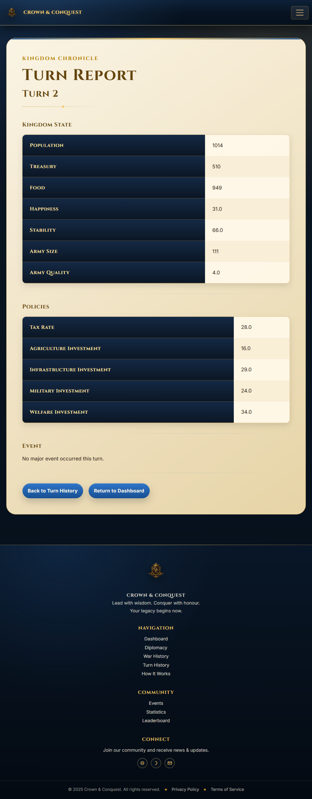

### Mobile View

On mobile devices, Turn Reports adopt a document-style layout where each section follows naturally from the previous one. Players can comfortably review the complete outcome of the turn through vertical scrolling while retaining access to every report section.

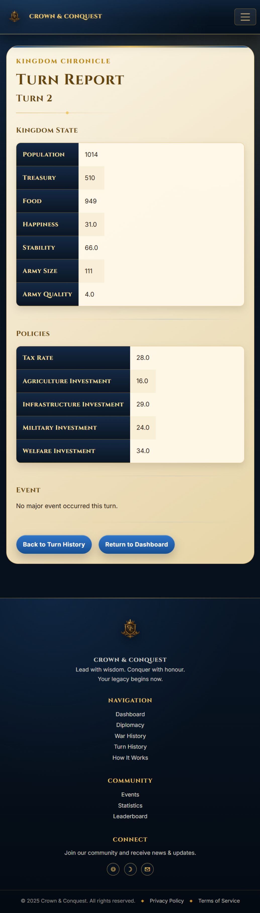

---

## Dynamic Event System

The Dynamic Event System is one of the defining gameplay mechanics within Crown & Conquest. Rather than relying on scripted scenarios or purely random encounters, the application generates events according to the evolving condition of each player's kingdom. Factors such as food production, stability, happiness, taxation, military strength, and previous kingdom development all contribute towards determining which events become possible as the simulation progresses.

This approach ensures that every kingdom develops its own unique history. Well-managed kingdoms are more likely to encounter opportunities for growth, while kingdoms suffering from poor leadership become increasingly vulnerable to internal crises. By linking event generation to the player's strategic decisions, the simulation encourages long-term planning instead of rewarding repetitive or predictable gameplay.

Each event follows the same overall workflow. Players are presented with a narrative describing the situation before responding through the integrated AI decision system. Their response is evaluated before the resulting outcome is recorded as a permanent event report within the kingdom's historical record.

---

## Famine Event

Famine events represent one of the most serious internal crises that can affect a kingdom. Triggered by poor food production or prolonged shortages, these events challenge players to balance economic development against the basic needs of their population. Left unmanaged, famine can reduce population, damage public morale, and destabilise the kingdom over several turns, making future recovery increasingly difficult.

The event encourages players to think proactively about food production rather than reacting only once shortages have begun. Successful kingdoms generally maintain sufficient agricultural capacity to minimise the likelihood of famine developing in the first place.

### Desktop View

The desktop event interface presents the famine narrative alongside the AI response panel, allowing players to carefully consider their leadership decision before submitting their response.


### Tablet View

On tablet devices, the event narrative and response controls are reorganised into larger stacked sections that remain comfortable to read and interact with using touch controls.


### Mobile View

The mobile interface presents the event as a continuous narrative followed by the response area, creating a natural reading and decision-making experience on smaller screens.

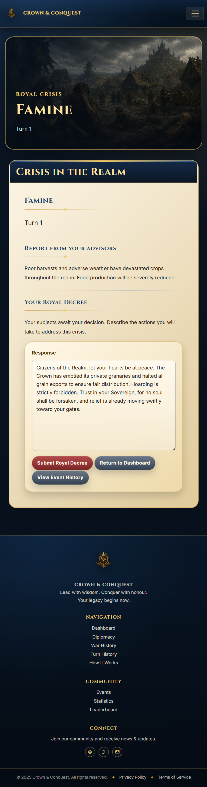

### Famine Event Report

After the player's response has been evaluated, the outcome is incorporated into the Turn Report, documenting both the narrative consequences of the decision and any resulting changes to the kingdom's resources, population, stability, or other affected statistics. Recording the outcome in this way allows players to understand how individual decisions contribute to the long-term development of their kingdom while also creating a permanent historical record that can be revisited in future turns.

### Desktop View

The desktop report provides ample space to display the event outcome alongside the wider turn summary, allowing players to review narrative details and statistical changes together within a clear document-style layout.


### Tablet View

On tablet devices, the report reorganises the same information into larger stacked sections that remain easy to read while preserving the overall structure of the desktop version. This ensures that both narrative content and statistical summaries remain equally accessible on medium-sized screens.


### Mobile View

The mobile report adopts a single-column layout that presents the event outcome as part of a continuous scrolling report. This approach maintains readability on smaller devices while allowing players to review the complete results of their decision without sacrificing any information.


---

## Riot Event

Riot events occur when public dissatisfaction reaches dangerous levels. Declining happiness and political instability increase the likelihood of civil unrest, forcing players to address the concerns of their population before disorder spreads further throughout the kingdom.

Unlike famine, which develops from resource shortages, riots primarily reflect the social consequences of poor governance. This distinction encourages players to balance economic decisions with public satisfaction throughout the simulation.

### Desktop View

The desktop layout provides sufficient space for the event description and AI response while maintaining the immersive presentation established throughout the event system.


### Tablet View

The tablet layout preserves the same interaction while adapting the content into larger touch-friendly sections suitable for medium-sized displays.


### Mobile View

On mobile devices, the event narrative and response controls are displayed in a single-column layout that guides players naturally through the decision-making process.

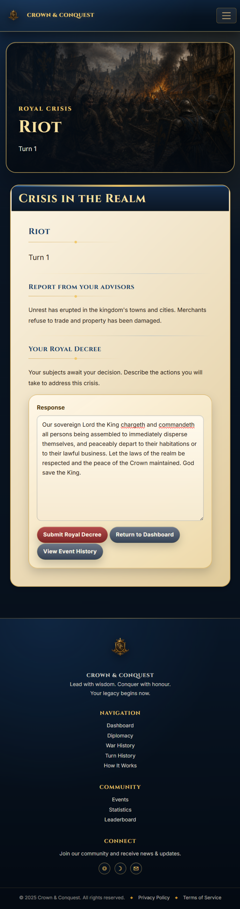

### Riot Event Report

Once the player's response has been processed, the outcome of the riot is documented within the Turn Report, outlining how the civil unrest affected the kingdom and summarising the consequences of the chosen course of action. By recording these events alongside the wider turn summary, players can clearly see how periods of instability influence the long-term development of their realm and use this information to inform future strategic decisions.

### Desktop View

The desktop report presents the riot outcome alongside the wider turn summary, providing sufficient space for both the narrative explanation and the resulting statistical changes. This allows players to review the full impact of the disturbance within a structured and easy-to-read document layout.


### Tablet View

On tablet devices, the report maintains the same logical structure while reorganising content into larger stacked sections that are better suited to medium-sized screens. The narrative and statistical information remain closely associated, making the report easy to review using touch interaction.


### Mobile View

The mobile report presents the riot outcome as part of a continuous vertical report, allowing players to comfortably review the event consequences and updated kingdom information through natural scrolling without losing any important detail.


---

## Rebellion Event

Rebellion events represent one of the most severe political crises within the simulation. Triggered by prolonged instability and declining public confidence, rebellions challenge the player's authority directly and may result in significant military and population losses if handled poorly.

Because rebellions develop gradually from existing instability, they reinforce the importance of maintaining a balanced and well-governed kingdom throughout the simulation.

### Desktop View

The desktop interface presents the rebellion scenario together with the response controls, encouraging players to carefully consider their strategy before attempting to restore order.


### Tablet View

The tablet layout reorganises supporting information into larger content blocks while maintaining the same decision-making workflow as the desktop version.


### Mobile View

The mobile interface presents the event as a sequential narrative followed by the AI response area, creating an intuitive experience on smaller devices.

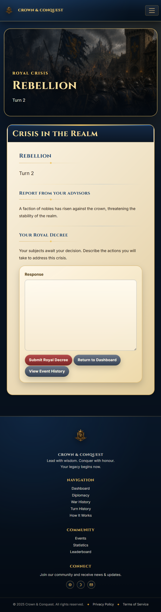

### Rebellion Event Report

Following the resolution of a rebellion, the resulting Turn Report documents the consequences of the player's decision and records the lasting effects on the kingdom. As one of the most severe internal crises within the simulation, rebellion outcomes often have a significant impact on military strength, population, and overall stability. Recording these results as part of the kingdom's permanent history allows players to reflect on how previous leadership decisions have shaped the continued development of their realm.

### Desktop View

The desktop report provides a comprehensive overview of the rebellion outcome, combining the narrative summary with the updated kingdom statistics in a spacious document-style layout. This enables players to understand both the immediate consequences of the uprising and its wider impact on the kingdom without navigating away from the report.


### Tablet View

On tablet devices, the report maintains the same clear hierarchy while reorganising the content into larger stacked sections that are easier to browse using touch interaction. The balance between narrative content and statistical information remains consistent with the desktop experience.


### Mobile View

The mobile report presents the rebellion outcome within a vertically scrolling layout that guides players naturally through the event summary and resulting kingdom changes. This responsive design ensures that the complete report remains readable and accessible on smaller screens while preserving all of the important information.


---

## Market Crash Event

Market Crash events simulate periods of economic instability that threaten the kingdom's financial prosperity. Economic decisions, taxation, and wider kingdom conditions all contribute towards the likelihood of these events occurring.

The feature reinforces the importance of maintaining a resilient economy capable of withstanding unexpected financial setbacks rather than focusing solely on short-term treasury growth.

### Desktop View

The desktop layout combines the event narrative with the AI response interface, allowing players to assess the financial crisis before deciding upon an appropriate course of action.


### Tablet View

The tablet version maintains the same presentation while optimising spacing for touch interaction and medium-sized displays.


### Mobile View

On mobile devices, the event is presented through a clean vertical layout that supports comfortable reading and text entry.

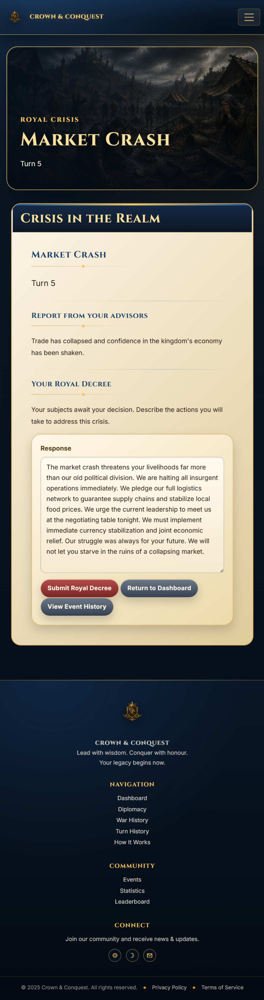

### Market Crash Event Report

Once the player's response has been evaluated, the outcome of the market crash is incorporated into the Turn Report, documenting the financial impact of the crisis together with any resulting changes to the kingdom's economy and overall stability. By recording these consequences alongside the wider turn summary, players can clearly understand how economic decisions influence the long-term prosperity of their kingdom and use this historical information to guide future financial strategy.

### Desktop View

The desktop report presents the market crash outcome within a spacious report layout, allowing the financial consequences, narrative summary, and updated kingdom statistics to be viewed together. This provides players with a complete overview of the economic event while maintaining a clear and structured presentation.


### Tablet View

On tablet devices, the report reorganises the same information into larger stacked sections that remain easy to navigate while preserving the relationship between the event narrative and the updated financial statistics. The responsive layout ensures that the report remains comfortable to review using touch interaction.


### Mobile View

The mobile report presents the market crash outcome as part of a vertically scrolling Turn Report, allowing players to comfortably review the narrative explanation and the resulting changes to their kingdom's economy without losing any important information.


---

## Desertion Event

Desertion events affect the kingdom's military forces, reflecting declining morale or dissatisfaction within the army. Rather than occurring independently, these events emerge from broader problems within the kingdom, encouraging players to maintain both military strength and internal stability.

The event highlights the interconnected nature of the simulation by demonstrating how political and social decisions can eventually influence military capability.

### Desktop View

The desktop interface provides a detailed description of the military situation alongside the AI response panel, allowing players to consider the wider implications of their leadership decision.


### Tablet View

The tablet layout reorganises the content into larger sections while preserving the same interaction and visual hierarchy.


### Mobile View

The mobile version presents the event as a vertically scrolling experience that remains easy to read and interact with on smaller screens.

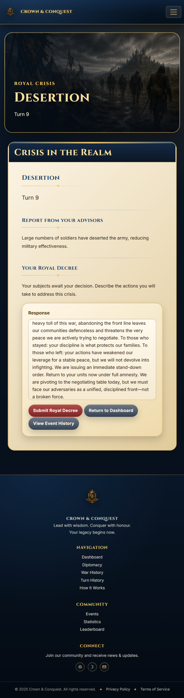

### Desertion Event Report

After the player's decision has been processed, the outcome of the desertion event is documented within the Turn Report, detailing the effect on the kingdom's armed forces together with any associated changes to military strength, morale, and overall stability. Recording these consequences as part of the kingdom's permanent history allows players to understand how internal issues can gradually weaken their military capability and influence future strategic decisions.

### Desktop View

The desktop report provides a detailed overview of the desertion event, presenting the narrative outcome alongside the updated military statistics and wider turn summary. The spacious document-style layout allows players to quickly understand both the immediate impact on their armed forces and the longer-term implications for the kingdom.


### Tablet View

On tablet devices, the report reorganises the information into larger stacked sections that remain easy to navigate while preserving the relationship between the event narrative and the updated kingdom statistics. This responsive layout ensures the report remains comfortable to review using touch interaction without sacrificing any detail.


### Mobile View

The mobile report presents the desertion outcome within a vertically scrolling Turn Report that guides players naturally through the narrative explanation and the resulting changes to their kingdom. This layout preserves the complete report while ensuring readability and ease of navigation on smaller screens.


---

## Event History

The Event History page provides a permanent chronological record of every significant event experienced throughout the life of the kingdom. Rather than acting as a simple archive, it allows players to review how previous decisions and random events have contributed to the kingdom's current state.

This historical perspective encourages players to analyse long-term patterns rather than focusing solely on individual turns, reinforcing one of the project's central themes that successful kingdoms are built through cumulative strategic decision making.

### Desktop View

The desktop layout presents historical entries in a structured chronological format that makes it easy to browse extensive event histories while maintaining a clear distinction between individual records.


### Tablet View

The tablet interface preserves the chronological layout while adjusting spacing and content width to improve readability on medium-sized displays. Navigation remains straightforward, even as the number of recorded events increases.

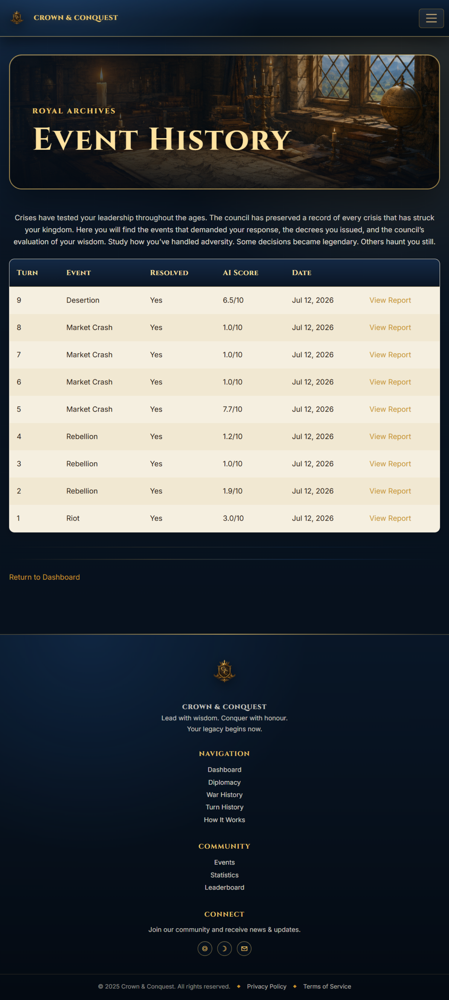

### Mobile View

On mobile devices, historical entries are presented as vertically stacked records that can be comfortably reviewed through natural scrolling. The simplified layout maintains readability without sacrificing access to historical information.

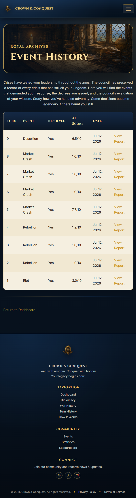

---

## Leaderboard

The Leaderboard introduces a competitive element by allowing players to compare the overall success of their kingdoms against others. Rankings reflect long-term strategic performance rather than isolated achievements, encouraging balanced gameplay across economic, military, and political systems.

The page is intentionally designed for quick comparison, allowing players to identify their current position while reviewing the progress of competing kingdoms. This encourages continued engagement and provides additional motivation to improve long-term strategic performance.

### Desktop View

The desktop leaderboard displays rankings in a structured table that allows multiple kingdoms to be compared simultaneously. Important information remains clearly aligned, making it easy to identify relative performance at a glance.


### Tablet View

The tablet layout maintains the comparative nature of the leaderboard while reducing horizontal spacing to better suit medium-sized displays. Rankings remain easy to scan and interact with using touch controls.

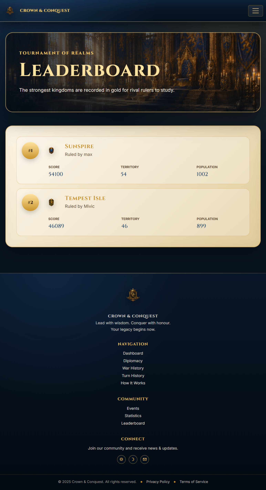

### Mobile View

On mobile devices, leaderboard entries are reorganised into stacked layouts that preserve the same ranking information while improving readability on smaller screens. This ensures that competitive information remains accessible regardless of device.

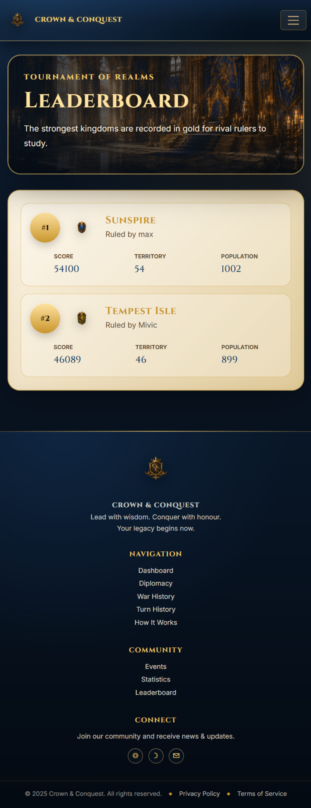

---

## Kingdom Detail

The Kingdom Detail page provides a public overview of an individual kingdom, allowing players to inspect another ruler's progress without exposing private management information. Accessible through features such as the leaderboard and diplomacy system, the page presents key public statistics that help players evaluate the strength, development, and overall performance of neighbouring kingdoms.

Rather than replicating the player's own dashboard, this page focuses exclusively on information that supports comparison and strategic decision making. Public metrics such as population, military capability, ranking score, territorial expansion, and current progress help players assess potential allies or rivals while maintaining the privacy of internal kingdom management.

### Desktop View

The desktop layout presents the kingdom profile and public statistics using a clean two-column table that allows values to be compared quickly. The generous spacing and structured layout reinforce the page's role as an informational overview while maintaining consistency with the rest of the application.

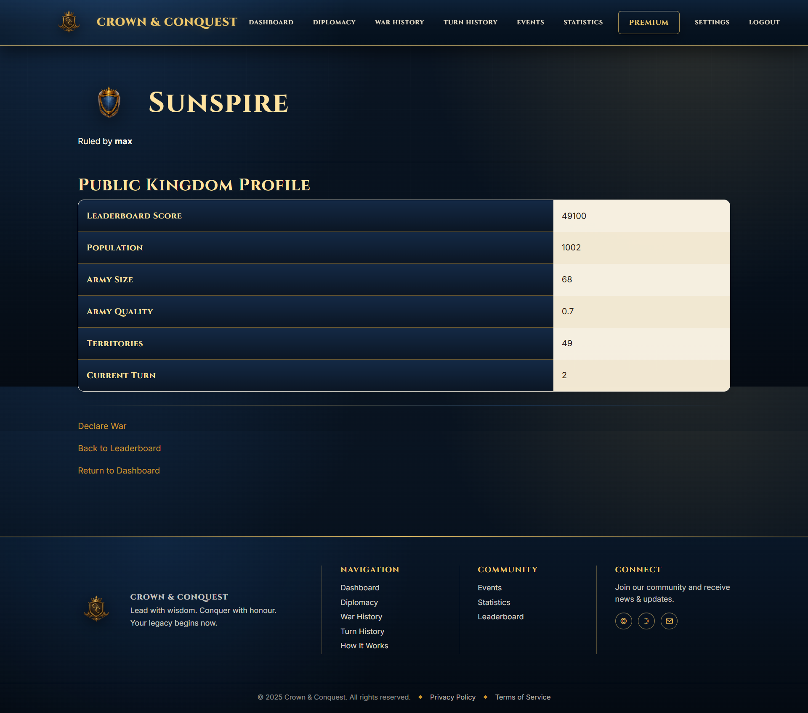

### Tablet View

The tablet version preserves the same information hierarchy while reducing horizontal spacing to better suit medium-sized devices. Public statistics remain clearly organised, allowing players to review another kingdom's progress comfortably using touch controls.

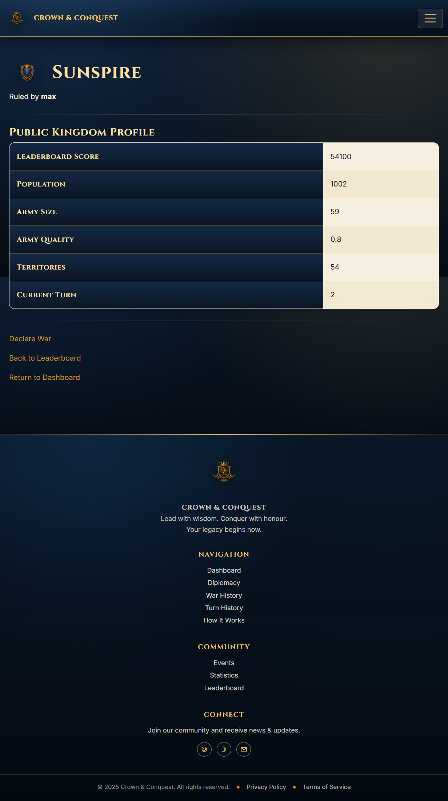

### Mobile View

On mobile devices, the profile information is reorganised into a vertically stacked layout that prioritises readability. Each public statistic remains easy to interpret while allowing players to browse kingdom profiles comfortably from smaller screens.

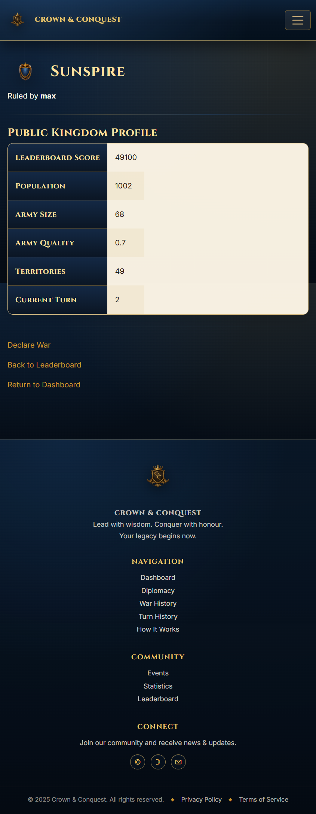

---

## Diplomacy

The Diplomacy page allows players to manage political relationships with neighbouring kingdoms before military conflict becomes necessary. Instead of encouraging constant warfare, the diplomacy system introduces alternative strategic options that reward careful planning, negotiation, and long-term thinking.

By presenting current diplomatic relationships alongside available actions, the page encourages players to consider the wider political consequences of their decisions. This additional strategic layer helps create a richer simulation where successful leadership depends upon more than military strength alone.

### Desktop View

The desktop diplomacy interface displays relationship information, diplomatic status, and available actions together, allowing players to evaluate their options before committing to a course of action. The wider layout provides space for supporting information while maintaining a clear visual hierarchy.


### Tablet View

The tablet layout maintains the same diplomatic workflow while reorganising content into larger touch-friendly sections. Information remains clearly grouped, ensuring that players can comfortably review political relationships without unnecessary scrolling.

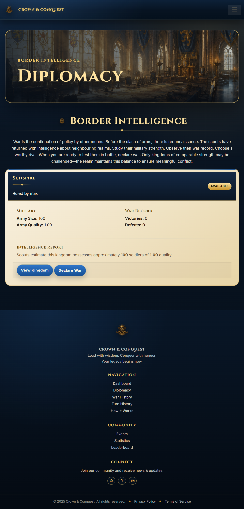

### Mobile View

On mobile devices, diplomatic information is presented in a logical vertical sequence that guides players naturally through relationship details before displaying the available diplomatic actions.

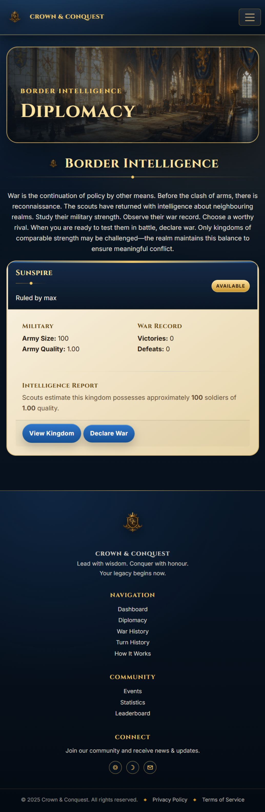

---

## Declare War

The Declare War page enables players to initiate military conflict against another kingdom once diplomatic options have been exhausted. Because warfare represents one of the most significant decisions available within the simulation, the interface is designed to communicate the importance of the action before it is confirmed.

Supporting information relating to the target kingdom is presented alongside the available controls, allowing players to assess the potential consequences before committing their forces. This reinforces the strategic nature of warfare throughout the simulation.

### Desktop View

The desktop layout combines military information, strategic context, and confirmation controls within a spacious interface that encourages careful consideration before declaring war.


### Tablet View

The tablet interface preserves the overall decision-making workflow while reducing horizontal spacing and increasing the prominence of interactive controls to improve touch usability.


### Mobile View

The mobile version reorganises information into a single-column layout where players naturally review the available information before reaching the confirmation controls, reducing the likelihood of accidental interaction.

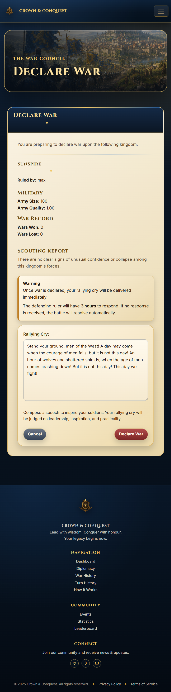

---

## War Pending

The War Pending page represents the intermediate stage between a successful war declaration and the defender’s response or eventual battle resolution.

Because warfare does not resolve immediately, this page reassures the attacking player that the declaration has been recorded successfully while clearly communicating that the conflict is still awaiting further action. It also prevents uncertainty by presenting the current war status and providing an obvious route back to the wider application.

### Desktop View

The desktop layout uses a centred status panel with generous spacing, allowing the pending state and supporting information to remain immediately visible without introducing unnecessary interface elements.


### Tablet View

The tablet layout reduces surrounding whitespace while preserving the focused status-led presentation. Important information remains grouped clearly and comfortably accessible through touch interaction.


### Mobile View

On mobile devices, the status message, supporting details, and navigation controls are arranged vertically, ensuring that the player can understand the current conflict state without horizontal scrolling.

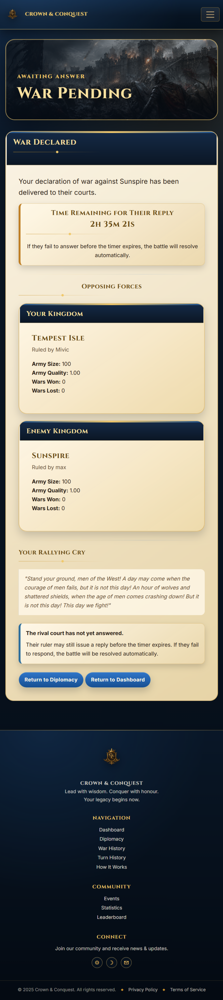

---

## War Declaration Received

When another kingdom declares war, players are presented with the War Declaration Received page, which communicates the incoming challenge and provides an opportunity to review the opposing kingdom before accepting the conflict.

The page combines narrative presentation with practical strategic information, displaying the opponent's military profile, historical record, response timer, and diplomatic message. This creates a stronger sense of immersion while encouraging informed decision making before entering battle.

### Desktop View

The desktop layout presents the incoming challenge as a structured military briefing. The response timer, opponent statistics, and exchanged messages are grouped into clearly defined sections that help players assess the situation before accepting the challenge.


### Tablet View

The tablet version maintains the same logical structure while reorganising statistical information into larger touch-friendly sections. The response timer remains prominent, ensuring that players remain aware of the limited time available to respond.


### Mobile View

On mobile devices, the challenge summary is presented as a vertically organised briefing where players review the incoming declaration, opponent profile, messages, and available actions in a natural scrolling sequence.

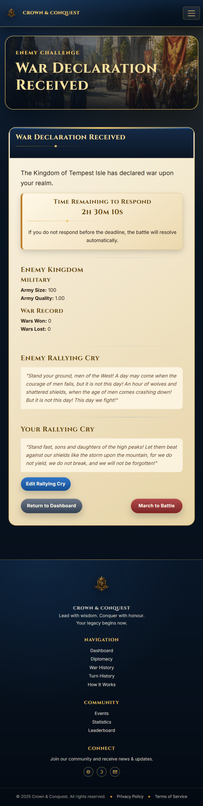

---

## Battle Reports

Battle Reports provide players with a detailed summary of every military engagement following its resolution. Rather than simply announcing victory or defeat, the reports explain the outcome of each conflict while creating a permanent historical record that contributes to the continuing story of the kingdom.

By documenting battles in a structured report format, players can review previous campaigns, analyse military performance, and use that information to inform future strategic decisions.

### Desktop View

The desktop report presents battle outcomes using a document-style layout that combines military results with supporting information in a clear and easily readable format.


### Tablet View

The tablet version reorganises the report into stacked sections that maintain readability while providing sufficient space for detailed battle summaries and supporting information.


### Mobile View

The mobile report adopts a scrolling document layout where players can comfortably review the complete battle summary from beginning to end without compromising readability.


---

## War History

War History provides a permanent archive of every military campaign undertaken by the kingdom. Rather than viewing battles as isolated events, players can examine the complete military history of their realm and observe how successive campaigns have influenced its long-term development.

This historical perspective reinforces one of the central themes of the project — that kingdoms evolve gradually through the accumulation of strategic decisions rather than individual moments of success or failure.

### Desktop View

The desktop layout displays military history using a structured chronological format that allows players to browse previous campaigns efficiently while maintaining clear separation between individual conflicts.


### Tablet View

The tablet interface preserves the chronological organisation while adapting spacing and content width to create a comfortable reading experience on medium-sized devices.

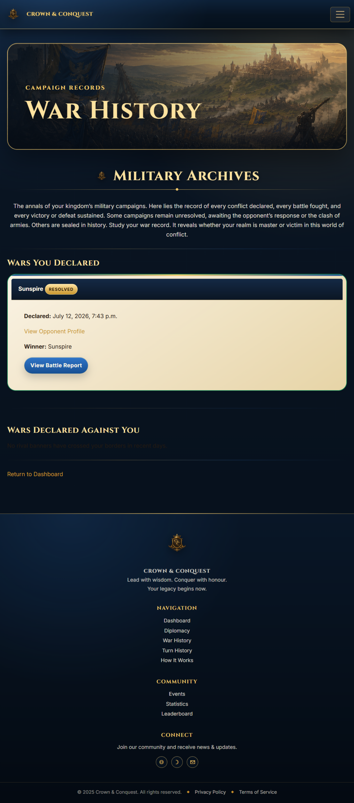

### Mobile View

On mobile devices, historical battle entries are presented as vertically stacked records that remain easy to browse through natural scrolling while preserving the chronological flow of the kingdom's military history.

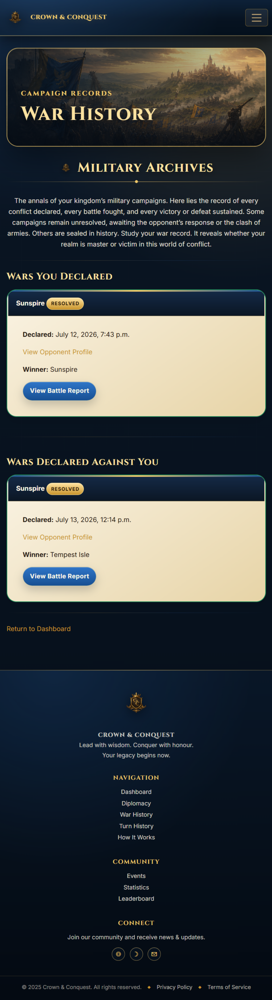

---

## Settings

The Settings page provides players with a dedicated area for managing their account independently from gameplay. Separating administrative functionality from kingdom management helps keep the simulation focused while allowing users to review and update personal account information through a familiar interface.

The design intentionally follows common account-management conventions, ensuring that players can quickly locate important settings without interrupting their gameplay experience.

### Desktop View

The desktop profile page presents account information within a clean and organised layout that clearly separates personal details from navigation and supporting actions.


### Tablet View

The tablet layout maintains the same structure while adjusting spacing and content width to improve touch interaction and readability on medium-sized devices.

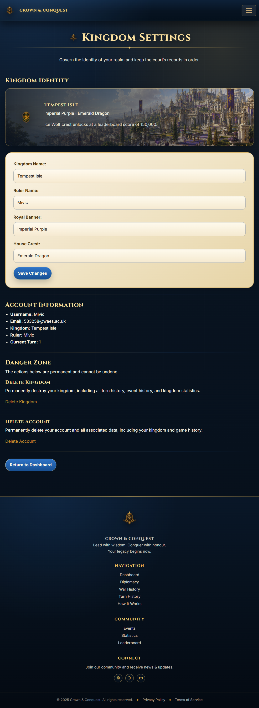

### Mobile View

The mobile profile page adopts a simplified vertical layout that keeps account information and management options easy to access while maintaining consistency with the wider application.

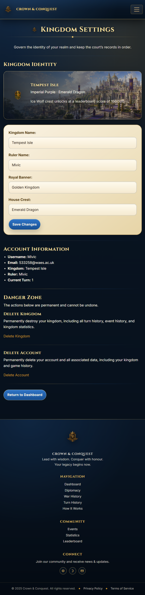

---

## Pricing

The Pricing page introduces players to the optional premium subscription available within Crown & Conquest. Rather than acting as a traditional sales page, it explains how premium functionality enhances the gameplay experience by providing additional analytical tools and historical insights while ensuring that the core simulation remains fully playable without a subscription.

The page focuses on transparency by clearly outlining the benefits included with Premium membership, allowing players to make an informed decision before proceeding to the secure Stripe checkout. This approach reflects the overall philosophy of the project by ensuring that premium features enhance strategic analysis rather than providing unfair gameplay advantages.

### Desktop View

The desktop pricing page presents subscription information using clearly separated content cards that highlight the benefits of Premium membership while maintaining a clean and balanced layout. Pricing details and subscription actions remain highly visible without distracting from the supporting feature descriptions.


### Tablet View

On tablet devices, pricing information is reorganised into stacked content sections that remain easy to compare while providing comfortable touch interaction. The overall layout preserves the same visual hierarchy established on larger screens.


### Mobile View

The mobile pricing page adopts a simple vertical layout where subscription benefits, pricing information, and upgrade actions are displayed in a logical scrolling sequence. This ensures that users can comfortably review the available options before beginning the checkout process.

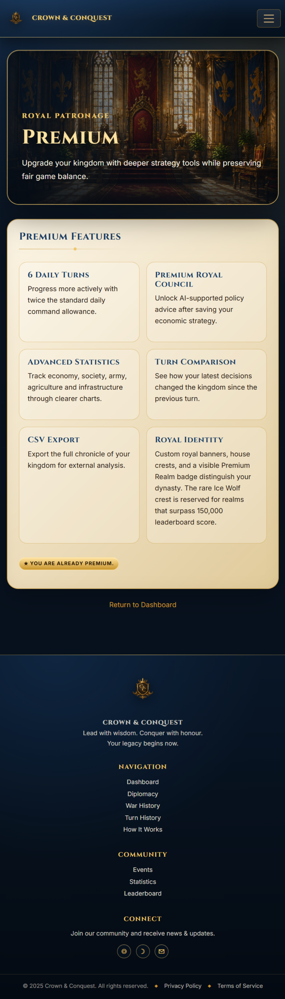

---

## Premium Statistics

Premium Statistics provide subscribers with a deeper understanding of how their kingdom has developed throughout the simulation. Instead of relying solely on the current dashboard values, players can examine broader historical trends that reveal patterns in economic growth, population development, military strength, and overall kingdom progression.

These additional insights encourage more informed decision making by allowing experienced players to identify long-term strengths, weaknesses, and strategic opportunities that may not be immediately obvious from individual turn reports.

### Desktop View

The desktop statistics page presents multiple analytical panels simultaneously, allowing players to compare different aspects of kingdom development within a single interface. The wider layout supports a comprehensive overview without overwhelming the user.


### Tablet View

On tablet devices, analytical content is reorganised into larger sections that remain easy to compare while improving readability and touch interaction. Important metrics remain clearly visible throughout the page.


### Mobile View

The mobile version displays analytical information as a structured sequence of statistical summaries that are easy to review through vertical scrolling while maintaining the same level of detail available on larger devices.


---

## Turn History

Turn History expands upon the standard reporting system by providing subscribers with a comprehensive historical overview of every completed turn. Instead of reviewing reports individually, players can analyse the long-term evolution of their kingdom and identify strategic trends that have emerged throughout their campaign.

The feature complements the Statistics page by focusing on historical progression rather than aggregated analytical data, giving players multiple perspectives from which to evaluate their leadership.

### Desktop View

The desktop layout presents historical reports in a spacious chronological format that allows players to browse large quantities of information efficiently while maintaining clear separation between individual turns.


### Tablet View

The tablet version preserves the chronological organisation while adapting spacing to improve readability and navigation on medium-sized devices. Historical entries remain clearly grouped, encouraging exploration of previous turns.

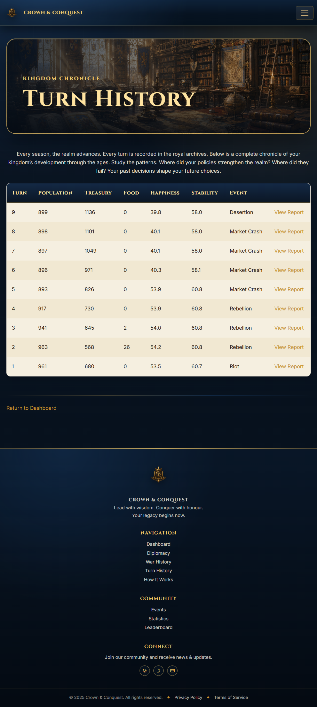

### Mobile View

The mobile layout reorganises historical reports into a vertically scrolling archive that remains easy to browse while preserving the complete chronological history of the kingdom's development.

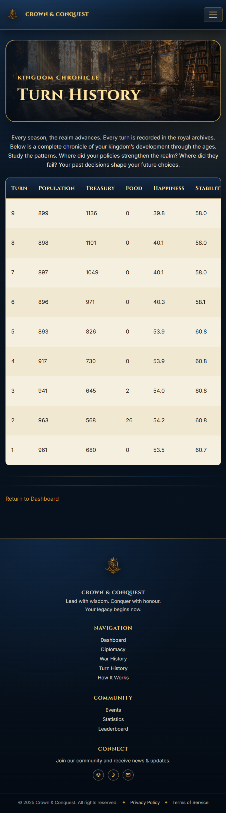

---

## Responsive Design

Responsiveness formed a core consideration throughout the development of Crown & Conquest rather than being introduced as a final stage of the project. Every page was designed to provide a consistent user experience across desktop, tablet, and mobile devices while preserving access to the application's complete feature set.

Layouts progressively adapt according to the available screen space rather than simply shrinking desktop content. Multi-column dashboards transition into stacked layouts, navigation components simplify naturally, and tables, reports, and statistical summaries are reorganised to maintain readability without sacrificing functionality.

This responsive-first approach ensures that players can comfortably manage their kingdoms, review reports, engage in diplomacy, participate in warfare, and access premium features regardless of the device they choose to use.

# Technical Discussion

While previous sections have focused primarily upon user experience and individual features, this section examines the underlying engineering decisions that shaped the implementation of Crown & Conquest.

Rather than simply describing what the application does, the following discussion explains **how** the simulation was implemented, **why** particular architectural decisions were chosen, and **how those decisions contribute to maintainability, scalability, and long-term development**.

This distinction is particularly important.

Many full-stack web applications consist primarily of CRUD operations layered over a relational database.

Although Crown & Conquest naturally incorporates CRUD functionality where appropriate, the project extends considerably beyond this model.

The application instead revolves around an evolving simulation in which the majority of user interactions trigger business logic rather than simple database manipulation.

Consequently, software architecture became significantly more important than interface design alone.

---

# Overall Architecture

Crown & Conquest was designed as a modular Django application rather than a single monolithic project. Although the application presents itself as a medieval kingdom simulation, it is ultimately a collection of independent systems that cooperate through clearly defined interfaces and shared database models.

Django's Model–View–Template architecture provides the foundation of the project, separating presentation from application logic and persistent data. This separation is particularly important for a simulation-driven application, where a single user action can update multiple gameplay systems simultaneously. Rather than embedding calculations throughout templates or client-side scripts, authoritative game logic remains within the backend, allowing each request to be validated, processed, and persisted before the updated state is presented to the user.

The project is further divided into multiple Django applications, each responsible for a specific domain such as kingdom management, warfare, payments, or shared functionality. This modular structure improves maintainability by reducing coupling between unrelated systems while allowing new mechanics to be introduced without requiring significant changes elsewhere in the codebase.

Throughout development, architectural decisions were guided by three principles:

- separation of concerns;
- maintainability;
- extensibility.

These principles influenced everything from database modelling and turn processing to AI integration and payment handling, ensuring that the simulation could continue growing without becoming increasingly difficult to understand or maintain.

# Django Applications

Building Crown & Conquest as a single Django application would have quickly become difficult to maintain as additional gameplay systems were introduced. Authentication, turn processing, diplomacy, warfare, payment processing, AI integration, and shared user-facing functionality all operate within the same simulation, but each solves a different problem and evolves at a different rate.

To manage this complexity, the project follows Django's recommended modular architecture by separating functionality into multiple applications, each with a clearly defined responsibility. This approach improves maintainability by reducing coupling between unrelated systems, makes the codebase easier to navigate, and allows individual features to be extended or refactored without unnecessarily affecting the rest of the project.

Although each application operates independently, they communicate through Django's ORM, shared templates, and the project's central configuration. Together they provide a cohesive simulation in which the boundaries between applications remain largely invisible to the user while keeping the underlying implementation organised and scalable.

## Core

The `core` application contains the shared functionality used throughout the project. It provides the public-facing pages, including the landing page and game mechanics guide, together with the leaderboard, common navigation, reusable utilities, and shared views that support the wider application.

By centralising functionality that is not directly related to gameplay, the remaining applications can focus exclusively on their own domain-specific responsibilities. This reduces duplication while ensuring that commonly used components remain consistent throughout the project.

## Kingdoms

The `kingdoms` application forms the heart of the simulation and contains the majority of the project's business logic. It is responsible for creating and managing kingdoms, processing turns, validating player policies, updating the simulation, generating historical records, managing settings, producing premium statistics, and coordinating the AI-assisted event system.

Because the `Kingdom` model represents the current state of each player's realm, this application acts as the primary interface between player actions and the underlying simulation. Every completed turn transforms the kingdom into a new persistent state, while historical records preserve the progression that led to that outcome.

## Wars

The `wars` application encapsulates diplomacy and military conflict, separating warfare mechanics from the core kingdom simulation. It manages war declarations, rallying cries, battle modifiers, pending conflicts, battle resolution, historical reports, and cooldown periods between kingdoms.

Keeping these mechanics within a dedicated application allows the combat system to evolve independently while remaining fully integrated with the wider simulation. The application communicates with kingdom data through defined model relationships rather than embedding warfare logic throughout the core gameplay code.

## Payments

The `payments` application manages the project's Stripe integration and premium subscription system. It is responsible for creating checkout sessions, validating webhook requests, synchronising subscription status, and controlling access to premium functionality.

Separating payment processing from gameplay logic improves both security and maintainability. External payment infrastructure remains isolated from the simulation, ensuring that subscription management can evolve independently without introducing unnecessary dependencies into the kingdom or warfare applications.

---

# Separation of Concerns

As the scope of Crown & Conquest expanded, maintaining a clear separation of responsibilities became increasingly important. The application combines authentication, persistent simulation, artificial intelligence, payment processing, warfare, historical reporting, and responsive user interfaces, all of which interact with the same underlying kingdom data. Without clear architectural boundaries, these systems would quickly become difficult to understand, maintain, and extend.

To manage this complexity, the project follows Django's Model–View–Template architecture while assigning each layer a distinct responsibility within the request lifecycle.

- **Models** define the application's persistent data and the relationships between gameplay entities.
- **Views** coordinate requests, permissions, and communication between the frontend and backend systems.
- **Forms** validate user input before any changes are applied to the simulation, ensuring that only valid data reaches the application logic.
- **Templates** are responsible solely for presenting information to the user and deliberately avoid performing gameplay calculations.
- **Static assets**, including CSS and JavaScript, provide styling, responsive layouts, and client-side enhancements that improve the user experience without affecting the authoritative state of the simulation.

Separating these responsibilities prevents individual components from becoming tightly coupled and allows features to evolve independently. New gameplay systems can therefore be introduced with minimal impact on existing functionality, while testing and debugging remain considerably more straightforward because each layer performs a clearly defined role.

---

# Server-Side Business Logic

One of the most significant architectural decisions made during development was to perform all authoritative gameplay calculations on the server. Although JavaScript is used to enhance interaction and provide immediate feedback to the user, it is never responsible for determining the outcome of the simulation. Instead, every action that affects a kingdom is validated and processed within Django before the updated state is written to the database.

This approach was adopted primarily to preserve the integrity of the simulation. Client-side calculations can be manipulated through browser developer tools, making them unsuitable for competitive features such as leaderboards, warfare, or premium statistics. By centralising business logic within the backend, every player experiences the same simulation regardless of their browser or device, and gameplay remains protected from client-side modification.

Keeping business logic on the server also improves maintainability. Turn progression, economic calculations, warfare resolution, AI evaluations, and subscription management all rely on shared rules that can be reused across multiple views without duplication. Changes to these systems only need to be implemented in one place, reducing the likelihood of inconsistent behaviour as the application evolves.

Finally, this architecture greatly simplifies testing. Because the simulation operates independently of the user interface, calculations can be validated through Django's testing framework without requiring browser interaction. This separation allows the core mechanics of the application to be tested in isolation, making future development and refactoring significantly more reliable.

---

## Relationships

Foreign keys establish clear ownership between related gameplay entities.

Historical reports belong to kingdoms.

Events reference kingdoms.

Battles reference participating kingdoms.

Premium subscriptions belong to authenticated users.

Maintaining these relationships through Django's ORM significantly improves data integrity.

---

## Extensibility

Models were intentionally designed to accommodate future gameplay mechanics.

Features such as:

- trade;
- alliances;
- technology;
- religion;
- espionage;
- seasonal simulation;

could be introduced without requiring fundamental redesign of the existing database structure.

This extensibility reflects one of the principal advantages of relational database modelling when combined with Django's ORM.

---

# Maintainability

Throughout development, maintainability consistently influenced architectural decisions.

Several practices contributed towards achieving this objective.

These include:

- modular Django applications;
- reusable templates;
- shared styling;
- isolated business logic;
- relational database design;
- reusable forms;
- clear naming conventions.

Collectively, these practices reduce technical debt while improving the long-term sustainability of the project.

They also ensure that future gameplay systems can be incorporated with considerably less effort than would otherwise be required.

---

# Turn Processing Architecture

Turn progression forms the core of the simulation and represents one of the most complex processing pipelines within Crown & Conquest. While advancing a turn appears to the player as a single action, it triggers a carefully ordered sequence of backend operations that update every aspect of the kingdom before persisting the new state to the database. The complete workflow is illustrated in the **Turn Progression Flowchart** presented earlier in this document; this section focuses on the architectural decisions behind that implementation.

Rather than performing calculations independently or in an arbitrary order, the simulation follows a deterministic processing pipeline in which each stage builds upon the results of the previous one. Many gameplay systems are interdependent—for example, policy decisions influence food production, food availability affects population growth, and population changes subsequently impact taxation, military recruitment, and future resource requirements. Processing these systems sequentially ensures that each calculation is based on the most up-to-date state of the kingdom, maintaining consistency throughout the simulation.

This staged approach also improves maintainability. Individual processing steps remain focused on a specific aspect of the simulation, making them easier to understand, test, and modify without introducing unintended side effects elsewhere in the pipeline. As new mechanics were introduced during development, such as AI-assisted events, premium analytics, and warfare systems, they could be integrated into the existing processing sequence rather than requiring fundamental changes to the overall architecture.

Finally, processing an entire turn on the server guarantees that every update is validated before being committed to the database. Once all calculations have been completed successfully, the resulting kingdom state is persisted and recorded within the historical reporting system, providing both an accurate snapshot of progression and a reliable foundation for future turns. This ensures that each turn represents a complete and consistent transition from one kingdom state to the next, preserving the integrity of the simulation as it evolves over time.

# Simulation Algorithms

Although Crown & Conquest presents itself as a medieval kingdom management game, its underlying implementation is driven by a collection of interconnected algorithms that model the changing state of each kingdom. Rather than treating gameplay systems as independent mechanics, the simulation evaluates a range of economic, social, and military variables that influence one another over successive turns. This interconnected approach creates a simulation where player decisions produce meaningful long-term consequences rather than isolated outcomes.

The majority of calculations performed during turn progression are deterministic, ensuring that identical kingdom states always produce the same baseline results. This predictability allows players to understand the consequences of their decisions over time while also making the simulation easier to test and maintain. However, deterministic calculations alone would eventually lead to highly predictable gameplay, reducing both challenge and replayability.

To address this, deterministic processing is combined with controlled randomness. Random events are not generated in isolation but are influenced by the current condition of the kingdom, allowing player decisions to shape the likelihood of future opportunities and crises without making outcomes entirely predictable. This hybrid approach preserves strategic agency while introducing enough uncertainty to ensure that no two playthroughs evolve in exactly the same way.

The simulation also models the relationships between gameplay systems rather than evaluating each variable independently. Changes made in one area of the kingdom naturally influence several others, encouraging players to consider the wider consequences of every decision instead of optimising individual statistics in isolation.

```text
Population
     ↓
Food Consumption
     ↓
Treasury
     ↓
Infrastructure
     ↓
Military Capacity
     ↓
Diplomatic Strength
```

In practice, these relationships create feedback loops throughout the simulation. Increasing taxation may improve the treasury in the short term, but it can also reduce public happiness and increase the likelihood of future instability. Similarly, expanding the military provides greater defensive capability but increases ongoing costs that must be supported by the kingdom's economy and food production. As a result, successful gameplay depends on balancing competing priorities rather than maximising a single attribute.

This philosophy extends to the policy allocation system, where individual policy decisions influence multiple aspects of the simulation simultaneously. Rather than applying arbitrary bonuses or penalties, each policy represents a strategic trade-off that encourages players to weigh immediate benefits against potential long-term consequences. The implementation of these trade-offs is discussed in the following section.

# Policy Decision Trade-offs

Policy decisions are the primary mechanism through which players influence the development of their kingdom. At the beginning of each turn, the player selects a tax rate and allocates a fixed investment budget across agriculture, infrastructure, military development, and welfare.

The four investment categories must always total **100%**, meaning that increasing support for one area necessarily reduces the resources available to the others. The tax rate is managed separately and may range from **0% to 50%**.

This creates two distinct forms of strategic tension:

- The tax rate determines the balance between immediate revenue and public wellbeing.
- The investment allocation determines which sectors of the kingdom receive long-term support.

Because the simulation systems are interconnected, a policy choice rarely affects only a single statistic. Decisions influence food production, population growth, treasury income, happiness, stability, military strength, event probabilities, and future economic performance.

---

## Policy Constraints

The policy system enforces the following rules:

```text
Tax Rate:
0% - 50%

Agriculture + Infrastructure + Military + Welfare:
Must equal exactly 100%
```

For example:

```text
Agriculture      40%
Infrastructure   30%
Military         20%
Welfare          10%
--------------------
Total           100%
```

Increasing military investment from 20% to 40% requires removing 20 percentage points from one or more of the remaining categories.

This fixed allocation system forms the foundation of the game's policy trade-offs.

---

## Taxation

Taxation generates treasury revenue but also reduces economic productivity and public happiness.

### Economic Effects

Productivity is calculated using:

```text
Productivity =
1 - 0.8 × (Tax Rate ÷ 100)²
```

Economic output is then calculated as:

```text
Economic Output =
Population × Productivity × Economic Noise
```

Revenue is calculated as:

```text
Revenue =
Economic Output × (Tax Rate ÷ 100)
```

Higher tax rates collect a larger share of economic output but simultaneously reduce overall productivity.

Approximate productivity values before random variation:

```text
Tax Rate    Productivity
0%          100.0%
10%          99.2%
20%          96.8%
30%          92.8%
40%          87.2%
50%          80.0%
```

At 50% taxation the kingdom collects a large portion of output, but the economy operates at only 80% of its untaxed productivity.

### Happiness Cost

Taxation directly reduces happiness:

```text
Happiness =
50
- (Tax Rate × 0.3)
+ (Welfare Investment × 0.4)
+ Food Balance Effect
```

Each percentage point of tax reduces happiness by **0.3 points**.

Examples:

```text
Tax Rate    Happiness Penalty
10%         -3
20%         -6
30%         -9
40%         -12
50%         -15
```

This creates a clear trade-off:

```text
Higher Taxation
       ↓
More Revenue
       ↓
Lower Productivity
       ↓
Lower Happiness
       ↓
Lower Stability
       ↓
Higher Event Risk
```

### Market Crash Risk

Taxation contributes directly to market crash probability:

```text
Market Crash Chance =
2%
+ Tax Contribution
+ Stability Contribution
```

Where:

```text
Tax Contribution =
(Tax Rate ÷ 100) × 0.2
```

A 50% tax rate therefore adds **10 percentage points** to market crash probability before stability is considered.

### Strategic Trade-off

High taxation provides short-term financial strength but increases long-term economic and social pressure.

Low taxation supports happiness and growth but may leave the treasury unable to cover maintenance costs.

---

## Agriculture Investment

Agriculture investment improves agricultural efficiency, which determines food production.

Agricultural efficiency is updated each turn using:

```text
New Agricultural Efficiency =
Current Agricultural Efficiency
+ Agriculture Contribution
+ Infrastructure Contribution
- Natural Decay
```

Where:

```text
Agriculture Contribution =
Agriculture Investment ÷ 100 × 0.01

Infrastructure Contribution =
Infrastructure Investment ÷ 100 × 0.005

Natural Decay =
Current Agricultural Efficiency × 0.01
```

### Food Production

Food production is based on agricultural efficiency:

```text
Expected Food =
Population × Agricultural Efficiency
```

Food output is then modified by famine effects and stability-related variation.

More agricultural investment increases:

- Food production
- Food surplus potential
- Carrying capacity
- Population growth potential
- Happiness through food balance
- Resistance to famine

### Strategic Trade-off

Agriculture is essential for sustaining population growth, but every point invested in agriculture reduces funding available for:

- Infrastructure development
- Military growth
- Welfare spending

Overinvestment may produce a prosperous food supply but leave the kingdom vulnerable in other areas.

---

## Infrastructure Investment

Infrastructure is the strongest long-term growth investment in the simulation.

Infrastructure changes according to:

```text
New Infrastructure =
Current Infrastructure
+ (Infrastructure Investment ÷ 100 × 0.02)
- (Current Infrastructure × 0.01)
```

Like agricultural efficiency, infrastructure experiences continuous decay and requires ongoing investment.

### Carrying Capacity

Infrastructure improves carrying capacity:

```text
Carrying Capacity =
Food Production × (1 + Infrastructure)
```

This means infrastructure does not create food directly. Instead, it improves how effectively food supports population growth.

For example:

```text
Food Production = 1,000

Infrastructure = 1.0
Carrying Capacity = 2,000

Infrastructure = 1.5
Carrying Capacity = 2,500
```

### Secondary Agricultural Benefits

Infrastructure also improves agricultural efficiency:

```text
Infrastructure Contribution =
Infrastructure Investment ÷ 100 × 0.005
```

As a result, infrastructure supports both food systems and population growth.

### Strategic Trade-off

Infrastructure provides relatively little immediate benefit but compounds over time.

High infrastructure investment means sacrificing short-term gains for future growth.

Neglecting infrastructure allows decay to reduce future food efficiency and carrying capacity.

---

## Military Investment

Military investment provides the most immediate and visible effect.

Army growth is calculated as:

```text
Military Growth =
Military Investment ÷ 100 × 5
```

The result is converted to an integer before being added to the army.

Examples:

```text
Military Investment    Army Growth
10%                    0
20%                    1
40%                    2
60%                    3
80%                    4
100%                   5
```

This creates threshold effects where allocations below 20% provide no immediate troop increase.

### Stability Impact

Army effectiveness is calculated as:

```text
Army Effectiveness =
Army Quality × (Happiness ÷ 100)
```

Army strength becomes:

```text
Army Strength =
Army Size × Army Effectiveness
```

Stability receives a contribution from army strength:

```text
Stability =
50
+ (Happiness × 0.2)
+ (Army Strength × 0.0001)
```

A stronger army can improve stability, but effectiveness depends on happiness.

### Maintenance Costs

Every soldier generates ongoing expenses:

```text
Army Maintenance =
Army Size × 0.02
```

Total kingdom costs are:

```text
Population × 0.1
+ Army Size × 0.02
```

Military expansion therefore introduces long-term economic pressure.

### Strategic Trade-off

Military investment provides stronger defence and war capability but increases maintenance costs and limits investment in civilian sectors.

---

## Welfare Investment

Welfare has the strongest direct effect on happiness.

The contribution is:

```text
Welfare Happiness Bonus =
Welfare Investment × 0.4
```

Examples:

```text
Welfare Investment    Happiness Bonus
10%                   +4
20%                   +8
30%                   +12
40%                   +16
50%                   +20
```

Because welfare offsets tax penalties, it can be used to maintain public approval despite heavy taxation.

### Secondary Effects

Happiness influences:

- Population growth
- Army effectiveness
- Stability
- Riot probability
- Rebellion probability
- Desertion probability

Army effectiveness includes:

```text
Army Quality × Happiness ÷ 100
```

Population growth also includes:

```text
Happiness ÷ 100
```

Welfare therefore strengthens several systems indirectly.

### Strategic Trade-off

Welfare creates a happier and more stable kingdom but does not directly improve:

- Food production
- Infrastructure
- Army size
- Treasury revenue

Heavy welfare investment improves resilience while slowing physical development.

---

## Food, Happiness and Population Growth

Population growth combines the effects of several policy systems.

Growth is calculated using:

```text
Growth Rate =
2%
× (1 - Population ÷ Carrying Capacity)
× (Happiness ÷ 100)
× (Stability ÷ 100)
```

Population growth therefore depends on:

1. Sufficient carrying capacity.
2. Strong happiness.
3. Strong stability.
4. Random variation.

### Carrying Capacity Pressure

As population approaches carrying capacity:

```text
1 - Population ÷ Carrying Capacity
```

approaches zero, slowing growth.

If population exceeds carrying capacity, growth may become negative.

This means:

```text
High Agriculture
+ High Infrastructure
+ Low Happiness
= Weak Population Growth

High Welfare
+ Low Agriculture
+ Low Infrastructure
= Happy Population
  but Limited Capacity
```

No single policy can maximise population growth independently.

---

## Stability as a Delayed Outcome

Stability is recalculated near the end of the turn:

```text
Stability =
50
+ Happiness Contribution
+ Army Strength Contribution
```

Where:

```text
Happiness Contribution =
Happiness × 0.2

Army Strength Contribution =
Army Strength × 0.0001
```

This makes stability an indirect result of multiple policy decisions.

```text
Taxation
Welfare
Food Balance
      ↓
  Happiness
   ↙    ↘
Growth   Army Effectiveness
             ↓
       Army Strength
             ↓
         Stability
```

### Volatility Effects

Stability controls the amount of random variation applied to several systems:

```text
Noise Variation =
5% × (1 + (100 - Stability) ÷ 100)
```

Approximate values:

```text
Stability    Variation
100          5.0%
50           7.5%
0            10.0%
```

Stable kingdoms experience more predictable outcomes, while unstable kingdoms face greater volatility.

---

## Food Storage and Famine Risk

Food surpluses are partially stored:

```text
Stored Food =
Food Surplus × 0.25
```

If production fails to exceed current demand, stored food becomes zero.

Stored food influences famine probability.

The famine system begins with a base chance of 2% and increases risk when food reserves are inadequate relative to population.

Agriculture and infrastructure reduce famine exposure by increasing production and carrying capacity, while welfare helps minimise the social consequences when shortages occur.

---

## Maintenance Costs and Treasury Pressure

Investment percentages allocate development priorities but do not directly spend treasury funds.

The treasury changes according to:

```text
Treasury Change =
Tax Revenue
- Population Maintenance
- Army Maintenance
```

Where:

```text
Population Maintenance =
Population × 0.1

Army Maintenance =
Army Size × 0.02
```

This creates an important distinction:

- Policy allocations do not directly consume money.
- Population growth increases maintenance costs.
- Army expansion increases maintenance costs.
- Taxes are required to support long-term growth.

Growth alone is not automatically profitable. A larger kingdom also becomes more expensive to maintain.

---

## Timing and Delayed Effects

Several policies produce delayed benefits.

### Agriculture and Infrastructure

Updated before food production and therefore affect the current turn immediately.

### Military

New soldiers are added after army strength calculations.

New recruits therefore do not improve stability until future turns.

### Welfare and Taxation

Happiness is calculated after population growth has already been determined.

As a result, much of their effect is realised during subsequent turns.

### Stability

Random variation uses the stability value available at the start of the turn.

The newly calculated stability affects future turns rather than the current one.

This sequencing means policy decisions often reveal their full consequences several turns later.

---

## Summary of Policy Trade-offs

### Higher Taxation

**Benefits**

- Higher immediate revenue

**Costs**

- Lower productivity
- Lower happiness
- Higher event risk
- Increased market crash probability

### Lower Taxation

**Benefits**

- Higher happiness
- Stronger long-term growth potential

**Costs**

- Reduced treasury income

### Agriculture

**Benefits**

- Greater food production
- Better population support
- Reduced famine pressure

**Costs**

- Less investment available elsewhere

### Infrastructure

**Benefits**

- Higher carrying capacity
- Strong long-term growth
- Secondary agricultural benefits

**Costs**

- Limited short-term rewards

### Military

**Benefits**

- Larger army
- Better military capability
- Increased long-term security

**Costs**

- Higher maintenance costs
- Reduced civilian investment

### Welfare

**Benefits**

- Higher happiness
- Better stability
- Stronger army effectiveness
- Lower unrest risk

**Costs**

- No direct economic, military, or agricultural growth

---

## Conclusion

The policy system rewards adaptation rather than a single optimal strategy. Effective decisions depend on the kingdom's current circumstances, including treasury reserves, food production, population pressure, military requirements, happiness, stability, and exposure to future events.

Every percentage point invested in one area is a deliberate sacrifice in another. As a result, successful play requires balancing immediate needs against long-term sustainability, ensuring that growth in one sector does not create vulnerabilities elsewhere in the kingdom.

---

## Dynamic Event Design

Dynamic events were designed to reinforce the interconnected nature of the simulation rather than exist as isolated random encounters. Instead of presenting players with a fixed sequence of scripted scenarios or selecting events entirely at random, the event system evaluates the current state of each kingdom before determining which outcomes are appropriate. Factors such as stability, food reserves, happiness, military strength, and recent policy decisions all contribute to the likelihood of particular events occurring.

This approach ensures that events feel like natural consequences of the player's leadership rather than arbitrary interruptions. Poor economic management, for example, increases the probability of unrest or financial crises, while a prosperous and stable kingdom is more likely to experience beneficial developments. Although an element of randomness is retained to preserve variety and replayability, player decisions continue to influence the overall direction of the simulation.

By combining deterministic simulation with state-dependent event generation, Crown & Conquest creates a gameplay experience in which events emerge from the evolving condition of the kingdom, encouraging long-term strategic planning while ensuring that no two playthroughs unfold in exactly the same way.

---

# Artificial Intelligence Integration

Artificial intelligence is integrated into Crown & Conquest as a bounded evaluation service rather than as an autonomous simulation engine. Gemini supports three areas of gameplay: assessing player responses to kingdom events, evaluating rallying cries used during warfare, and providing strategic policy advice to premium users.

The AI does not determine the underlying rules of the simulation. Resource calculations, policy effects, event consequences, battle resolution, and persistent state changes remain controlled by Django. Gemini instead evaluates player-written input and returns structured information that the backend can validate and incorporate into existing gameplay systems. This preserves the authority of the server-side simulation while allowing player decisions to receive contextual and varied feedback.

Prompt engineering was particularly important because unrestricted natural-language responses would be difficult to process reliably. Each prompt defines the role Gemini should adopt, the criteria it must evaluate, the expected scoring range, and the exact fields that must be returned. Event responses are assessed according to empathy, leadership, and practicality, while rallying cries are evaluated for leadership, inspiration, and strategic practicality. Policy advice is restricted to a concise summary, identified risk, and recommendation.

Gemini is configured to return JSON matching a defined response schema rather than arbitrary prose. The backend then parses the response, checks that valid data was returned, converts numerical values into the expected types, and constrains scores and modifiers to permitted ranges. For example, event and rallying-cry scores are limited to values between 1 and 10, while the battle modifier derived from a rallying cry is restricted to a narrow range. This prevents unusually generous or malformed AI output from creating disproportionate gameplay effects.

The application also deliberately recalculates some values after receiving the response. The rallying-cry modifier is derived by Django from the validated average score rather than being accepted directly from Gemini. Similarly, the final event score is calculated from the returned evaluation categories before event effects are applied. This ensures that AI contributes an assessment, while the application remains responsible for translating that assessment into gameplay consequences.

## Fallback Behaviour

Because Gemini is an external service, Crown & Conquest does not assume that every request will succeed. An API key may be unavailable, a network or service error may occur, or Gemini may return content that cannot be parsed as valid JSON. Each AI function therefore handles failures internally and returns a safe result in the same structure expected by the rest of the application.

If an event response cannot be evaluated, the player receives cautious default scores of 4 for empathy, leadership, and practicality, together with feedback explaining that the royal council could not complete a full assessment. The event can still be resolved and its effects applied, ensuring that an unavailable AI service does not block kingdom progression.

Rallying cries follow a similar approach. A failed evaluation receives conservative scores and a minor battle modifier of `0.98`. This avoids granting an unfair advantage while still allowing the declaration or battle process to continue normally.

The premium policy advisor uses a more detailed rule-based fallback. Django first calculates a deterministic preview of the selected policies and then evaluates conditions such as taxation, treasury pressure, food reserves, infrastructure, welfare, happiness, military investment, and exposure to war. It uses these conditions to generate a relevant risk and recommendation without requiring Gemini. The returned data also records whether the advice originated from Gemini or from the rules-based system.

This fallback architecture means that AI enhances the application without becoming a critical dependency. Core gameplay remains available when Gemini is unavailable, and every fallback preserves the same response structure expected by the views and templates. As a result, failures can be handled transparently without interrupting event resolution, warfare, policy planning, or turn progression.

---

# Stripe Integration

Premium membership is implemented using Stripe, allowing payment processing to remain completely independent of the gameplay systems. Rather than handling financial transactions directly, Crown & Conquest delegates all payment processing to Stripe's hosted checkout and subscription infrastructure, reducing both the complexity of the application and the security responsibilities associated with processing payment information.

The backend is responsible for initiating checkout sessions, validating webhook notifications, and synchronising subscription status with the authenticated user. Once Stripe confirms that a payment or subscription event has been completed successfully, the application updates the user's premium status and enables access to premium gameplay features. This ensures that premium access is always determined by verified subscription data rather than information supplied by the client.

Separating payment processing from the simulation also improves maintainability. The kingdoms, warfare, and AI systems remain completely unaware of how subscriptions are purchased, interacting only with the user's premium status when determining access to enhanced functionality. This loose coupling allows the payment system to evolve independently without introducing unnecessary dependencies into the core gameplay logic.

Security was another key consideration throughout the implementation. Sensitive payment information is never stored within the application's database, with all financial data remaining under Stripe's management. Webhook signatures are verified before subscription changes are applied, preventing unauthorised requests from modifying premium access. Environment variables are used to manage API keys and webhook secrets, ensuring that sensitive credentials remain outside the source code and deployment repository.

By treating Stripe as a dedicated external service, Crown & Conquest benefits from a secure and reliable subscription system while keeping the simulation focused solely on gameplay. This separation of responsibilities aligns with the wider architectural principles adopted throughout the project, where external services enhance functionality without becoming tightly coupled to the core application.

---

# Frontend Architecture

Although Crown & Conquest is driven by a complex server-side simulation, the frontend was designed to remain lightweight, responsive, and maintainable. Django's template system provides the primary rendering mechanism, allowing the interface to reflect the current state of the simulation while keeping gameplay calculations and business rules within the backend.

Rather than functioning as a client-side application, the frontend is responsible for presenting information, collecting user input, and providing responsive interaction. This approach complements the server-authoritative architecture discussed previously, ensuring that interface behaviour remains separated from the deterministic simulation.

## Template Architecture

The user interface is built using Django's template inheritance system, reducing duplication across the application while maintaining a consistent user experience. A shared `base.html` template provides the common page structure, including navigation, typography, external assets, and reusable layout components. Individual pages extend this base template and override only the sections required for their specific functionality.

Templates are organised according to their corresponding Django applications, allowing kingdom management, warfare, payments, authentication, and core pages to remain logically separated. This mirrors the backend application structure, making it easier to locate and maintain related functionality as the project grows.

Template inheritance also promotes consistency throughout the interface. Shared navigation, branding, page layouts, and reusable components can be updated centrally, reducing duplication and ensuring visual consistency across the application.

## CSS Architecture

Styling is organised into a combination of global and page-specific stylesheets. A shared stylesheet establishes the application's visual identity, typography, colour palette, navigation, reusable components, and common layout rules, while dedicated stylesheets provide additional styling for more complex interfaces such as the kingdom dashboard and statistics pages.

Bootstrap 5 provides the responsive grid system and many of the application's foundational interface components. Custom CSS extends these defaults to implement the project's medieval visual identity without modifying the framework itself. This approach combines the reliability of a mature frontend framework with a distinctive appearance tailored to the application's theme.

Separating global styling from page-specific enhancements reduces unnecessary duplication while making future interface changes easier to manage.

---

## JavaScript Architecture

JavaScript is used selectively to enhance the user experience rather than implement core application logic. All authoritative gameplay calculations, validation, and state changes remain the responsibility of the Django backend, ensuring that client-side code cannot influence the outcome of the simulation.

The project's JavaScript is organised into small, feature-specific modules. Dashboard scripts provide real-time countdown timers for turn availability and synchronise policy sliders with their associated input fields, improving usability without replacing server-side validation. The statistics page uses Chart.js to visualise historical kingdom data generated by the backend, while the warfare system includes a dedicated countdown timer that updates response deadlines in real time.

This restrained use of JavaScript aligns with the wider architectural principles adopted throughout the project. Interactive behaviour improves responsiveness and usability, while the backend remains the authoritative source of truth for all gameplay mechanics. As a result, the frontend enhances the player experience without introducing unnecessary complexity or duplicating business logic already implemented on the server.

---

# Maintainability & Extensibility

Throughout the development of Crown & Conquest, architectural decisions were guided not only by the immediate requirements of the project but also by the expectation that additional gameplay systems would be introduced over time. As the simulation evolved, maintaining a modular and understandable codebase became increasingly important, influencing decisions ranging from application structure and database modelling to business logic and third-party integrations.

Several aspects of the implementation contribute directly to the long-term maintainability of the project. Functionality is divided across multiple Django applications with clearly defined responsibilities, reducing coupling between unrelated systems. Business logic is centralised within the backend, allowing calculations to be reused across multiple views while simplifying testing and future refactoring. Reusable templates, shared styling, and consistent naming conventions further reduce duplication and promote consistency throughout the user interface.

The architecture was also designed with extensibility in mind. Because gameplay systems communicate through clearly defined models and services, new mechanics can be introduced without requiring significant changes to the existing simulation. Features such as alliances, trade, espionage, technology progression, seasonal effects, or additional AI-assisted systems could be integrated alongside the current mechanics while reusing much of the existing infrastructure.

This emphasis on maintainability has also improved the development process itself. Individual systems can be tested and refined independently, external services such as Stripe and Gemini remain isolated from the core simulation, and the modular structure makes it easier to understand the responsibilities of each component within the wider application. As a result, the project has evolved from a relatively simple kingdom management application into a considerably more sophisticated simulation while remaining organised and approachable to maintain.

---

# Accessibility

Accessibility was considered throughout the development of Crown & Conquest rather than being addressed as a final stage before deployment. Although the application presents a complex strategy simulation with large amounts of dynamic information, the interface was designed to remain understandable, navigable, and usable across a wide range of devices and assistive technologies.

The overall accessibility strategy focused on four complementary principles: semantic structure, consistent interaction, responsive usability, and clear visual communication. Rather than treating accessibility as an isolated feature, these principles informed decisions throughout the project's design and implementation.

## Semantic Structure

The application uses semantic HTML wherever appropriate to provide meaningful document structure and improve compatibility with assistive technologies. Elements such as headings, navigation regions, forms, buttons, lists, tables, sections, and articles communicate the purpose of each part of the interface more effectively than generic containers alone.

Maintaining a consistent heading hierarchy also improves navigation throughout the application. Complex pages, including dashboards, reports, premium analytics, and warfare interfaces, are organised using logical heading levels so that both visual users and screen-reader users can understand the structure of each page quickly.

## Accessible Interaction

All major gameplay features can be accessed using a keyboard without requiring a mouse. Navigation menus, forms, buttons, dashboard controls, authentication pages, and payment workflows follow a predictable tab order, allowing users to move efficiently through the interface.

Visible focus indicators have also been preserved throughout the application. Rather than removing the browser's default focus styles for aesthetic reasons, they have been incorporated into the overall design to ensure that keyboard users can clearly identify the currently active element.

Forms follow consistent accessibility practices by pairing controls with descriptive labels and providing meaningful validation feedback. Where validation fails, users receive clear guidance explaining what needs to be corrected instead of generic error messages, improving both usability and accessibility.

## Visual Accessibility

The application's medieval-inspired visual identity was designed without compromising readability. Strong colour contrast is maintained between foreground and background elements, ensuring that headings, body text, navigation, buttons, forms, and dashboard information remain easy to read across a variety of devices.

Colour is not used as the sole means of communicating information. Important status messages and gameplay feedback are reinforced through accompanying text and iconography wherever possible, making the interface more accessible for users with colour vision deficiencies.

Responsive design also contributes to accessibility by ensuring that content remains usable regardless of screen size. Layouts adapt from multi-column desktop views to vertically organised mobile interfaces while preserving information hierarchy, comfortable touch targets, and consistent navigation patterns. This allows players to access the complete gameplay experience on desktop, tablet, and mobile devices without sacrificing usability.

By integrating accessibility considerations throughout both the frontend architecture and interface design, Crown & Conquest aims to provide an inclusive experience that balances the complexity of a strategy simulation with the clarity and usability expected of a modern web application.

---

# Testing

Extensive testing was carried out throughout the development of Crown & Conquest to ensure the application remained stable, responsive, accessible, and technically robust as additional gameplay systems were introduced.

Because the project evolved into a relatively sophisticated simulation involving numerous interconnected features, testing became an iterative process performed continuously during development rather than a single activity completed immediately before deployment.

To keep this README focused on the project itself, the complete testing documentation has been provided as a separate document.

The dedicated testing report contains comprehensive evidence covering:

- Manual testing procedures.
- User story validation.
- Browser compatibility testing.
- Responsive device testing.
- HTML validation.
- CSS validation.
- JavaScript validation.
- Python validation.
- Lighthouse testing.
- Accessibility testing.
- Bug tracking.
- Bug resolution.
- Known issues.
- Future testing considerations.

The report also includes all supporting screenshots, validation results, Lighthouse reports, testing tables, and documented bug fixes produced throughout development.

### Testing Document

A complete testing report can be found here:

**[TESTING.md](TESTING.md)**

*(Replace with the correct relative path if your testing document is stored elsewhere.)*

Keeping testing within its own document improves maintainability while allowing both the README and testing report to evolve independently as the project develops.

---

# AI Tool Usage and Reflection

Artificial intelligence tools were used throughout the development of Crown & Conquest to support research, problem solving, and learning while implementing technologies and architectural patterns that were new to the project. Rather than functioning as a replacement for software development, AI served as an interactive reference and debugging tool, helping to explain unfamiliar concepts, suggest possible implementation approaches, and review architectural decisions.

One of the most significant areas where AI proved valuable was learning and applying more advanced Django development practices. Crown & Conquest extends far beyond a traditional CRUD application, incorporating a persistent simulation, interconnected gameplay systems, artificial intelligence integration, subscription management, and complex server-side business logic. Designing these systems required careful consideration of application boundaries, data flow, and separation of concerns. AI was frequently used to discuss architectural trade-offs, evaluate alternative approaches, and identify opportunities to simplify or improve existing implementations before changes were introduced into the codebase.

AI also assisted during the implementation of third-party integrations. Stripe introduced concepts such as hosted checkout sessions, webhook verification, and synchronising subscription state with the application's own premium membership system. Similarly, integrating Google's Gemini API required structured prompt engineering, parsing JSON responses, validating AI output, and implementing deterministic fallback behaviour to ensure that gameplay remained reliable even when external services were unavailable. In both cases, AI provided explanations of unfamiliar concepts and suggested implementation strategies, but the resulting solutions were adapted to meet the specific requirements of the project.

As the simulation grew in complexity, AI became an effective debugging companion. Interactions between economic calculations, population growth, food production, warfare, event generation, and premium functionality often produced issues that involved multiple interconnected systems. AI was used to analyse error messages, reason through execution flow, and suggest potential causes for unexpected behaviour. These suggestions were treated as starting points rather than final solutions and were frequently refined or discarded after testing against the existing codebase.

Beyond implementation, AI also contributed to the project's planning and presentation. ChatGPT was used to generate low-fidelity wireframes during the early design stages, assist with image prompt generation for project assets, review technical documentation, and help refine sections of this README. These activities improved development efficiency while allowing implementation and architectural decisions to remain under the developer's direct control.

Throughout the project, AI-generated suggestions were critically evaluated before being incorporated into the application. Proposed code was regularly modified to align with the existing architecture, and many suggestions required adaptation before they could be integrated successfully. This process reinforced the importance of understanding the underlying technologies rather than relying on generated solutions without analysis.

Overall, AI functioned as a collaborative development tool that accelerated learning and supported problem solving across multiple areas of the project. The completed application reflects independently implemented business logic, architectural decisions, and gameplay systems, with AI contributing primarily as a resource for exploration, explanation, debugging, documentation, and iterative refinement rather than as a substitute for software engineering.

# Future Improvements

Although Crown & Conquest provides a fully functional medieval kingdom simulation, the modular architecture adopted throughout development leaves considerable scope for future expansion.

Several potential enhancements were identified during development but intentionally postponed in order to prioritise completion of the core gameplay systems.

Possible future improvements include:

- AI-controlled rival kingdoms.
- Dynamic seasonal weather systems.
- Trade routes and economic diplomacy.
- Technology and research progression.
- Religion and cultural development.
- Expanded diplomacy including alliances and treaties.
- Spy networks and intelligence gathering.
- Multiple kingdom difficulty levels.
- Interactive data visualisations for premium analytics.
- Achievement and progression systems.
- Expanded military unit types.
- Multiplayer diplomacy.
- Real-time global leaderboards.
- Advanced kingdom customisation.

Because gameplay systems remain modular, these additions could be incorporated with relatively limited modification to the existing architecture.

---

# Technologies Used & Credits

Crown & Conquest combines a range of modern web technologies and third-party services to deliver a persistent, browser-based strategy simulation. Each technology was selected to fulfil a specific role within the application, from backend development and data persistence to artificial intelligence, payment processing, deployment, and project planning.

The following sections outline the principal technologies used throughout the project and explain the role each played during development.

---

## Django

Django forms the foundation of the entire application.

Its Model–View–Template architecture provides clear separation between presentation, business logic, and persistence, making it particularly well suited to a project containing numerous interconnected gameplay systems.

The framework also offers several important built-in features including authentication, URL routing, security protections, ORM-based database interaction, template rendering, and administrative tooling.

Choosing Django allowed development effort to focus primarily upon the simulation itself rather than repeatedly implementing common backend functionality.

---

## PostgreSQL

Because Crown & Conquest revolves around persistent relational data, PostgreSQL was selected as the primary production database.

The project contains numerous interconnected entities including:

- users;
- kingdoms;
- turn history;
- events;
- diplomacy;
- warfare;
- premium subscriptions.

A relational database therefore provides significantly stronger data integrity than document-based alternatives.

PostgreSQL's reliability, scalability, and compatibility with Django make it particularly appropriate for simulation-based applications involving complex relationships.

---

## HTML5

HTML provides the semantic structure underpinning every interface within the application.

Rather than using markup purely for presentation, semantic elements contribute towards accessibility, responsive layouts, search engine compatibility, and improved maintainability.

Meaningful document structure also benefits assistive technologies throughout the application.

---

## CSS3

CSS is responsible for translating the structural HTML into the distinctive visual identity of Crown & Conquest.

Rather than relying exclusively upon framework styling, custom CSS establishes the medieval atmosphere while maintaining consistency across dashboards, reports, authentication pages, premium analytics, and supporting content.

Careful organisation of stylesheets also improves long-term maintainability as additional gameplay systems are introduced.

---

## JavaScript

Although Crown & Conquest remains primarily server-rendered, JavaScript enhances user interaction where appropriate.

Its role focuses upon improving responsiveness and interface behaviour rather than replacing Django's backend architecture.

This restrained approach keeps business logic securely on the server while providing a smoother overall user experience.

---

## Bootstrap

Bootstrap provides the responsive grid system underpinning the application's layouts.

Rather than dictating the overall appearance of the interface, Bootstrap functions as an architectural framework supporting responsive behaviour across desktop, tablet, and mobile devices.

Its reusable components also significantly reduced development time while maintaining consistency throughout the project.

---

## Cloudinary

Cloudinary manages media assets used throughout the application.

Delegating media storage to a dedicated cloud service improves scalability while simplifying deployment and reducing server storage requirements.

This approach also provides reliable image delivery regardless of user location.

---

## Google Gemini

Google Gemini extends the traditional event system by evaluating free-text player responses during important gameplay situations.

Rather than generating arbitrary narrative, Gemini functions as an intelligent decision-analysis engine whose structured output contributes directly towards subsequent simulation behaviour.

Its integration demonstrates how modern AI services can enhance gameplay without replacing traditional simulation mechanics.

---

## Django Allauth

User authentication forms the foundation of every persistent gameplay system within Crown & Conquest.

Rather than developing a custom authentication framework, Django Allauth was selected to provide a mature, secure, and well-supported solution that integrates seamlessly with Django's authentication ecosystem.

This decision significantly reduced development time while improving security and maintainability.

By relying upon a well-established authentication library, development effort could instead focus upon implementing the simulation itself.

Authentication also remains consistent throughout the application, allowing registration, login, logout, password management, and account verification to behave predictably across every user journey.

---

## Django Crispy Forms

Forms appear throughout Crown & Conquest in areas such as authentication, kingdom creation, profile management, premium functionality, and gameplay interaction.

Django Crispy Forms was selected to improve both consistency and maintainability when rendering these interfaces.

Rather than manually styling every individual form element, Crispy Forms provides reusable layouts that integrate naturally with Bootstrap.

This approach offers several advantages.

It reduces duplicated template code, improves visual consistency, simplifies future maintenance, and produces forms that remain fully responsive across different screen sizes.

The result is a cleaner codebase together with a considerably more consistent user experience.

---

## Summernote

Where richer text editing capabilities were required, Summernote provides an intuitive WYSIWYG editing experience.

Rather than requiring users to understand HTML formatting, Summernote enables structured content creation through a familiar editing interface.

Although only a relatively small component of the overall application, selecting an established editor significantly simplified implementation while improving usability.

---

## Gunicorn

Gunicorn acts as the production WSGI application server used to run the Django application in production.

Unlike Django's built-in development server, Gunicorn is specifically designed for production environments where reliability, scalability, and efficient request handling are essential.

Using Gunicorn also aligns with standard Django deployment practices and integrates naturally with Heroku.

---

## WhiteNoise

Static asset management forms an important part of every production Django application.

WhiteNoise was selected to simplify the serving of CSS, JavaScript, fonts, and other static resources directly from the application without requiring a dedicated web server.

This significantly simplifies deployment while ensuring that static assets remain available efficiently in production.

---

## Heroku

Heroku provides the production hosting environment for Crown & Conquest.

Heroku integrates particularly well with Django, supports PostgreSQL natively, simplifies environment variable management, and provides straightforward deployment directly from GitHub.

These characteristics allowed deployment effort to focus primarily upon application configuration rather than infrastructure management.

---

## Git & GitHub

Version control formed an essential part of development from the very beginning of the project.

Git provided continuous tracking of implementation progress while allowing features to be developed incrementally without risking the stability of the application.

GitHub complemented this workflow through:

- repository hosting;
- project management;
- Kanban boards;
- issue tracking;
- deployment integration;
- portfolio presentation.

Together they formed the backbone of the project's overall development workflow.

---

## Visual Studio Code

Visual Studio Code served as the primary development environment. Its combination of Python tooling, Django extensions, Git integration, intelligent code completion, debugging support, and integrated terminal significantly improved development efficiency throughout the project.

---

## ChatGPT

ChatGPT was used throughout the development process as a supporting design and productivity tool. It assisted with generating low-fidelity wireframes during the planning phase, creating prompts for AI-generated imagery used extensively throughout the website as well as generating the images themselves, refining documentation, and supporting technical discussions during development.

Using ChatGPT helped accelerate the design process while allowing implementation decisions to remain under direct developer control. All generated content was reviewed, adapted, and integrated into the project where appropriate, ensuring that the final application reflected the project's own architectural and gameplay requirements.

---

## dbdiagram.io

dbdiagram.io was used to design and document the application's database structure during development. Producing the Entity Relationship Diagrams (ERDs) provided a clear visual representation of the relationships between the project's models, helping to validate the database design before and during implementation.

The diagrams also serve as technical documentation within this README, making the database architecture easier to understand and maintain as the project evolves.

---

## Google Fonts

Typography contributes significantly towards the overall identity of Crown & Conquest.

Google Fonts provides reliable delivery of high-quality web typography while simplifying integration across different browsers and devices.

The selected fonts balance medieval character with modern readability, reinforcing the application's branding without compromising usability.

---

## Coolors

Coolors was used during the design phase to develop the application's colour palette. Rather than selecting colours independently, the platform made it possible to experiment with complementary colour combinations and refine a palette that balanced the medieval aesthetic with modern accessibility requirements.

The resulting palette established a consistent visual identity across the application, influencing the design of navigation, dashboards, reports, buttons, forms, and supporting interface components. Careful colour selection also contributed to maintaining sufficient contrast between foreground and background elements, improving readability while reinforcing the project's overall theme.
